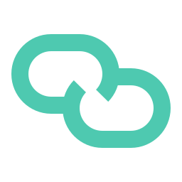

<p align="center">
  
</p>

# AgentLink

> **A coding-agent harness built into VS Code.**

Run frontier coding agents with the editor's intelligence, visible execution, reviewable changes, and as much—or as little—supervision as the task needs.

[Get started](#get-started) · [Documentation](resources/builtin-skills/documentation/README.md) · [Why AgentLink](why-agentlink.md) · [Releases](https://github.com/reefbarman/agentlink/releases)

## Why AgentLink

A capable model is only part of a capable coding agent. It also needs a good working environment: editor intelligence instead of text guesses, fast feedback instead of a surprise broken build, and a way for you to supervise or redirect work without taking the controls away.

AgentLink works _through_ VS Code. It gives an agent language-server navigation and diagnostics, opens edits in native diff views, runs commands in the terminal you can see, and keeps activity, decisions, and recovery close to the work.

That is the product bet: better context, better feedback, and better control make agents more useful on real codebases—not just more autonomous in a demo. Read the concise [case for AgentLink](why-agentlink.md).

## What makes it different

### The editor is the runtime

Give the agent the same semantic understanding you use: definitions, references, symbols, type information, code actions, diagnostics, and workspace-aware rename. Proposed edits arrive as diffs you can accept, reject, or adjust yourself.

### Autonomy is a dial, not a switch

Review every action when the task is risky, or let familiar work move faster with focused rules and **Approve for Me**. Commands remain visible, approvals carry your feedback back to the agent, and checkpoints make experimentation reversible.

### Nothing happens in the dark

Tool calls, progress, questions, approvals, queued work, and background agents stay visible in the chat and Activity Shelf. Use the browser remote to check a session, answer a question, or inspect a read-only diff without taking over the editor.

### A second opinion from another model provider

Use OpenAI/Codex alongside models from configured OpenAI-compatible providers or external ACP agents. AgentLink can route review to another provider, giving important work an independent set of model blind spots.

### Context for the code, not the harness

AgentLink keeps local lexical and structural codebase retrieval on your machine, progressively discloses tools, bounds noisy terminal output, and condenses long sessions without losing the active task.

## What you can do

| Work                      | AgentLink gives you                                                                                                                                    |
| ------------------------- | ------------------------------------------------------------------------------------------------------------------------------------------------------ |
| **Build in the editor**   | VS Code chat, language intelligence, diagnostics, diff review, integrated terminals, and modes for coding, planning, debugging, review, and questions. |
| **Stay in control**       | Inline approvals, editable command requests, audit context, checkpoints/revert, structured questions, and visible task status.                         |
| **Work in parallel**      | Background research and review, cross-provider review, Fleet progress, steering, and bounded results.                                                  |
| **Connect your workflow** | MCP tools, resources, and prompts; `AGENTS.md`/`CLAUDE.md`; skills, custom modes, slash commands, hooks, and Agent Plugins.                            |
| **Use your accounts**     | ChatGPT/Codex, OpenAI, and compatible providers on your own accounts. Local retrieval and telemetry stay local by default.                             |

## Get started

### Install the latest release

The installer selects the target for the VS Code extension host on this machine:

```sh
curl -fsSL https://raw.githubusercontent.com/reefbarman/agentlink/main/scripts/install.sh | bash
```

For a remote or emulated extension host, set its target explicitly:

```sh
curl -fsSL https://raw.githubusercontent.com/reefbarman/agentlink/main/scripts/install.sh \
  | AGENTLINK_VSCE_TARGET=linux-x64 bash
```

You can also download a matching `.vsix` from the [latest release](https://github.com/reefbarman/agentlink/releases/latest):

```sh
code --install-extension agentlink-*.vsix --force
```

### Start your first session

1. Reload VS Code and open the folder you want to work in.
2. Open **AgentLink** from the Activity Bar, then choose **Agent**.
3. Use the empty-chat card to sign in with ChatGPT/Codex, add an OpenAI API key, or configure another compatible provider.
4. Start with a bounded request:

   > Read this project, explain its main module boundaries, and identify the safest place to add `<feature>`.

5. Review diffs and approve commands as needed. Use `/checkpoint` before risky work and `/revert` if you want to undo it.

The [getting started guide](resources/builtin-skills/documentation/references/getting-started.md) covers source builds, platform details, first-run behavior, and next steps.

## Bring your own models and workflow

Choose ChatGPT/Codex, OpenAI, or an OpenAI-compatible provider. Connect the tools and services you already use through [MCP](resources/builtin-skills/documentation/references/mcp.md). Keep existing instructions, skills, commands, and compatible hooks in the conventions your projects already understand.

## What AgentLink is not

- It does not train or sell a proprietary model, and it does not put a cloud middleman between you and your provider account.
- It is not a VS Code fork—your extensions, marketplace, language tooling, and existing setup remain yours.
- The browser remote is for supervision: diffs are read-only there and it has no remote shell or write path.
- Some capabilities are still maturing, including best-of-N and scheduled automations. The [positioning article](why-agentlink.md) keeps the current rough edges explicit.

## Documentation

- [Getting started](resources/builtin-skills/documentation/references/getting-started.md)
- [Capabilities overview](resources/builtin-skills/documentation/references/capabilities.md)
- [Tools](resources/builtin-skills/documentation/references/tools.md)
- [Customization](resources/builtin-skills/documentation/references/customization.md)
- [MCP](resources/builtin-skills/documentation/references/mcp.md)
- [Troubleshooting](resources/builtin-skills/documentation/references/troubleshooting.md)
- [Complete product reference](resources/builtin-skills/documentation/references/complete-reference.md)

## Contributing

AgentLink development requires Node.js 22.19 or newer and VS Code 1.109 or newer.

```sh
git clone https://github.com/reefbarman/agentlink.git
cd agentlink
npm install
npm run build
```

Press **F5** in VS Code to launch an Extension Development Host. Read the [development reference](resources/builtin-skills/documentation/references/complete-reference.md#development) before submitting a production change.

## Project links

[Releases](https://github.com/reefbarman/agentlink/releases) · [Issues](https://github.com/reefbarman/agentlink/issues) · [Changelog](CHANGELOG.md) · [License](LICENSE)
