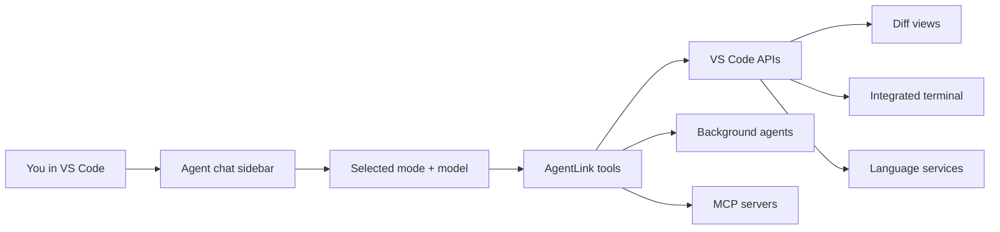

# AgentLink

An AI coding agent for VS Code with browser remote control.

AgentLink runs a built-in coding agent inside VS Code: chat in the sidebar, switch modes, run editor-native tools, review diffs inline, approve terminal commands, spawn background agents, search code semantically, and continue the same session from a browser. The built-in agent can also connect out to [MCP](https://modelcontextprotocol.io/) servers configured for your user or project.

## Why?

Most AI coding agents operate at the filesystem level — they read and write files directly, run commands in hidden subprocesses, and have no awareness of your editor. AgentLink routes agent work _through_ VS Code, unlocking capabilities that are impossible with raw filesystem access.

### What you get over built-in tools

| Capability                | Built-in tools              | AgentLink                                                                                                                                                                                                                            |
| ------------------------- | --------------------------- | ------------------------------------------------------------------------------------------------------------------------------------------------------------------------------------------------------------------------------------ |
| **File editing**          | Writes directly to disk     | Opens a **diff view** — you see exactly what's changing, can edit inline, and accept or reject. Format-on-save applies automatically.                                                                                                |
| **Terminal commands**     | Runs in a hidden subprocess | Runs in VS Code's **integrated terminal** — visible, interactive, with shell integration for output capture. Supports named terminals, parallel tasks, and **split terminal groups**.                                                |
| **Diagnostics**           | Not available               | Real **TypeScript errors, ESLint warnings**, etc. from VS Code's language services — returned after writes and available on-demand.                                                                                                  |
| **File reading**          | Raw file content            | Content plus **file metadata** (size, modified date), **language detection**, **git status**, **diagnostics summary**, and **symbol outlines** (functions, classes, interfaces grouped by kind).                                     |
| **Search**                | `grep`/`rg` via subprocess  | Same ripgrep engine with context lines, pagination, and multiple output modes.                                                                                                                                                       |
| **File listing**          | `find`/`ls` via subprocess  | Native listing with ripgrep's `--files` mode for fast recursive listing with automatic `.gitignore` support.                                                                                                                         |
| **Language intelligence** | Not available               | **Go to definition/implementation/type**, **find references**, **hover types**, **completions**, **symbols**, **rename**, **code actions**, **call/type hierarchy**, and **inlay hints** — all powered by VS Code's language server. |
| **Approval system**       | All-or-nothing permissions  | **Granular approval** — per-file write rules, per-sub-command pattern matching, outside-workspace path trust with prefix/glob/exact patterns, all in a dedicated approval panel.                                                     |
| **Follow-up messages**    | Silent rejection            | Every approval dialog includes a **follow-up message** field — returned to the agent as context on accept or as a rejection reason on reject.                                                                                        |

## Built-in Agent

The **Agent** view in the AgentLink activity bar is the primary coding experience.

### What the built-in agent does

- chats directly inside VS Code
- edits files through diff views instead of writing blindly to disk
- runs commands in the integrated terminal instead of hidden subprocesses
- uses VS Code diagnostics, symbol/navigation APIs, code actions, and rename support
- can switch between specialized modes for coding, planning, debugging, review, and lightweight Q&A
- can spawn background agents for parallel review or research
- can connect to MCP servers and use MCP tools from inside the built-in chat

### Modes

AgentLink includes these built-in modes:

| Mode        | What it is for                                                                             |
| ----------- | ------------------------------------------------------------------------------------------ |
| `code`      | Primary implementation mode: read, edit, run commands, navigate symbols, and use MCP tools |
| `architect` | Planning and design work with read/search/language tools and planning-oriented behavior    |
| `ask`       | Lightweight question answering with read/search tools only                                 |
| `debug`     | Investigation and troubleshooting with commands, language tools, and search                |
| `review`    | Focused code review mode with read/search/language tools and structured review output      |

### How the built-in agent works



### Core built-in agent features

- **Inline approvals in chat** — command, write, rename, MCP, and mode-switch approvals render in the built-in chat UI. The separate approval panel provides a focused review surface for pending operations.
- **Session history and restore** — chat sessions are persisted and restored across VS Code reloads/startup.
- **Checkpoints and revert** — create workspace checkpoints and revert later. Checkpoints are stored in AgentLink’s own shadow git repo under `.agentlink/checkpoints/`, separate from your project’s real git history.
- **Slash commands** — built-ins include `/new`, `/mode`, `/model`, `/condense`, `/checkpoint`, `/revert`, `/help`, `/skills`, `/mcp`, `/mcp-config`, `/mcp-refresh`, `/btw`, and `/pair`. Custom commands and detected skills appear in the same picker.
- **`/btw` side questions** — `/btw <question>` asks a quick side question that forks the current conversation into a read-only session (no edits or commands), so you get an answer without polluting the main thread. The answer streams into a side panel with a visible turn/tool budget (max 5 API turns / 10 tool calls) and a Cancel button; when it finishes you can **Add to conversation** to promote the question and answer into the main transcript. Runs self-abort after a deadline if they stall. (Foreground surface only — not exposed on the read-only browser remote.)
- **Background agents** — spawn parallel sub-agents for review and research, then inspect their result/transcript from the foreground session.
- **Auto-condense** — when context fills up, AgentLink can condense the conversation and continue without losing task continuity.
- **Model picker + auth-aware UX** — model selection is built into the chat UI and can prompt for Anthropic or OpenAI/Codex auth as needed. For Anthropic, model metadata (available models, context window, output tokens, reasoning-effort options) is refreshed from the Anthropic API and merged over built-in defaults; the refresh is lazy (never on activation) and falls back to built-in static metadata when offline. Toggle with `agentlink.anthropic.dynamicModelCapabilities` (default on).

### Remote control and MCP integrations

- **Browser remote control** mirrors built-in agent sessions, approvals, questions, background activity, and read-only diff review through a stable local gateway URL.
- **Outbound MCP client** support lets the built-in agent discover and call tools, resources, and prompts from configured MCP servers.
- **Layered MCP configuration** supports user and project files under `.agents`, `.claude`, and `.agentlink`, with project configuration taking precedence.

## Installation

### Install script (recommended)

Download and install the latest release from GitHub:

```sh
curl -sL https://raw.githubusercontent.com/reefbarman/agentlink/main/scripts/install.sh | bash
```

Or clone the repo first and run it locally:

```sh
./scripts/install.sh
```

### Manual download

1. Go to the [latest release](https://github.com/reefbarman/agentlink/releases/latest)
2. Download the `.vsix` file
3. Install it:

   ```sh
   code --install-extension agentlink-*.vsix --force
   ```

### Build from source

```sh
git clone https://github.com/reefbarman/agentlink.git
cd agentlink
npm install && npm run build
npx @vscode/vsce package --no-dependencies --allow-star-activation
code --install-extension agentlink-*.vsix --force
```

After installing, reload VS Code and open the AgentLink activity bar.

### AgentLink Terminal requirements

The custom **AgentLink Terminal** currently requires a local macOS extension host and a compatible standalone Node.js runtime. AgentLink probes Node.js from the environment inherited by VS Code and from standard macOS installation paths. The probe starts the packaged PTY module, so incompatible architecture, native ABI, or code-signing combinations are rejected before the terminal is enabled.

If VS Code was launched from Finder and does not inherit the shell path used by a version manager such as fnm, nvm, or Volta, set `agentlink.terminal.nodePath` to the absolute standalone Node.js executable. Do not point it at VS Code's Electron executable.

When the dependency is missing or incompatible, AgentLink:

- does not register or show the custom AgentLink Terminal;
- shows one warning with **Configure Node Path**, **Install Node.js**, and **Retry** actions;
- routes built-in agent commands through the native VS Code terminal provider;
- continues to block command execution in untrusted workspaces.

A failure after a sandbox provider has been selected remains fail-closed; AgentLink never silently reruns that command outside the sandbox.

## Quick Start

### Use the built-in agent

1. Install the extension (see [Installation](#installation))
2. Open the **AgentLink** activity bar icon and select the **Agent** view
3. Pick a model if prompted and configure auth if needed:
   - **AgentLink: Sign In to OpenAI/Codex** for ChatGPT/Codex OAuth or OpenAI API-key-backed models
   - **AgentLink: Set OpenAI API Key** for direct OpenAI API key setup
   - **AgentLink: Set Anthropic API Key** for Anthropic models
4. Start chatting in the sidebar
5. Switch modes as needed (`code`, `architect`, `ask`, `debug`, `review`)
6. Approve edits and commands inline when the agent requests them

Useful built-in workflows:

- use `/model` to switch models
- use `/mode` to switch behavior without starting over
- use `/condense` to manually compress context
- use `/checkpoint` before risky edits and `/revert` if needed
- use background agents for review/research from inside the chat UI

### Command palette workflows

Useful command-palette entries include:

- **AgentLink: Sign In to OpenAI/Codex**
- **AgentLink: Manage OpenAI/Codex Authentication**
- **AgentLink: Manage ChatGPT/Codex Accounts**
- **AgentLink: Add ChatGPT/Codex Account**
- **AgentLink: Switch Active ChatGPT/Codex Account**
- **AgentLink: Re-sign In / Replace ChatGPT/Codex Account**
- **AgentLink: Set OpenAI API Key**
- **AgentLink: Rebuild Codebase Index** / **AgentLink: Cancel Indexing**
- **AgentLink: Clear Built-In Agent Session Approvals**
- **AgentLink: Add Built-In Agent Trusted Command Pattern**
- **AgentLink: Complete Tool Call** / **AgentLink: Cancel Tool Call**

### Built-in chat entry points

You can push editor context into the built-in agent without copy/paste:

- **AgentLink: Add File to Chat** — attach the current file (also available from editor and explorer context menus)
- **AgentLink: Add Selection to Chat** — inject the current editor selection with file/line context
- **Explain with AgentLink** — ask the built-in agent to explain the current selection
- **Fix with AgentLink** — send selected diagnostics/issues to the built-in agent as a fixing prompt

### Custom modes and slash commands

AgentLink supports both project-level and user-level customization for the built-in agent.

**Custom modes** are project-level only and are loaded from these files, in ascending priority:

- `.agents/modes.json`
- `.claude/modes.json`
- `.agentlink/modes.json`

Later files override earlier ones for the same mode slug. Custom modes can also override built-in modes like `code` or `review`.

**Custom slash commands** are loaded from these directories, again with later sources taking precedence:

- `~/.agents/commands/`
- `~/.claude/commands/`
- `~/.agentlink/commands/`
- `.agents/commands/`
- `.claude/commands/`
- `.agentlink/commands/`

This lets you define reusable prompts/workflows for the built-in agent while keeping project-specific commands in the repo.

Detected skills are also exposed as slash commands in the built-in chat. Skills loaded from `~/.agents/skills/`, `~/.claude/skills/`, `~/.agentlink/skills/`, `.agents/skills/`, `.claude/skills/`, `.agentlink/skills/`, and their `skills-<mode>/` variants appear as `/<name>` with a `Skill` badge. Selecting one sends a prompt that asks the agent to load that skill with `load_skill` and follow its instructions. Use `/skills` to open the AgentLink output channel with the skills detected for the current mode, including their resolved `SKILL.md` paths.

### Connect the built-in agent to MCP servers

Use `/mcp-config` in the built-in chat to inspect and edit AgentLink-owned MCP configuration, `/mcp` to inspect connected servers, and `/mcp-refresh` after changing configuration.

The main agent merges MCP server definitions from these files, in ascending priority:

1. `~/.agents/mcp.json`
2. `~/.claude/mcp.json`
3. `~/.agentlink/mcp.json`
4. `<workspace>/.agents/mcp.json`
5. `<workspace>/.claude/mcp.json`
6. `<workspace>/.agentlink/mcp.json`

Each file uses an `mcpServers` object. For example:

```json
{
  "mcpServers": {
    "example": {
      "command": "example-mcp-server",
      "args": ["--stdio"],
      "toolPolicy": "ask"
    }
  }
}
```

AgentLink can progressively disclose large MCP catalogs and applies the same session/project/global approval model to connected servers and tools.

## Semantic Codebase Search Setup

Semantic search powers `codebase_search` plus the `query` parameter on `read_file` and `list_files`. It uses a local Qdrant vector database for the code index and OpenAI embeddings for indexing and queries.

### Requirements

- Qdrant running locally or remotely
- OpenAI authentication configured in AgentLink
- `agentlink.semanticSearchEnabled` set to `true`

### 1. Set up Qdrant

The default Qdrant URL is:

```text
http://localhost:6333
```

The quickest way to run Qdrant locally is Docker:

```sh
docker run -p 6333:6333 -p 6334:6334 qdrant/qdrant
```

If you already run Qdrant elsewhere, point AgentLink at it with the `agentlink.qdrantUrl` setting.

### 2. Configure OpenAI authentication

Semantic indexing and search need embedding auth. In VS Code, run:

- **AgentLink: Sign In to OpenAI/Codex** to use ChatGPT/Codex OAuth or an OpenAI API key
- or **AgentLink: Set OpenAI API Key** if you want to store an API key directly

You can also provide `OPENAI_API_KEY` in the environment.

### 3. Enable semantic search

Set these VS Code settings:

```jsonc
{
  "agentlink.semanticSearchEnabled": true,
  "agentlink.qdrantUrl": "http://localhost:6333",
  "agentlink.autoIndex": true,
}
```

- `agentlink.semanticSearchEnabled` turns on semantic indexing and search
- `agentlink.qdrantUrl` points to your Qdrant instance
- `agentlink.autoIndex` rebuilds the workspace index automatically on startup when semantic search is enabled

### 4. Build the codebase index

Once semantic search is enabled, use either of these entry points:

- Sidebar button: **Index Codebase** / **Rebuild Index**
- Command palette: **AgentLink: Rebuild Codebase Index**

If indexing is already running, use **AgentLink: Cancel Indexing**.

### 5. Query the index

After indexing completes, agents can use:

- `codebase_search` for semantic code search
- `read_file` with `query` to jump to the most relevant section of a file
- `list_files` with `query` to find files by meaning instead of path/glob

### Notes

- Index data is workspace-specific.
- `agentlink.indexExclusions` adds extra glob-based exclusions on top of `.gitignore`.
- `agentlink.chunkGranularity` controls indexing detail: `standard` is cheaper, `fine` gives better granularity.
- If you are following Roo Code's Qdrant docs, the same Qdrant setup applies here; the AgentLink-specific pieces are enabling `agentlink.semanticSearchEnabled` and configuring OpenAI auth inside AgentLink.

## Upgrading from the retired external-agent integration

Current AgentLink releases no longer run an inbound MCP server, auto-configure external agents, inject instruction blocks, or install enforcement hooks. On activation, AgentLink performs a conservative one-time cleanup of artifacts it can identify as AgentLink-owned:

- AgentLink MCP entries in supported external-agent configuration files
- AgentLink-managed instruction blocks delimited by `<!-- BEGIN agentlink -->` and `<!-- END agentlink -->`
- AgentLink-owned `enforce-agentlink.sh` / `enforce-agentlink.ps1` hook references and scripts

Cleanup preserves unrelated servers, instructions, hooks, and user-owned same-name scripts. If a target cannot be updated, AgentLink reports the failing target and error in the AgentLink output channel; use the manual fallback below.

Manual fallback:

1. Remove only the `agentlink` MCP server entry from the reported external-agent config file.
2. Remove only the AgentLink-delimited instruction block; keep surrounding user content.
3. Remove AgentLink hook entries that invoke `enforce-agentlink.sh` or `enforce-agentlink.ps1`.
4. Delete a hook script only when its contents identify it as AgentLink-owned.

Do not add those retired entries back. To connect the built-in agent to third-party MCP servers, use the layered `mcp.json` configuration described in [Connect the built-in agent to MCP servers](#connect-the-built-in-agent-to-mcp-servers).

## Tool runtime model

The built-in agent uses AgentLink's editor-native tools for file access, diff-based edits, terminals, diagnostics, language intelligence, semantic search, approvals, and orchestration. MCP meta tools separately let the built-in agent consume tools, resources, and prompts from connected third-party MCP servers.

When a connected MCP server requests URL elicitation, AgentLink shows an explicit browser-flow prompt in both the VS Code chat and browser gateway. URLs are never auto-opened; only `http` and `https` URLs are accepted, and local/private network targets are called out before the user proceeds.

## Tools

The tools below are available to the built-in agent according to its active mode and capability profile. Some development or orchestration tools are intentionally exposed only in specific modes.

### read_file

Read file contents with line numbers. Returns rich metadata that built-in read tools cannot provide. Supports text files, local images, and PDF text extraction.

| Parameter                | Type     | Description                                                                                                                                        |
| ------------------------ | -------- | -------------------------------------------------------------------------------------------------------------------------------------------------- |
| `path`                   | string   | File path (absolute or relative to workspace root)                                                                                                 |
| `offset`                 | number?  | Starting line number (1-indexed, default: 1)                                                                                                       |
| `limit`                  | number?  | Maximum lines to read (default: 2000)                                                                                                              |
| `include_symbols`        | boolean? | Include top-level symbol outline (default: true)                                                                                                   |
| `query`                  | string?  | Semantic search query to jump to the most relevant section. Auto-sets offset using the codebase index. Ignored if `offset` is explicitly provided. |
| `anchor`                 | string?  | Literal anchor text to locate and jump near. Ignored if `offset` is explicitly provided.                                                           |
| `anchor_regex`           | string?  | Regex anchor pattern to locate and jump near. Ignored if `offset` is explicitly provided.                                                          |
| `anchor_offset`          | number?  | Line offset applied after anchor/semantic match (e.g. `-20` for context above).                                                                    |
| `auto_follow_suggestion` | boolean? | If `path` is not found and exactly one high-confidence suggestion exists, automatically read that suggested file and include resolution metadata.  |

**Response includes:**

- `total_lines`, `showing`, `truncated` — pagination info
- `size` (bytes), `modified` (ISO timestamp) — file metadata
- `language` — detected from open document or file extension (~80 extensions mapped)
- `git_status` — `"staged"`, `"modified"`, `"untracked"`, or `"clean"` (via VS Code's git extension)
- `diagnostics` — `{ errors: N, warnings: N }` summary from language services
- `symbols` — top-level symbols grouped by kind (e.g. `{ "function": ["foo (line 1)"], "class": ["Bar (line 20)"] }`). Automatically skipped for JSON/JSONC files.
- `content` — numbered lines in `line_number | content` format
- `semantic_match` — when `query` is used: `{ query, startLine, endLine }` showing the matched chunk
- `anchor_match` — when `anchor`/`anchor_regex` is used: match metadata (or `status: "not_found"`)

Fields like `git_status`, `diagnostics`, and `symbols` are omitted when not available rather than returned as null.

**Image support:** Local image files (`.png`, `.jpg`, `.jpeg`, `.gif`, `.webp`) are returned as base64-encoded `image` content that the agent can view directly. Max image size: 10 MB.

**PDF support:** Local `.pdf` files are parsed to extracted text and returned in the same numbered-line JSON shape as text files, with `file_type: "pdf"`. Max PDF size: 50 MB. `offset` and `limit` apply to extracted text lines.

**Friendly errors:** `ENOENT` → `"File not found: {path}. Working directory: {root}"`, `EACCES` → `"Permission denied"`, `EISDIR` → `"Use list_files instead"`. When `auto_follow_suggestion` succeeds, the response includes suggestion/resolution metadata showing the requested path and followed file.

### get_context

Build a compact read-only context pack for an explicit file. Prefer this over `read_file` for first-pass orientation when the file path is already known; use `read_file` when you need exact file content, local images/PDFs, complete temp outputs, a specific large line slice, or semantic in-file jumping via `query`. This is intended to collapse the common orientation sequence into one bounded response while tracking whether the same content range has already been returned in the current session.

| Parameter                  | Type     | Description                                                                                           |
| -------------------------- | -------- | ----------------------------------------------------------------------------------------------------- |
| `path`                     | string   | File path to build context for. Directory paths are not bulk-read.                                    |
| `offset`                   | number?  | Starting line number for the content slice (1-indexed, default: 1).                                   |
| `limit`                    | number?  | Maximum content lines to include (default: 200, capped at 400).                                       |
| `dedupe_unchanged_content` | boolean? | When true, omit content for an unchanged exact range already returned in this session. Default false. |
| `refresh`                  | boolean? | When true, include content even if unchanged-content dedupe would otherwise omit it.                  |

**Response includes:**

- `path`, `total_lines`, `showing`, `truncated` — target and pagination info
- `size`, `modified`, `language`, `git_status` — file metadata when available
- `diagnostics` — `{ errors: N, warnings: N }` summary when diagnostics exist
- `symbols` — compact document symbol outline when language services provide one
- `working_set` — `status`, `content_hash`, optional `previous_content_hash`, `range`, `should_include_content`, and `last_read_at`
- `content` — numbered lines, omitted only when `working_set.should_include_content` is false

Working-set statuses are `new`, `unchanged`, `changed`, and `omitted_unchanged`. Omission is opt-in and exact-range only; overlapping ranges and full-file reads are tracked independently so callers do not lose content they have not explicitly received.

### get_repo_map

Read the structural repo-map sidecar as a budgeted whole-project or scoped skeleton. Use this before broad edits to understand module boundaries and high-level dependency shape, then drill into specific files with `get_module_neighbors` when you need exact imports/dependents.

| Parameter          | Type     | Description                                                                                                         |
| ------------------ | -------- | ------------------------------------------------------------------------------------------------------------------- |
| `path`             | string?  | Optional workspace-relative or absolute file/directory path to scope the map. Omit for the first workspace root.    |
| `max_chars`        | number?  | Hard output budget in characters for the JSON payload (default 20,000; minimum 2,000; capped at 60,000).            |
| `max_files`        | number?  | Maximum file skeleton entries to include before budget truncation (default 200; capped at 1,000).                   |
| `include_external` | boolean? | Include summarized external dependency specifiers (default true). Set false to reserve budget for internal modules. |

**Response includes:**

- `workspace_root`, `cache` — sidecar identity and cache location when available
- `freshness.graph` — sidecar availability, generated timestamp, cache version, and indexed file count
- `scope` — requested scope path and number of indexed files matched
- `totals` — aggregate counts for files, imports, internal imports, external imports, exports, and symbols
- `directories` — budgeted directory summaries sorted by file count
- `external_dependencies` — budgeted external specifier summaries by importer count (omitted when `include_external: false`)
- `files` — budgeted file/module skeletons: path, language, internal imports, external imports, exports, top-level symbols, and reverse import count
- `budget` — requested budget, final serialized character count, truncation flag, and omitted counts
- `note` — present for missing sidecar or empty scope cases

The tool is intentionally static and budgeted. It is best for orientation, module-boundary discovery, and deciding where to inspect next; use `get_module_neighbors` for a complete single-file neighborhood and LSP tools for symbol-precise semantics. Requires the codebase index/structural sidecar to be built.

### get_module_neighbors

Read the structural repo-map sidecar for a single source/config file. Use this after `get_context` when you need module-level blast-radius awareness before editing: what the file imports, what it exports, which indexed modules import it, and what top-level symbols it declares.

| Parameter     | Type    | Description                                                                                                   |
| ------------- | ------- | ------------------------------------------------------------------------------------------------------------- |
| `path`        | string  | Source/config file path (absolute or relative to workspace root)                                              |
| `max_results` | number? | Maximum items to return in each list: `imports`, `exports`, `symbols`, and `dependents` (default 50, max 200) |

**Response includes:**

- `path`, `workspace_root`, `cache` — target and sidecar cache identity
- `freshness.target` — `fresh`, `stale`, `missing_from_graph`, `target_missing`, or `unknown`, with hashes when available
- `freshness.graph` — sidecar availability, generated timestamp, cache version, and file count
- `imports` — bounded list of static/reexport/require/dynamic imports with specifiers, resolved relative paths, imported names, and line numbers
- `exports` — bounded list of named/default/reexport/CommonJS exports
- `symbols` — bounded top-level symbols recorded by the structural extractor
- `dependents` — bounded reverse module dependencies: indexed files whose resolved imports point at the target
- `note` — omitted when the sidecar and target are usable; present for missing/stale graph cases

This is a static module graph, not an LSP-precise symbol reference query. Use language tools such as `get_references`, `go_to_definition`, and `get_call_hierarchy` when exact symbol semantics matter. Requires the codebase index/structural sidecar to be built.

### load_skill

Load the full contents of an AgentLink skill file that was explicitly advertised in the current built-in agent system prompt. This is intentionally not a general-purpose file reader: it only accepts skill paths that were listed for the active session.

| Parameter | Type   | Description                                |
| --------- | ------ | ------------------------------------------ |
| `path`    | string | Advertised skill file path to load exactly |

Returns the skill file content and metadata needed for the agent to follow the skill instructions.

### load_rule

Load the full contents of a deferred local rule file that was explicitly advertised in the current built-in agent Rule Catalog. This is intentionally not a general-purpose file reader: it only accepts deferred rule paths that were listed for the active session.

| Parameter | Type   | Description                                        |
| --------- | ------ | -------------------------------------------------- |
| `path`    | string | Advertised deferred rule file path to load exactly |

Returns the rule file content with frontmatter stripped, plus metadata identifying the loaded rule.

### list_files

List files and directories. Directories have a trailing `/` suffix.

| Parameter         | Type     | Description                                                                                                                                                                                   |
| ----------------- | -------- | --------------------------------------------------------------------------------------------------------------------------------------------------------------------------------------------- |
| `path`            | string   | Directory path                                                                                                                                                                                |
| `recursive`       | boolean? | List recursively (default: false)                                                                                                                                                             |
| `depth`           | number?  | Max directory depth for recursive listing                                                                                                                                                     |
| `pattern`         | string?  | Glob pattern to filter files (e.g. `*.ts`, `*.test.*`). Implies recursive search.                                                                                                             |
| `include_ignored` | boolean? | Include ignored files/directories in recursive/pattern listing. Still excludes `node_modules` and `.git`. Default: false. Pair with `pattern` when possible to avoid noisy/truncated results. |
| `query`           | string?  | Semantic search query to find files by meaning (e.g. `"authentication logic"`). Returns files ranked by relevance. Other params ignored when set. Requires codebase index.                    |

Recursive listing uses ripgrep (`--files` mode) for speed and automatic `.gitignore` support by default. Use `include_ignored: true` when expected files may live under ignored directories; pair it with `pattern` when possible (for example, `pattern: "*.pdf"`) to avoid noisy/truncated results.

**Semantic mode:** When `query` is provided, the response includes `semantic: true`, files ranked by score, and `count`. Other listing params are ignored.

### search_files

Search file contents using regex, or perform semantic codebase search when `semantic: true`.

| Parameter          | Type     | Description                                                                                                                  |
| ------------------ | -------- | ---------------------------------------------------------------------------------------------------------------------------- |
| `path`             | string   | Directory to search in                                                                                                       |
| `regex`            | string   | Regex pattern to search for, or a natural-language query when `semantic=true`                                                |
| `file_pattern`     | string?  | Glob to filter files (e.g. `*.ts`). Used for regex mode only.                                                                |
| `semantic`         | boolean? | Use vector/semantic search instead of regex. Requires the codebase index.                                                    |
| `context`          | number?  | Number of context lines around each match (default: 1). Overridden by `context_before`/`context_after` if specified.         |
| `context_before`   | number?  | Context lines BEFORE each match (like `grep -B`). Overrides `context` for before-match lines.                                |
| `context_after`    | number?  | Context lines AFTER each match (like `grep -A`). Overrides `context` for after-match lines.                                  |
| `case_insensitive` | boolean? | Case-insensitive search (default: false, regex mode only)                                                                    |
| `multiline`        | boolean? | Enable multiline matching where `.` matches newlines (default: false, regex mode only)                                       |
| `max_results`      | number?  | Maximum number of matches to return (default: 300)                                                                           |
| `offset`           | number?  | Skip first N matches before returning results. Use with `max_results` for pagination.                                        |
| `output_mode`      | string?  | `content` (default, matching lines with context), `files_with_matches` (file paths only), or `count` (match counts per file) |

Regex mode is powered by ripgrep with context lines and per-file match counts. Semantic mode uses the same Qdrant-backed codebase index as `codebase_search`.

### get_diagnostics

Get VS Code diagnostics (errors, warnings, etc.) for a file or the entire workspace.

| Parameter  | Type    | Description                                                                        |
| ---------- | ------- | ---------------------------------------------------------------------------------- |
| `path`     | string? | File path (omit for all workspace diagnostics)                                     |
| `severity` | string? | Comma-separated filter: `error`, `warning`, `info`, `hint`                         |
| `source`   | string? | Comma-separated source filter (e.g. `typescript`, `eslint`). Default: all sources. |

### write_file

Create or overwrite a file, creating missing parent directories if the write is approved. Opens a **diff view** in VS Code for the user to review, optionally edit, and accept or reject. Benefits from format-on-save. Returns any user edits, format-on-save edits, and new diagnostics.

| Parameter | Type   | Description           |
| --------- | ------ | --------------------- |
| `path`    | string | File path             |
| `content` | string | Complete file content |

Response fields may include `user_edits` (proposed content → reviewer-edited content) and `format_on_save_edits` (reviewer-edited/proposed content → final saved content). If `format_on_save_edits_omitted: "size_cap"` is returned, the file was substantially reformatted and the agent should re-read before composing more diffs.

### generate_image

Generate PNG images through OpenAI/Codex auth and show them inline in chat. With ChatGPT/Codex OAuth, usage consumes the active account's image-generation quota; with an OpenAI API key, usage is billed to the API key. The tool always shows an approval prompt before generation because quota/billing is consumed before images are returned. In VS Code, pass `output_path` to also save generated PNGs into the workspace; browser-initiated generation is display-only.

| Parameter               | Type               | Description                                                                                                                                                                                                          |
| ----------------------- | ------------------ | -------------------------------------------------------------------------------------------------------------------------------------------------------------------------------------------------------------------- |
| `prompt`                | string             | Prompt describing the image or images to generate                                                                                                                                                                    |
| `output_path`           | string?            | Optional workspace-relative PNG file path or output directory. When omitted, images are shown in chat only and no files are written. When provided in VS Code, images are also saved to this workspace path.         |
| `size`                  | string?            | Optional requested size/aspect hint, e.g. `1024x1024`, `1536x1024`, or `1024x1536`                                                                                                                                   |
| `count`                 | number?            | Number of images to generate. Default: 1. Maximum: 4                                                                                                                                                                 |
| `reference_image_paths` | string[]?          | Workspace-local PNG/JPEG/GIF/WebP files to use as generation references                                                                                                                                              |
| `reference_image_ids`   | string[]?          | IDs of prior user-attached images in the current built-in agent session. Prefer `use_recent_images` for images the user just provided. Explicit IDs follow `image_N` attachment order and errors list available IDs. |
| `use_recent_images`     | boolean \| number? | Use recent user-attached images as references. Prefer this when the user asks to use an image they already provided. `true` uses up to 4 recent images; a number uses that many.                                     |
| `timeout_seconds`       | number?            | Overall timeout in seconds. Default and maximum: 300                                                                                                                                                                 |

**Approval prompt:** shows the generation prompt, requested size/count, reference image labels, billing/quota note, and either chat-only output or workspace output paths. Approving uses the standard `accept` decision; rejecting returns `User denied image generation` and any planned output paths.

**Response includes:** `status`, `model`, `billing`, `requested_count`, `generated_count`, `reference_images` metadata, generated `images` metadata, Codex stream `event_types`, and image blocks rendered inline in chat. `images[].path` is present only when `output_path` saved a file.

### propose_memory

Propose a cross-session memory/config update. This is the sanctioned path for durable learnings: the tool resolves the correct target, validates skill/command names and skill frontmatter, and always requires explicit user approval before writing. Approval can retarget tier/scope/name in the approval card; add/update proposals then open an editable diff view for reviewing or editing the final target file content before it is saved. Skill/command removals delete the target only after approval.

| Parameter   | Type                                                 | Description                                                                   |
| ----------- | ---------------------------------------------------- | ----------------------------------------------------------------------------- |
| `tier`      | `"instructions" \| "skill" \| "command" \| "memory"` | Destination tier. Prefer instructions/skills/commands before memory fallback. |
| `scope`     | `"global" \| "project"`                              | Write to user-global AgentLink config or the current project.                 |
| `operation` | `"add" \| "update" \| "remove"`                      | Add new content, update existing content, or remove stale content.            |
| `title`     | string                                               | Short approval-card label.                                                    |
| `rationale` | string                                               | Why this should be remembered; shown to the user.                             |
| `content`   | string                                               | Markdown entry/body. For `skill`, this must be the complete `SKILL.md`.       |
| `name`      | string?                                              | Required for `skill` and `command`; lowercase hyphen identifier.              |
| `replaces`  | string?                                              | Existing text to update/remove, matched with normalized whitespace.           |

Targets:

- `instructions` + `project` → existing root `AGENTS.md` / `AGENT.md` / `CLAUDE.md`, or creates `AGENTS.md`
- `instructions` + `global` → `~/.agentlink/CLAUDE.md`
- `skill` → `{scope}/.agentlink/skills/<name>/SKILL.md`
- `command` → `{scope}/.agentlink/commands/<name>.md`
- `memory` → `{scope}/.agentlink/memory.md`

Responses include `status`, `path`, `tier`, `scope`, `operation`, and any new diagnostics. If `replaces` cannot be found, the error includes the current target content so the agent can retry accurately. Rejected approvals return `status: "rejected"` and any rejection reason.

### apply_diff

Edit an existing file using search/replace blocks. Opens a diff view for review. Supports **multiple hunks** in a single call. Responses include per-block diagnostics for partial matches/failures, format-on-save edits, and pending-edit lock conflicts return a structured recovery hint instead of a bare timeout string.

| Parameter | Type   | Description                              |
| --------- | ------ | ---------------------------------------- |
| `path`    | string | File path                                |
| `diff`    | string | Search/replace blocks (see format below) |

```text
<<<<<<< SEARCH
exact content to find
======= DIVIDER =======
replacement content
>>>>>>> REPLACE
```

Include multiple SEARCH/REPLACE blocks for multiple edits in one call. If a response includes both `user_edits` and `format_on_save_edits`, compose them in order: proposed content → `user_edits` → `format_on_save_edits`. If the format patch is omitted due to size, re-read the file before the next edit.

### go_to_definition

Resolve the definition location of a symbol using VS Code's language server. Works across files and languages.

| Parameter | Type   | Description                                        |
| --------- | ------ | -------------------------------------------------- |
| `path`    | string | File path (absolute or relative to workspace root) |
| `line`    | number | Line number (1-indexed)                            |
| `column`  | number | Column number (1-indexed)                          |

Returns an array of `definitions`, each with `path`, `line`, `column`, `endLine`, `endColumn`.

### go_to_implementation

Find concrete implementations of an interface, abstract class, or method.

| Parameter | Type   | Description                                        |
| --------- | ------ | -------------------------------------------------- |
| `path`    | string | File path (absolute or relative to workspace root) |
| `line`    | number | Line number (1-indexed)                            |
| `column`  | number | Column number (1-indexed)                          |

### go_to_type_definition

Navigate to the type definition of a symbol. For `const x = getFoo()`, `go_to_definition` goes to `getFoo`'s declaration, but `go_to_type_definition` goes to the return type.

| Parameter | Type   | Description                                        |
| --------- | ------ | -------------------------------------------------- |
| `path`    | string | File path (absolute or relative to workspace root) |
| `line`    | number | Line number (1-indexed)                            |
| `column`  | number | Column number (1-indexed)                          |

### get_references

Find all references to a symbol across the workspace.

| Parameter             | Type     | Description                                               |
| --------------------- | -------- | --------------------------------------------------------- |
| `path`                | string   | File path (absolute or relative to workspace root)        |
| `line`                | number   | Line number (1-indexed)                                   |
| `column`              | number   | Column number (1-indexed)                                 |
| `include_declaration` | boolean? | Include the declaration itself in results (default: true) |

### get_symbols

Get symbols from a document or search workspace symbols. Two modes:

| Parameter | Type    | Description                                                                 |
| --------- | ------- | --------------------------------------------------------------------------- |
| `path`    | string? | File path for document symbols (full hierarchy with children)               |
| `query`   | string? | Search query for workspace-wide symbol search (used when `path` is omitted) |

### get_hover

Get hover information (inferred types, documentation) for a symbol at a specific position.

| Parameter | Type   | Description                                        |
| --------- | ------ | -------------------------------------------------- |
| `path`    | string | File path (absolute or relative to workspace root) |
| `line`    | number | Line number (1-indexed)                            |
| `column`  | number | Column number (1-indexed)                          |

### get_completions

Get autocomplete suggestions at a cursor position.

| Parameter | Type    | Description                                                |
| --------- | ------- | ---------------------------------------------------------- |
| `path`    | string  | File path (absolute or relative to workspace root)         |
| `line`    | number  | Line number (1-indexed)                                    |
| `column`  | number  | Column number (1-indexed)                                  |
| `limit`   | number? | Maximum number of completion items to return (default: 50) |

### get_code_actions

Get available code actions (quick fixes, refactorings) at a position or range.

| Parameter        | Type     | Description                                                                                                  |
| ---------------- | -------- | ------------------------------------------------------------------------------------------------------------ |
| `path`           | string   | File path (absolute or relative to workspace root)                                                           |
| `line`           | number   | Line number (1-indexed)                                                                                      |
| `column`         | number   | Column number (1-indexed)                                                                                    |
| `end_line`       | number?  | End line for range selection (1-indexed)                                                                     |
| `end_column`     | number?  | End column for range selection (1-indexed)                                                                   |
| `kind`           | string?  | Filter by action kind: `quickfix`, `refactor`, `refactor.extract`, `source.organizeImports`, `source.fixAll` |
| `only_preferred` | boolean? | Only return preferred/recommended actions (default: false)                                                   |

Use the returned `index` with `apply_code_action` to apply an action.

### apply_code_action

Apply a code action returned by `get_code_actions`.

| Parameter | Type   | Description                                                    |
| --------- | ------ | -------------------------------------------------------------- |
| `index`   | number | 0-based index of the action to apply (from `get_code_actions`) |

### get_call_hierarchy

Get incoming callers and/or outgoing callees for a function or method.

| Parameter   | Type    | Description                                                          |
| ----------- | ------- | -------------------------------------------------------------------- |
| `path`      | string  | File path (absolute or relative to workspace root)                   |
| `line`      | number  | Line number (1-indexed)                                              |
| `column`    | number  | Column number (1-indexed)                                            |
| `direction` | string  | `incoming` (who calls this), `outgoing` (what this calls), or `both` |
| `max_depth` | number? | Maximum recursion depth for call chain (default: 1, max: 3)          |

### get_type_hierarchy

Get supertypes (parent classes/interfaces) and/or subtypes (child classes/implementations) of a type.

| Parameter   | Type    | Description                                              |
| ----------- | ------- | -------------------------------------------------------- |
| `path`      | string  | File path (absolute or relative to workspace root)       |
| `line`      | number  | Line number (1-indexed)                                  |
| `column`    | number  | Column number (1-indexed)                                |
| `direction` | string  | `supertypes` (parents), `subtypes` (children), or `both` |
| `max_depth` | number? | Maximum recursion depth (default: 2, max: 5)             |

### get_inlay_hints

Get inlay hints (inferred types, parameter names) for a range of lines.

| Parameter    | Type    | Description                                        |
| ------------ | ------- | -------------------------------------------------- |
| `path`       | string  | File path (absolute or relative to workspace root) |
| `start_line` | number? | Start of range (1-indexed, default: 1)             |
| `end_line`   | number? | End of range (1-indexed, default: end of file)     |

### open_file

Open a file in the VS Code editor, optionally scrolling to a specific line. Supports range selection.

| Parameter    | Type    | Description                                                                      |
| ------------ | ------- | -------------------------------------------------------------------------------- |
| `path`       | string  | File path (absolute or relative to workspace root)                               |
| `line`       | number? | Line number to scroll to (1-indexed)                                             |
| `column`     | number? | Column for cursor placement (1-indexed)                                          |
| `end_line`   | number? | End line for range selection (1-indexed, requires `line`). Highlights the range. |
| `end_column` | number? | End column for range selection (1-indexed, requires `end_line`).                 |

### show_notification

Show a notification message in VS Code.

| Parameter | Type    | Description                                     |
| --------- | ------- | ----------------------------------------------- |
| `message` | string  | The notification message to display             |
| `type`    | string? | `info`, `warning`, or `error` (default: `info`) |

### rename_symbol

Rename a symbol across the workspace using VS Code's language server. Updates all references, imports, and re-exports. Shows affected files for approval before applying.

| Parameter  | Type   | Description                             |
| ---------- | ------ | --------------------------------------- |
| `path`     | string | File path containing the symbol         |
| `line`     | number | Line number of the symbol (1-indexed)   |
| `column`   | number | Column number of the symbol (1-indexed) |
| `new_name` | string | The new name for the symbol             |

### find_and_replace

Bulk find-and-replace across **multiple files**. Opens a rich preview panel showing each match in context with inline diffs — users can toggle individual matches on/off before accepting.

| Parameter          | Type     | Description                                                                                                   |
| ------------------ | -------- | ------------------------------------------------------------------------------------------------------------- |
| `find`             | string   | Text to find. Treated as a literal string unless `regex=true`.                                                |
| `replace`          | string   | Replacement text                                                                                              |
| `path`             | string?  | Single file path to search in. Mutually exclusive with `glob`.                                                |
| `glob`             | string?  | Glob pattern to match files (e.g. `src/**/*.ts`). Mutually exclusive with `path`.                             |
| `regex`            | boolean? | Treat `find` as a regular expression. Supports capture groups (`$1`, `$2`) in `replace`. Default: false.      |
| `max_replacements` | number?  | Maximum allowed matches. If exceeded, no edits are applied and the tool returns `status: "too_many_matches"`. |

For single-file edits, prefer `apply_diff` — it provides better diff review and format-on-save.

### execute_command

Run a command in VS Code's integrated terminal. Output is captured when shell integration is available.

By default, AgentLink reuses an existing idle terminal for sequential commands. Omit `terminal_name` and `terminal_id` unless you intentionally need a separate terminal (parallel work, long-running background process, or temporary environment isolation). For a separate terminal, use a short purpose-based `terminal_name` such as `Dev server`, `Unit tests`, or `Build`; sandbox state is shown separately in the terminal UI.

**Interactive command validation:** Commands that require interactive input are automatically rejected with a helpful suggestion.

**Ask/read-only background policy:** Ask mode and agents using the authoritative `review` or `readonly-research` tool profiles receive a reduced, fail-closed version of this tool, even if the background route overrides the resolved mode. This lets read-only background agents use shell commands to inspect the workspace while preserving their non-mutating boundary. It runs only commands that the static classifier recognizes as safe and read-only, synchronously, with a working directory inside the workspace. Unknown or path-qualified executables, mutations, redirection, network/external effects, privileged or opaque shell syntax, mixed compound commands, environment overrides, inline files, `force`, background execution, timeouts, and terminal selection/splitting are rejected before normal approval handling. User approval, command rules, model review, and master bypass cannot escalate a rejected readonly command. The restricted schema exposes only `command`, `cwd`, output filtering, and `reason`. This is a conservative classifier-enforced policy, not an OS-level sandbox; commands with configurable execution hooks require explicit disabling flags or are rejected.

Output is capped to the **last 200 lines** by default. Full output is saved to a temp file (returned as `output_file`) for on-demand access via `read_file`. Use `output_head`, `output_tail`, or `output_grep` to customize filtering.

The **Approve for Me** button above the chat input enables a session-only command policy. Every execution-eligible command is first bound to one exact prepared terminal route. On a trusted local macOS workspace, sandbox-aware review is available only after the packaged production helper passes behavioral attestation; the approval card identifies the verified network-blocked sandbox and the result carries the same opaque audit identity. Native fallback routes remain explicitly unsandboxed and use the conservative legacy reviewer policy. Safe commands continue to follow the configured static tier. Eligible sensitive commands are sent to a fresh one-shot review using the session model, the exact command and classification, the host-owned route summary, and a bounded window of recent conversation and tool evidence. Only a high-confidence, low- or medium-risk reviewer decision runs automatically. Destructive, credential, deployment/publication, privileged, external-effect, inline-file, environment-override, and materially uncertain commands remain human-only. Reviewer uncertainty, errors, invalid output, timeouts, cancellation, policy changes, stale preparation, or sandbox verification failure never silently downgrade to native execution. The reviewer has no tools. The mode consumes model quota, is not persisted across extension-host restarts, creates no approval rules, and does not populate the recent-human-approval cache.

Common response fields include `terminal_id` (for reuse/polling), `output`, and `output_file`. When a foreground command times out, AgentLink returns `timed_out: true` and a `terminal_id` so you can continue with `get_terminal_output` instead of re-running the command. Approved commands include `approval: { by: ... }` in the response (`readonly_policy`, `master_bypass`, `explicit_rule`, `recent_approval`, `tier`, `model_reviewer`, `human`, or `human_edited`) and show an audit badge in the chat transcript. Reviewer approvals include the reviewer model, confidence, risk, and bounded rationale. Tier auto-approvals also include the legacy-compatible `auto_approved: { by: "tier", tier, threshold }` field; reviewer approvals do not.

| Parameter             | Type     | Description                                                                                                                                             |
| --------------------- | -------- | ------------------------------------------------------------------------------------------------------------------------------------------------------- |
| `command`             | string   | Shell command to execute                                                                                                                                |
| `cwd`                 | string?  | Working directory                                                                                                                                       |
| `env`                 | object?  | Environment variables to merge into the terminal's base execution environment                                                                           |
| `files`               | array?   | Throwaway temp files to create for this command. Reference paths with `$AL_FILE(name)`. POSIX shells only; incompatible with `background=true`.         |
| `terminal_id`         | string?  | Reuse a specific terminal by ID. Usually omit for sequential commands so AgentLink can auto-reuse the default terminal.                                 |
| `terminal_name`       | string?  | Run in a named terminal. Use a short purpose label (e.g. `Dev server`, `Unit tests`, `Build`) when intentionally creating/reusing a separate terminal.  |
| `split_from`          | string?  | Split alongside an existing terminal, creating a visual group (for intentionally separate terminals).                                                   |
| `background`          | boolean? | Run without waiting for completion. Returns immediately with `terminal_id`. Use `get_terminal_output` to check progress.                                |
| `timeout`             | number?  | Timeout in seconds. Timed-out commands transition to background state — use `get_terminal_output` with the returned `terminal_id` to check on progress. |
| `output_head`         | number?  | Return only the first N lines of output                                                                                                                 |
| `output_tail`         | number?  | Return only the last N lines of output                                                                                                                  |
| `output_offset`       | number?  | Skip first N lines before applying head/tail                                                                                                            |
| `output_grep`         | string?  | Filter output to lines matching this regex (case-insensitive)                                                                                           |
| `output_grep_context` | number?  | Context lines around each grep match                                                                                                                    |
| `reason`              | string?  | Short reason explaining why the agent needs to run this command (shown in the approval dialog)                                                          |
| `force`               | boolean? | Bypass command validation only for false-positive rejections of direct file-reading commands                                                            |
| `force_reason`        | string?  | Required when `force=true`; explain why the validator rejection was a false positive                                                                    |

`files` entries are `{ name, content, ext?, mode? }`. `name` must match `/^[A-Za-z0-9_.-]{1,64}$/`, `ext` must match `/^[A-Za-z0-9]{1,16}$/`, and `mode` may be `"644"` or `"755"`. Prefer an extension-free logical `name` with `ext` (for example, `name: "body", ext: "md"`); if `name` already ends in the supplied extension, AgentLink does not append it again. AgentLink writes these files under the OS temp directory, substitutes each `$AL_FILE(name)` token with a quoted absolute path, shows bounded previews in the command approval UI, runs the command, then deletes the temp directory. This is intended for ephemeral CLI inputs such as `gh --body-file`, not for creating or editing workspace files.

Example:

```json
{
  "command": "gh pr comment 42 --body-file $AL_FILE(body)",
  "files": [
    {
      "name": "body",
      "ext": "md",
      "content": "Looks good. Preserves `foo` and doesn't break quoting."
    }
  ]
}
```

### close_terminals

Close managed terminals. With no arguments, closes all terminals created by AgentLink.

Use this proactively to clean up dedicated terminals you created for background/parallel work once they are no longer needed.

| Parameter | Type      | Description                                                                      |
| --------- | --------- | -------------------------------------------------------------------------------- |
| `names`   | string[]? | Terminal names to close (e.g. `["Server", "Tests"]`). Omit to close all managed. |

### start_worktree_agent

Create or reuse a Git worktree, open it in a new VS Code window, and bootstrap AgentLink in that window with a supplied prompt. This is for isolated filesystem/workspace lanes when the user explicitly requests or approves a separate worktree window; it does not replace in-process `spawn_background_agent`.

Safety/consent behavior:

- Always shows an explicit approval prompt before creating/opening anything, even if command/write approvals are permissive.
- Approval detail includes destination path, branch, base ref, prompt preview, autosubmit state, dirty-source warning, and existing-worktree reuse details when applicable.
- Denial returns `status: "rejected"` and creates no worktree.
- v1 supports only local `file` workspace folders; remote extension hosts are rejected rather than opening a wrong local path.
- Uncommitted source changes are not copied into the new worktree; new branches are based on committed Git state.

| Parameter      | Type     | Description                                                                                                        |
| -------------- | -------- | ------------------------------------------------------------------------------------------------------------------ |
| `task`         | string   | Short label for the parallel workstream                                                                            |
| `prompt`       | string   | Initial prompt to autosubmit or prefill in the child AgentLink window                                              |
| `sourcePath`   | string?  | Source workspace/repository path; required in multi-root workspaces                                                |
| `branch`       | string?  | Branch to create/use; defaults to an `agentlink/<sanitized-task>-<id>` branch                                      |
| `baseRef`      | string?  | Git ref to base a new branch on; defaults to current `HEAD`                                                        |
| `worktreePath` | string?  | Absolute or workspace-relative destination; defaults under `<repo-parent>/<repo-name><suffix>/<sanitized-name>`    |
| `mode`         | string?  | Optional child AgentLink mode (`code`, `architect`, `ask`, `debug`, `review`)                                      |
| `autoSubmit`   | boolean? | Defaults to `true`; the approval prompt lets the user approve with autosubmit or approve with the prompt prefilled |

Returns JSON with:

- `status`: `"opened"`, `"rejected"`, or `"error"`
- `worktreePath`, `branch`, `baseRef`
- `intentId` when an intent was written for the child window
- `message` for caveats/errors

Example:

```json
{
  "task": "Try alternate API client refactor",
  "prompt": "In this isolated worktree, prototype the API client refactor and report trade-offs.",
  "mode": "code"
}
```

## Built-in agent orchestration tools

These orchestration tools are available inside AgentLink's built-in agent runtime when the active mode and capability profile allow them.

### spawn_background_agent

Spawn a background agent that runs in parallel with the current session. Use this for independent research, non-conflicting code/test/docs work, diagnostics, alternative approaches, and quick or thorough reviews.

Good examples:

- foreground implements production code while a background agent owns separate test files
- foreground follows the leading debug hypothesis while a background agent checks an alternate hypothesis
- foreground edits the core change while a background agent checks docs/browser parity/downstream call chains
- foreground coordinates multiple independent lanes, then integrates completed results

For writable background work, include explicit ownership boundaries in `message`: owned files/directories, files to avoid, allowed commands/tests, and what to do on conflicts.

For review delegations, use `reviewScope` to describe the target. AgentLink captures it into an immutable snapshot when the agent is spawned, so queued reviews are not affected by later edits or commits. `working_tree` captures unstaged tracked changes and untracked files by default, with optional state and path filters; `files` captures exact current file contents; `commit_range` resolves a Git range immediately; and `diff` accepts content already captured by the caller. The `review_findings` envelope includes `reviewedScope` (what was actually reviewed) and `emptyDiff` (true when the requested scope was empty or missing).

| Parameter        | Type    | Description                                                                                                                       |
| ---------------- | ------- | --------------------------------------------------------------------------------------------------------------------------------- |
| `task`           | string  | Short label shown in UI                                                                                                           |
| `message`        | string  | Full instruction for the background agent, including scope boundaries for writable work                                           |
| `mode`           | string? | Optional mode override (`code`, `architect`, `ask`, `debug`, `review`)                                                            |
| `model`          | string? | Optional explicit model override                                                                                                  |
| `provider`       | string? | Optional provider preference/constraint                                                                                           |
| `taskClass`      | string? | Routing profile key (e.g. `review_code`, `review_plan`, `readonly-research`, `research`, `debug`, `explore`, `design`, `general`) |
| `modelTier`      | string? | Optional routing tier override (`cheap`, `balanced`, `deep_reasoning`)                                                            |
| `reviewScope`    | object? | Runtime-captured review target (`working_tree`, `files`, `commit_range`, or `diff`)                                               |
| `expectedResult` | string? | Structured result envelope (`text`, `review_findings`, `patch`, `verification`)                                                   |
| `budget`         | object? | Optional resource caps (`maxTokens`, `maxToolCalls`, `maxApiTurns`, `maxElapsedMs`, `maxEstimatedCostUsd`, `scope`) - see below   |

Budgets are optional. Review task classes receive automatic complexity-based soft budgets when `budget` is omitted; other task classes run uncapped. `maxTokens` counts uncached input + output tokens summed across all API turns (cache misses charge the full context, so a large diff review typically spends 100k–300k tokens; don't cap reviews below ~100k). At `warningThresholdRatio` (default 0.8) the agent is nudged to prioritize remaining work. Reaching a cap asks the agent to finish promptly but does not block tools that are still needed for a correct result. The manager only force-stops the agent (`budget_exhausted:<kind>`) when observed usage reaches the `3×` safety backstop. Session-scoped `maxToolCalls`/`maxApiTurns` caps are also enforced inside the engine at that same hard boundary. Tool calls are tracked only after a provider response commits successfully, so interrupted or retried partial tool streams do not consume the tool budget; automatic review budgets also allow substantially more tool calls than API turns.

Returns structured JSON including:

- `sessionId`
- `resolvedMode`, `resolvedModel`, `resolvedProvider`
- `taskClass`
- `routingReason`
- `fallbackUsed`

### get_background_status

Non-blocking status check for a background session.

| Parameter   | Type   | Description                             |
| ----------- | ------ | --------------------------------------- |
| `sessionId` | string | Background session id from spawn result |

Returns JSON with:

- `status`, `currentTool`, `displayStatus`, `done`
- `streamingPreview` and `progressSummary` for running sessions when available
- `resolvedMode`, `resolvedModel`, `resolvedProvider`, `taskClass`
- `toolCalls`, `tokenUsage`
- `partialOutput` only when `done=true`

### get_background_result

Block until a background session finishes and return its final assistant output text.

| Parameter   | Type   | Description                             |
| ----------- | ------ | --------------------------------------- |
| `sessionId` | string | Background session id from spawn result |

### kill_background_agent

Stop a running background agent and return any partial output collected so far.

| Parameter   | Type    | Description                                    |
| ----------- | ------- | ---------------------------------------------- |
| `sessionId` | string  | Background session id to stop                  |
| `reason`    | string? | Optional reason recorded with the cancellation |

### set_task_status

Mark the current built-in agent turn's final status. This drives the highlighted final marker shown in the chat transcript.

| Parameter        | Type     | Description                                                                                                            |
| ---------------- | -------- | ---------------------------------------------------------------------------------------------------------------------- |
| `status`         | string   | Required final status: `completed`, `waiting_for_user`, `blocked`, or `cancelled`                                      |
| `summary`        | string?  | User-facing final result. Make it self-contained: what changed, why it matters, validation run/skipped, and follow-up. |
| `continueLabel`  | string?  | Optional button label for a clear continuation action                                                                  |
| `continuePrompt` | string?  | Optional prompt sent as the user's visible message if the continuation action is clicked                               |
| `completeTodos`  | boolean? | With `status: "completed"`, mark all current todos completed without a separate final `todo_write` call                |

For non-trivial completed work, prefer 3-6 concise bullets or 1-2 short paragraphs over a terse “Done.” Include what changed, why it matters, validation results, skipped checks with reasons, and concrete caveats or handoff notes. Completed markers get a default Continue action; blocked, waiting, and cancelled markers do not. Keep the result final; avoid open-ended questions or generic offers for more help. Use `completeTodos: true` only when the existing todo list accurately represents finished work.

### ask_user

Ask the user one or more structured questions and wait for responses before continuing.

| Parameter   | Type       | Description                                    |
| ----------- | ---------- | ---------------------------------------------- |
| `questions` | question[] | Questions shown to the user in a structured UI |

`question` objects support:

- `id`, `type`, `question`
- `options` and `recommended` for choice questions
- `scale_min`, `scale_max`, `scale_min_label`, `scale_max_label` for scale questions
- `allowBlank` for `text` questions when an intentionally empty response should be submittable
- `modeSwitch` on exactly one `multiple_choice` question to combine a user choice with mode-change consent; the result includes `modeSwitched` when a mapped choice switches modes

Use this when the agent needs explicit confirmation or a bounded choice rather than guessing.

### switch_mode

Request a switch of the current built-in agent mode. The user must approve the switch.

| Parameter | Type    | Description                                                      |
| --------- | ------- | ---------------------------------------------------------------- |
| `mode`    | string  | Target mode slug (`code`, `architect`, `ask`, `debug`, `review`) |
| `reason`  | string? | Short explanation shown in the approval UI                       |

### todo_write

Create or replace the built-in structured task list used to track progress on multi-step work.

| Parameter | Type   | Description                                                   |
| --------- | ------ | ------------------------------------------------------------- |
| `todos`   | todo[] | Complete task list, including completed and in-progress items |

Use this for larger tasks that benefit from explicit progress tracking. During ongoing work, update completed tasks promptly. When finishing a turn and the current todo list should all be complete, prefer `set_task_status` with `status: "completed"` and `completeTodos: true` instead of a final `todo_write` call whose only purpose is marking todos complete.

## Built-in MCP client tools

These are available to the built-in AgentLink chat when it connects out to other MCP servers from project/global MCP config. Connected MCP servers may also request user input through MCP elicitation; URL-mode elicitations are surfaced as explicit, approval-gated browser-flow prompts in both the VS Code chat and browser gateway.

### find_mcp_tools

Discover tools exposed by currently connected MCP servers.

Use this when MCP tool schemas are progressively disclosed through a compact catalog instead of all being included in the main provider tool list.

| Parameter        | Type     | Description                                                                                           |
| ---------------- | -------- | ----------------------------------------------------------------------------------------------------- |
| `query`          | string?  | Case-insensitive search over server name, tool name, and description                                  |
| `server`         | string?  | Restrict results to one MCP server name                                                               |
| `includeSchemas` | boolean? | Include full input schemas for matching tools; defaults to `false`                                    |
| `schemaLimit`    | number?  | Max returned tools that include schemas when `includeSchemas=true`; defaults to 1 and is capped at 20 |
| `limit`          | number?  | Maximum tools to return; defaults to 50 and is capped at 200                                          |

Response details:

- `tools[]` contains `{ server, tool, name, description }`, plus `input_schema` for the top `schemaLimit` matches when requested.
- `name` is the prefixed runtime tool name (`server__tool`); `tool` is the bare tool name to pass to `call_mcp_tool`.
- `totalMatches` and `truncated` indicate whether more matches were available.
- `schemaCount` and `schemaLimited` indicate how many full schemas were included and whether additional returned tools had schemas omitted.

### call_mcp_tool

Call a tool on a connected MCP server after discovering it with `find_mcp_tools`.

This uses the same approval policy as directly exposed MCP tools, including session/project/global tool or server approvals.

| Parameter | Type   | Description                                      |
| --------- | ------ | ------------------------------------------------ |
| `server`  | string | MCP server name                                  |
| `tool`    | string | Bare MCP tool name without the `server__` prefix |
| `input`   | object | Arguments object to pass to the MCP tool         |

### list_mcp_resources

List resources exposed by currently connected MCP servers.

This is useful from the built-in agent when an MCP server publishes documentation, files, or other browseable resources.

### read_mcp_resource

Read an MCP resource by server name and resource URI.

| Parameter | Type   | Description     |
| --------- | ------ | --------------- |
| `server`  | string | MCP server name |
| `uri`     | string | Resource URI    |

### list_mcp_prompts

List prompt templates exposed by connected MCP servers.

### get_mcp_prompt

Fetch a specific prompt template from an MCP server.

| Parameter   | Type    | Description                   |
| ----------- | ------- | ----------------------------- |
| `server`    | string  | MCP server name               |
| `name`      | string  | Prompt/template name          |
| `arguments` | object? | Optional prompt template args |

### Background routing and review mode

AgentLink includes static routing policy for background agents (`src/agent/backgroundModelRouting.config.json`) with explainable outcomes.

- **Default behavior**: non-review tasks stay on the foreground model when policy says `useForegroundModelByDefault`.
- **Coordinator behavior**: background agents are intended for parallel lanes. Use `get_background_status` for non-blocking progress and `get_background_result` only when ready to integrate.
- **Writable lanes**: background agents may write code/tests/docs when delegated a non-conflicting scope and remain subject to normal approval gates. Use explicit owned/forbidden paths in the spawn message.
- **Read-only lanes**: `readonly-research` routes to ask mode with the `readonly-research` tool profile for pure lookup/exploration. Both `readonly-research` and `review` profiles can run classifier-approved, non-mutating shell commands for workspace inspection.
- **Review behavior**: review task classes (e.g. `review_code`, `review_plan`) prefer opposite-provider routing when available and use provider-specific model preferences for each tier. Balanced Anthropic reviews prefer Claude Opus 4.8 with a reduced 6,000-token thinking budget, then Sonnet 4.6 and Sonnet 5 as fallbacks; balanced Codex reviews prefer GPT-5.6 Sol. Deep Anthropic reviews use the same model order. Claude Fable 5 is foreground-only and is never routed to a background agent.
- **Review complexity**: review spawns can explicitly set `modelTier`; otherwise review routing defaults to `balanced` for routine reviews and upgrades to `deep_reasoning` for complex reviews based on task/message heuristics.
- **Fallback behavior**: deterministic fallback order is used when preferred candidates are unavailable or unauthenticated.
- **Transparency**: routing decisions are returned by `spawn_background_agent`, logged as `[bg-route]`, and shown in background UI/debug info.

### ACP background-agent backends

AgentLink can optionally run background agents through an [Agent Client Protocol](https://agentclientprotocol.com/) stdio agent instead of AgentLink's native background-agent runtime. This is intended first for read-only research and review lanes where another local ACP-compatible agent can inspect context and report back through the existing background-agent UI.

Configure ACP agents in VS Code settings:

```jsonc
{
  // Keep native AgentLink routing by default, or set this to "acp:<id>".
  "agentlink.background.defaultAgent": "acp:external-reviewer",

  "agentlink.background.acpAgents": [
    {
      "id": "external-reviewer",
      "label": "External ACP Reviewer",
      "command": "external-acp-agent",
      "args": ["--stdio"],
      "env": {
        // Optional extra environment for the subprocess. Values are redacted in diagnostics.
        "EXAMPLE_API_KEY": "...",
      },
      "initTimeoutMs": 10000,
      "readonlyOnly": true,
    },
  ],
}
```

Routing options:

- Use `"agentlink.background.defaultAgent": "native:auto"` to keep AgentLink's native background routing.
- Use `"agentlink.background.defaultAgent": "acp:<id>"` to make all background spawns default to that ACP backend.
- A foreground agent can target one ACP backend explicitly with `spawn_background_agent({ provider: "acp:<id>", ... })`; this bypasses native background model routing for that spawn.

Runtime behavior:

- ACP agents are launched as local stdio subprocesses with the workspace root as `cwd`.
- Additional VS Code workspace folders are passed as ACP `additionalDirectories`.
- Client capabilities are read-only in this first implementation (`fs.readTextFile=false`, `fs.writeTextFile=false`, `terminal=false`).
- With `readonlyOnly: true` (default), write/move/delete/execute/unknown permission requests are rejected before showing approval UI.
- ACP text, tool status, stop reason, and final usage are mapped into AgentLink's existing background status/result UI.
- `kill_background_agent` aborts the ACP request and terminates the subprocess.

#### ACP smoke-test checklist

Use this when wiring a real ACP stdio agent:

- Confirm the command starts from a normal terminal and speaks ACP over stdio; avoid commands that print banners or prompts on stdout before ACP JSON-RPC starts.
- Add one `agentlink.background.acpAgents` entry with `readonlyOnly: true` and a short `initTimeoutMs` such as `10000`.
- Set `agentlink.background.defaultAgent` to `acp:<id>` or spawn explicitly with `provider: "acp:<id>"`.
- Start with a read-only/review prompt, for example: “Review this plan and report risks; do not edit files or run commands.”
- Check the background strip/status: `resolvedProvider` should be `acp`, `resolvedModel` should be `acp:<id>`, and the result should appear through `get_background_result`.
- If the run hangs, use `kill_background_agent`; then inspect **View > Output > AgentLink** for `[acp:<id>]` stderr logs and timeout/exit messages.

#### ACP troubleshooting

- **`Unknown ACP background agent "id"`** — the `acp:<id>` reference does not match any `agentlink.background.acpAgents[].id`.
- **Initialization timeout** — increase `initTimeoutMs`, verify the command is installed on VS Code's environment `PATH`, and make sure the ACP agent writes protocol messages to stdout rather than human logs.
- **Completed without output** — the ACP agent reached a stop response without sending `agent_message_chunk` text; check the agent's ACP implementation and stderr logs.
- **Refusal / max token / max turn result** — AgentLink surfaces non-`end_turn` ACP stop reasons in the background result and marks the background session as an error.
- **Permission request cancelled** — read-only ACP backends reject writes, deletes, moves, command execution, and unknown tool kinds. Keep ACP background agents focused on review/research until writable ACP support is designed.
- **Native routing unexpectedly used** — confirm `agentlink.background.defaultAgent` is exactly `acp:<id>` or the spawn request uses `provider: "acp:<id>"`.

### Background guardrails

Background runs enforce explicit safety limits:

- Configurable concurrent background sessions (extra launches queue until a slot is available)
- Task-class soft `maxToolCalls` / `maxApiTurns` routing policy where configured
- Tool profiles such as `review` and `readonly-research` for constrained read-only work
- Foreground cancellation via `kill_background_agent`

When a soft tool-call/API-turn limit is reached, the agent is asked to wrap up with the information it has instead of continuing to dispatch tools. Guardrail events are logged as `[bg-guard]` or emitted as background warnings where applicable.

### Review mode

`review` is a first-class mode across backend/UI/settings and is designed for structured technical review output.

Expected review output format includes:

- Executive summary
- Findings table (severity/category/location/issue/recommendation)
- Open questions / assumptions
- Recommended next actions

### codebase_search

Search the codebase by meaning, not exact text.

| Parameter       | Type      | Description                                                                                               |
| --------------- | --------- | --------------------------------------------------------------------------------------------------------- |
| `query`         | string    | Natural language query describing what you're looking for                                                 |
| `path`          | string?   | Directory to scope the search to                                                                          |
| `limit`         | number?   | Maximum number of semantic results to return (default: 10)                                                |
| `exclude_globs` | string[]? | Glob patterns to suppress from returned semantic results without rebuilding the index (e.g. `**/dist/**`) |

AgentLink automatically suppresses common `.agentlink` runtime artifacts from semantic results. Use `exclude_globs` when you need to hide additional noisy indexed paths for a specific query.

### get_terminal_output

Get the output and status of a background or timed-out command. Use after `execute_command` with `background: true`, or after a foreground command that timed out (`timed_out: true` in the response).

If you pass `kill: true`, AgentLink sends Ctrl+C to the terminal and reports whether the process was killed or had already exited.

| Parameter             | Type     | Description                                                               |
| --------------------- | -------- | ------------------------------------------------------------------------- |
| `terminal_id`         | string   | Terminal ID returned by `execute_command`                                 |
| `wait_seconds`        | number?  | Wait up to N seconds for new output before returning                      |
| `kill`                | boolean? | Send Ctrl+C (SIGINT) to kill the running command. Returns `killed: true`. |
| `output_head`         | number?  | Return only the first N lines of output                                   |
| `output_tail`         | number?  | Return only the last N lines of output                                    |
| `output_offset`       | number?  | Skip first N lines before applying head/tail                              |
| `output_grep`         | string?  | Filter output to lines matching this regex                                |
| `output_grep_context` | number?  | Context lines around each grep match                                      |

When a command is still running and the captured tail appears to include an interactive prompt, responses include `blocked_on_prompt: true` with a `prompt_hint` to distinguish likely prompt stalls from active progress.

## Built-in Agent UI Surfaces

AgentLink contributes three main UI surfaces in VS Code:

- **Activity** view in the AgentLink activity bar — active/recent tool calls, indexing status, approval rules, and shortcuts
- **Agent** view in the AgentLink activity bar — built-in chat agent, sessions, slash commands, models, approvals, and background-agent activity
- **Approvals** panel view — focused approval and diff/command review surface

## Sidebar & Approval Panel

The extension provides two webview panels:

- **Activity view** (AgentLink icon in the activity bar) — built-in tool-call activity, index status, rule management, and settings/output/browser shortcuts
- **Approval Panel** (bottom panel by default, or split editor — configurable via `agentlink.approvalPosition`) — interactive approval dialogs for commands, file writes, path access, and renames. Each dialog includes a follow-up message field returned to the agent.

### Tool Call Tracking

Built-in agent tool calls are tracked from start to finish. The Activity view's Tool Calls section lets you intervene in long-running operations:

- **Continue in background** — For `execute_command`: returns control while the terminal command keeps running. For `get_background_result`: stops waiting while the background agent continues running, so the foreground agent can do other work and check again later.
- **Complete** — For `execute_command`: captures current terminal output, sends Ctrl+C, and returns partial results. For `write_file`/`apply_diff`: auto-accepts the pending diff view. For other tools: force-resolves immediately.
- **Cancel** — Sends Ctrl+C to any linked terminal, rejects any pending diff view, and returns a cancellation result.

## Approval System

AgentLink includes a granular approval system to keep you in control.

### Write Approval

When an agent proposes file changes, a diff view opens showing the proposed changes and the approval panel presents a write approval card. The editor title bar has quick-access buttons: **Accept** (checkmark), **Options** (...), and **Reject** (X).

User edits made in the diff view before accepting are captured and returned to the agent as `user_edits`. If VS Code format-on-save or save participants further change the file, the tool result includes `format_on_save: true` plus `format_on_save_edits` when the patch is small enough; otherwise it includes `format_on_save_edits_omitted: "size_cap"` and the agent should re-read the file.

#### File-Level Write Rules

The approval panel's collapsible "Auto Approval Rules" section lets you scope the approval:

- **All files** — blanket approval for all writes
- **This file** — only auto-approve this specific file
- **Custom pattern** — define a prefix, exact, or glob pattern

Rules can be scoped to session, project, or global. Manage them from the sidebar.

### Command Approval

When an agent runs a command, the approval panel shows the command in a terminal-style display. The command text is editable inline — you can modify it before running.

#### Per-Sub-Command Rules

For compound commands (e.g. `npm install && npm test`), the approval panel splits the command into individual sub-commands, each with its own rule row.

#### Tiered Command Auto-Approval

`agentlink.commandAutoApproveTier` controls an optional local static classifier for `execute_command` calls that do not already match an explicit command rule:

| Setting     | Behavior                                                                                                                                                                                                                     |
| ----------- | ---------------------------------------------------------------------------------------------------------------------------------------------------------------------------------------------------------------------------- |
| `off`       | Prompt unless an explicit command rule or recent single-use approval applies.                                                                                                                                                |
| `safe`      | **Default.** Auto-approve recognized read-only commands such as `ls`, `git status`, `git diff`, `rg`, and version checks. Mutations still prompt.                                                                            |
| `sensitive` | Also auto-approve workspace-local mutations, project toolchain commands (`npm install`, `npm test`, builds), and unrecognized plain commands. This trusts the workspace's scripts/tooling to run without per-command review. |

Commands classified as `dangerous` always prompt unless covered by `masterBypass` or an explicit/recent approval. Dangerous includes destructive commands (`rm`, `git reset --hard`, `git clean`), privileged commands (`sudo`), external/network commands (`curl`, `wget`, `ssh`, `git push`), writes outside the workspace, secret-path reads, and opaque shell constructs such as command substitution, heredocs, env-assignment prefixes, and inline interpreter execution (`bash -c`, `python -c`, `node -e`).

Approval cards show the classifier's tier per sub-command. Executed commands include approval metadata in the tool result and show badges such as `approved · rule`, `approved · human`, or `auto · <tier>` in the transcript for auditability.

### Outside-Workspace Path Access

When a tool accesses a file outside the workspace, the approval panel prompts for approval with options to allow once, save a rule, or reject.

### Rename Approval

When an agent renames a symbol, the approval panel shows the old and new names along with the list of affected files.

### Managing Rules

The sidebar shows all global and session rules for writes, commands, and trusted paths. You can edit, delete, or add rules manually.

### Master Bypass

Set `agentlink.masterBypass` to `true` in settings to skip all approval prompts. Use with caution.

### Recent Approval Auto-Approve

When you approve a command or file write, the approval is remembered for a short window (default: 60 seconds). Repeat identical operations within that window are auto-approved without prompting.

Configure with `agentlink.recentApprovalTtl` (seconds). Set to `0` to disable.

## Browser Remote Session Control

AgentLink can be driven from a browser for remote interaction with a running built-in agent session. Open the UI with **AgentLink: Open Browser Gateway** from the command palette.

A shared local helper process serves the browser UI on a stable configured port (`agentlink.browserGatewayPort`, default `47137`) so the URL is bookmarkable. In the default loopback-only mode it is available only on the same machine. If `agentlink.browserGatewayLanAccess` is enabled, the helper binds on the LAN, advertises `agentlink.browserGatewayMdnsName` (default `agentlink`) as `<name>.local`, and requires each non-loopback browser device to pair before it can control a session. Pair from `/pair` in chat or **AgentLink: Pair Browser Device**, and revoke devices with `/pair list` or **AgentLink: Manage Paired Browser Devices**.

When multiple VS Code windows are open, each registers a per-window API/SSE bridge and the browser can switch between them by instance from a single URL.

The browser surface supports:

- live transcript viewing and send, including slash-command autocomplete backed by the same registry as VS Code
- approvals and structured questions as chat-pane cards
- background task visibility
- read-only file diff review in the Review pane for pending write-tool changes
- command output in transcript tool-call results
- mode, model, and write-approval selectors
- `@` project-file mentions and external-file attach (routed through VS Code's file picker)
- media paste and drag-drop (images/PDFs)

The Review pane is intentionally diff-only: it shows pending file changes from write tools in a read-only Monaco diff viewer and does not duplicate approval or question cards from the chat pane. Pending diffs are selected from a VS Code-like file-tab strip, and the editor uses captured VS Code CSS theme variables for tab/editor/diff chrome plus Monaco language tokenization for syntax highlighting. Exact custom theme token colors are best-effort today because the gateway receives CSS variables, not the full resolved VS Code TextMate token color rules.

It is **not** a full browser IDE — diff editing/apply and terminal interaction intentionally stay in VS Code. The browser does not emulate the integrated terminal; command output is available from the `execute_command` tool-call result in the chat transcript. The gateway is designed for local/dev use; treat it as MVP-grade rather than final-hardened.

## Multi-Window Support

Each VS Code window owns its own built-in agent sessions, approvals, terminals, diffs, and workspace state. The shared browser gateway helper registers each window under a distinct instance ID so one stable browser URL can switch between them.

- **Correct window routing** — diffs, approvals, command execution, and file access happen in the window that owns the workspace.
- **Workspace-scoped identity** — instance IDs are persisted per workspace window so multiple open windows remain distinct.
- **Shared browser entry point** — the helper routes browser actions to the selected healthy VS Code instance.

## Settings

| Setting                                        | Default                    | Description                                                                                                      |
| ---------------------------------------------- | -------------------------- | ---------------------------------------------------------------------------------------------------------------- |
| `agentlink.browserGatewayPort`                 | `47137`                    | Stable port for the shared browser gateway helper                                                                |
| `agentlink.browserGatewayLanAccess`            | `false`                    | Expose the browser gateway on the LAN; non-loopback devices must pair first                                      |
| `agentlink.browserGatewayMdnsName`             | `agentlink`                | mDNS hostname advertised as `<name>.local` when LAN access is enabled                                            |
| `agentlink.defaultMode`                        | `code`                     | Default mode for new built-in agent sessions                                                                     |
| `agentlink.agentModel`                         | `claude-sonnet-4-6`        | Legacy fallback model for the built-in agent chat; mode defaults use `agentlink.modeModelPreferences`            |
| `agentlink.modeModelPreferences`               | per-mode defaults          | Default model by mode slug; changing the picker in a mode updates that mode's preference                         |
| `agentlink.modeReasoningEffortPreferences`     | `{}`                       | Default thinking level by mode slug; changing the picker in a mode updates that mode's preference                |
| `agentlink.agentMaxTokens`                     | `8192`                     | Maximum output tokens per built-in agent response                                                                |
| `agentlink.thinkingBudget`                     | `10000`                    | Extended thinking budget for thinking-capable models                                                             |
| `agentlink.showThinking`                       | `true`                     | Show thinking blocks in the built-in agent chat UI                                                               |
| `agentlink.anthropic.dynamicModelCapabilities` | `true`                     | Lazily refresh Anthropic model capabilities and merge them over built-in defaults                                |
| `agentlink.autoCondense`                       | `true`                     | Automatically condense built-in agent conversation context when it fills up                                      |
| `agentlink.autoCondenseThreshold`              | `0.9`                      | Legacy global condense threshold retained for migration; prefer `agentlink.modelCondenseThresholds`              |
| `agentlink.modelCondenseThresholds`            | `{}`                       | Per-model condense thresholds for the built-in agent                                                             |
| `agentlink.codexStatefulResponses`             | `true`                     | Chain OpenAI/Codex Responses API turns with `previous_response_id` when available                                |
| `agentlink.codexStoreResponses`                | `false`                    | Opt into OpenAI server-side response storage for stateful Codex/API-key sessions                                 |
| `agentlink.openaiCompatible.baseUrl`           | `http://127.0.0.1:1234/v1` | OpenAI-compatible helper endpoint for optional question detection/background summaries                           |
| `agentlink.openaiCompatible.model`             | `""`                       | Helper endpoint model id; empty lets compatible local servers choose                                             |
| `agentlink.openaiCompatible.apiKey`            | `""`                       | Optional helper endpoint Bearer token                                                                            |
| `agentlink.openaiCompatible.timeoutMs`         | `5000`                     | Timeout for helper endpoint calls before falling back                                                            |
| `agentlink.questionDetection.mode`             | `heuristic`                | How AgentLink detects idle agent questions and generates answer buttons (`heuristic`, `agent`, `openai`)         |
| `agentlink.bgSummary.mode`                     | `agent`                    | How background-agent status snippets are summarized (`agent`, `openai`, `heuristic`)                             |
| `agentlink.background.defaultAgent`            | `native:auto`              | Background backend: native routing or a configured ACP backend (`acp:<id>`)                                      |
| `agentlink.background.acpAgents`               | `[]`                       | ACP stdio subprocesses available as background-agent backends                                                    |
| `agentlink.background.maxConcurrent`           | `3`                        | Max background agents running at once (also caps per-root and per-provider concurrency); extra launches queue    |
| `agentlink.semanticSearchEnabled`              | `false`                    | Enable semantic codebase search via Qdrant. Requires Qdrant plus OpenAI auth for embeddings                      |
| `agentlink.qdrantUrl`                          | `http://localhost:6333`    | Qdrant vector database URL used for semantic search and indexing                                                 |
| `agentlink.autoIndex`                          | `true`                     | Automatically index the workspace on startup when semantic search is enabled                                     |
| `agentlink.chunkGranularity`                   | `fine`                     | Index chunking mode: `standard` or `fine`                                                                        |
| `agentlink.indexExclusions`                    | built-in defaults          | Extra glob patterns to exclude from indexing in addition to `.gitignore`                                         |
| `agentlink.masterBypass`                       | `false`                    | Skip all approval prompts                                                                                        |
| `agentlink.approvalPosition`                   | `panel`                    | Where to show approval dialogs: `beside` (split editor) or `panel` (bottom panel)                                |
| `agentlink.diagnosticDelay`                    | `1500`                     | Max ms to wait for diagnostics after save                                                                        |
| `agentlink.recentApprovalTtl`                  | `60`                       | Seconds to remember single-use approvals. Repeat identical operations auto-approve within this window. `0` = off |
| `agentlink.commandAutoApproveTier`             | `safe`                     | Static command safety tier auto-approved when no explicit rule applies (`off`, `safe`, or `sensitive`)           |
| `agentlink.worktreeDirectorySuffix`            | `-worktrees`               | Suffix for sibling worktree containers used by `start_worktree_agent` default paths                              |
| `agentlink.writeRules`                         | `[]`                       | Glob patterns for auto-approved file writes (settings-level)                                                     |

## Platform Notes

### Windows

All core features work on Windows: diff views, integrated terminal, diagnostics, language server tools, file operations, browser remote control, and the approval system.

**Building from source:** `npm install && npm run build` works on all platforms. The release script (`npm run release`) requires bash — use Git Bash, WSL, or macOS/Linux.

### macOS / Linux

Fully supported. Browser remote control, integrated terminals, diff review, and semantic indexing use the same extension workflows as Windows.

## Troubleshooting

### Tool calls hanging / timing out

If a built-in tool call is waiting on a long-running terminal, approval, or diff review, use the **Activity** view to inspect it. **Complete** returns the best available partial result; **Cancel** interrupts linked terminal work, rejects a pending diff, and returns a cancellation result.

For background terminals, use `get_terminal_output` with `wait_seconds` for bounded polling or `kill: true` to send Ctrl+C.

### Browser gateway not opening

Check **View > Output > AgentLink** for helper startup and registry logs. Use **AgentLink: Restart Browser Gateway** after rebuilding/reinstalling the extension, and refresh the browser tab so it loads the current assets. For LAN access, confirm the device is paired and `agentlink.browserGatewayLanAccess` is enabled.

### Built-in agent issues

Common fixes:

- **Model unavailable or unauthenticated** — configure credentials with **AgentLink: Sign In to OpenAI/Codex**, **AgentLink: Set OpenAI API Key**, or **AgentLink: Set Anthropic API Key**
- **Too much context / degraded responses** — use `/condense`, lower the active model's condense threshold, or leave `agentlink.autoCondense` enabled
- **Approvals feel too noisy** — adjust write/command approvals and `agentlink.recentApprovalTtl`
- **Want a different startup behavior** — change `agentlink.defaultMode`, `agentlink.modeModelPreferences`, or legacy fallback `agentlink.agentModel`
- **ACP background agent not starting** — verify `agentlink.background.defaultAgent`, the matching `agentlink.background.acpAgents` entry, the subprocess command/args, and **View > Output > AgentLink** for `[acp:<id>]` logs

### Semantic search not working

Common causes:

- **Semantic search disabled** — set `agentlink.semanticSearchEnabled` to `true`
- **Qdrant not reachable** — verify `agentlink.qdrantUrl` and make sure Qdrant is running
- **No index yet** — run **AgentLink: Rebuild Codebase Index** or click **Index Codebase** in the sidebar
- **OpenAI auth missing** — run **AgentLink: Sign In to OpenAI/Codex** or set `OPENAI_API_KEY`
- **No workspace open** — semantic search requires an open workspace folder

If Qdrant is reachable but returns no collection, AgentLink will report that no codebase index was found for the current workspace.

## Architecture

- **Extension runtime**: the built-in agent, approvals, editor/language capabilities, terminal integration, indexer, and per-window browser bridge run in the VS Code extension host.
- **Agent runtime**: provider-neutral session/tool contracts support Anthropic and OpenAI/Codex providers, mode-specific capabilities, persistence, checkpoints, and background-agent orchestration.
- **Outbound MCP client**: layered user/project `mcp.json` files feed the built-in MCP client; tool/resource/prompt discovery and approvals stay inside the agent runtime.
- **Browser gateway**: a shared helper serves the browser web app on a stable port and routes API/SSE traffic to workspace-scoped VS Code window instances.
- **Webviews**: Preact-based VS Code webviews render Activity, built-in chat, and approvals; shared UI primitives are reused by the browser surface where practical.
- **Bundling**: esbuild targets the extension host, helper, workers, and each webview/browser surface. New bundle outputs must be added to `.vscodeignore`'s packaging allowlist.

## Development

Development requires Node.js 22.19 or newer. The included `.nvmrc` selects the minimum supported version with nvm.

```sh
nvm install
nvm use
npm install
npm run build     # one-shot build
npm run watch     # rebuild on change
```

Press F5 in VS Code to launch the Extension Development Host for testing.

To release:

```sh
npm run release -- --install   # bump patch, build, package VSIX, install
npm run release -- --minor     # minor version bump
```
