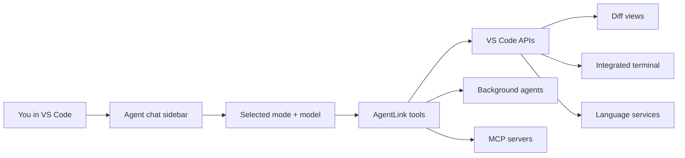

# AgentLink

An AI coding agent for VS Code with browser remote control.

AgentLink runs a built-in coding agent inside VS Code: chat in the sidebar, switch modes, run editor-native tools, review diffs inline, approve terminal commands, spawn background agents, search code semantically, and continue the same session from a browser. The built-in agent can also connect out to [MCP](https://modelcontextprotocol.io/) servers configured for your user or project.

## Why?

Most AI coding agents operate at the filesystem level — they read and write files directly, run commands in hidden subprocesses, and have no awareness of your editor. AgentLink routes agent work _through_ VS Code, unlocking capabilities that are impossible with raw filesystem access.

### What you get over built-in tools

| Capability                | Built-in tools              | AgentLink                                                                                                                                                                                                                            |
| ------------------------- | --------------------------- | ------------------------------------------------------------------------------------------------------------------------------------------------------------------------------------------------------------------------------------ |
| **File editing**          | Writes directly to disk     | Opens a **diff view** — you see exactly what's changing, can edit inline, and accept or reject. Format-on-save applies automatically.                                                                                                |
| **Terminal commands**     | Runs in a hidden subprocess | Runs in VS Code's **integrated terminal** — visible, interactive, with shell integration for output capture. Supports named terminals, parallel tasks, and **split terminal groups**.                                                |
| **Diagnostics**           | Not available               | Real **TypeScript errors, ESLint warnings**, etc. from VS Code's language services — returned after writes and available on-demand.                                                                                                  |
| **File reading**          | Raw file content            | Content plus **file metadata** (size, modified date), **language detection**, **git status**, **diagnostics summary**, and **symbol outlines** (functions, classes, interfaces grouped by kind).                                     |
| **Search**                | `grep`/`rg` via subprocess  | Same ripgrep engine with context lines, pagination, and multiple output modes.                                                                                                                                                       |
| **File listing**          | `find`/`ls` via subprocess  | Native listing with ripgrep's `--files` mode for fast recursive listing with automatic `.gitignore` support.                                                                                                                         |
| **Language intelligence** | Not available               | **Go to definition/implementation/type**, **find references**, **hover types**, **completions**, **symbols**, **rename**, **code actions**, **call/type hierarchy**, and **inlay hints** — all powered by VS Code's language server. |
| **Approval system**       | All-or-nothing permissions  | **Granular approval** — per-file write rules, per-sub-command pattern matching, outside-workspace path trust with prefix/glob/exact patterns, all in a dedicated approval panel.                                                     |
| **Follow-up messages**    | Silent rejection            | Every approval dialog includes a **follow-up message** field — returned to the agent as context on accept or as a rejection reason on reject.                                                                                        |

## Built-in Agent

The **Agent** view in the AgentLink activity bar is the primary coding experience.

### What the built-in agent does

- chats directly inside VS Code
- edits files through diff views instead of writing blindly to disk
- runs commands in the integrated terminal instead of hidden subprocesses
- uses VS Code diagnostics, symbol/navigation APIs, code actions, and rename support
- can switch between specialized modes for coding, planning, debugging, review, and lightweight Q&A
- can spawn background agents for parallel review or research
- can connect to MCP servers and use MCP tools from inside the built-in chat

### Modes

AgentLink includes these built-in modes:

| Mode        | What it is for                                                                             |
| ----------- | ------------------------------------------------------------------------------------------ |
| `code`      | Primary implementation mode: read, edit, run commands, navigate symbols, and use MCP tools |
| `architect` | Planning and design work with read/search/language tools and planning-oriented behavior    |
| `ask`       | Lightweight question answering with read/search tools only                                 |
| `debug`     | Investigation and troubleshooting with commands, language tools, and search                |
| `review`    | Focused code review mode with read/search/language tools and structured review output      |

In foreground sessions, mode instructions are delivered to the model inside the conversation (as `<current_mode>` blocks pinned at the point each mode became active) rather than baked into the system prompt, and the advertised tool list is the union across modes. This keeps the system prompt and tool definitions byte-stable across mode switches so the provider prompt cache — including the full conversation history — survives a switch instead of being reprocessed from scratch. Per-mode tool restrictions are still enforced: calling a tool outside the current mode's allowance is rejected at invocation with guidance to use `switch_mode`, and `execute_command` retains its runtime read-only policy in restricted modes.

When no workspace folder is open, AgentLink remains available as a projectless chat and defaults to an Ask-only mode. Projectless chats use global model, reasoning, and context settings and accept self-contained pasted or dropped images/PDFs, but they are intentionally non-persistent and expose no workspace files, path attachments, shell, editor tools, MCP, checkpoints, or approval controls. Open a folder to enable the workspace-backed modes and capabilities.

### How the built-in agent works



### Core built-in agent features

- **Independent chat tabs and editor pop-outs** — run multiple built-in agent sessions in stable VS Code chat tabs without switching interrupting active work. Any tab except the last docked tab can move into its own editor panel; popped layouts and session bindings restore across reloads, and closing a panel docks its tab again.
- **Inline approvals in chat** — command, write, rename, MCP, and mode-switch approvals render in the built-in chat UI. The separate approval panel provides a focused review surface for pending operations.
- **Session history and restore** — chat sessions are persisted and restored across VS Code reloads/startup.
- **Checkpoints and revert** — create workspace checkpoints and revert later. Checkpoints are stored in AgentLink’s own shadow git repo under `.agentlink/checkpoints/`, separate from your project’s real git history.
- **Slash commands** — built-ins include `/new`, `/mode`, `/model`, `/condense`, `/checkpoint`, `/revert`, `/help`, `/fleet`, `/skills`, `/mcp`, `/mcp-config`, `/mcp-refresh`, `/btw`, `/worktree`, and `/pair`. Custom commands and detected skills appear in the same picker.
- **`/btw` side questions** — `/btw <question>` asks a quick side question that forks the current conversation into a read-only session (no edits or commands), so you get an answer without polluting the main thread. The answer streams into a side panel with a visible turn/tool budget (max 5 API turns / 10 tool calls) and a Cancel button; when it finishes you can **Add to conversation** to promote the question and answer into the main transcript. Runs self-abort after a deadline if they stall. (Foreground surface only — not exposed on the read-only browser remote.)
- **`/worktree` parallel setup** — runs independently of an active foreground turn, so it can configure and open alternative work without queuing a message or interrupting the current agent. A bare `/worktree` opens a lightweight read-only text session in the Chat Activity Shelf; the setup agent can inspect the repository and ask simple follow-up questions there before presenting inline **Create & start** and **Create & prefill** actions. Supplying a task directly, such as `/worktree Prototype the passkey flow`, skips the questions and shows the same inline launch actions. Optional flags are `--task`, `--prompt`, `--branch`, `--base`/`--base-ref`, `--path`/`--worktree-path`, `--mode`, `--autosubmit`, and `--prefill`/`--no-autosubmit`. This local-window launcher is explicitly unavailable from the browser remote.
- **Background agents** — spawn parallel sub-agents for review and research, then inspect their result/transcript from the foreground session. The Agent Fleet panel hides itself when every agent finishes; run `/fleet` to reveal completed results again.
- **Auto-condense** — when context fills up, AgentLink condenses the conversation while deterministically reattaching the structured TODO list (including completed, in-progress, and pending status) so the agent can resume from the same plan.
- **Polish prompt** — a sparkle button in the composer toolbar rewrites your draft with the current provider's fast model before sending: it fixes spelling, grammar, and punctuation and tightens wording while preserving meaning, tone, code, file paths, `@`-mentions, and any leading slash command. The polished text replaces the draft in place (nothing is sent), a revert button restores exactly what you had typed, and a draft edited while the request was in flight is never overwritten. Available in both the VS Code chat and the browser remote; uses model quota.
- **Model picker + auth-aware UX** — model selection is built into the chat UI and can prompt for Anthropic or OpenAI/Codex auth as needed. For Anthropic, model metadata (available models, context window, output tokens, reasoning-effort options) is refreshed from the Anthropic API and merged over built-in defaults; the refresh is lazy (never on activation) and falls back to built-in static metadata when offline. Toggle with `agentlink.anthropic.dynamicModelCapabilities` (default on).

### Remote control and MCP integrations

- **Browser remote control** mirrors built-in agent sessions, approvals, questions, background activity, and read-only diff review through a stable local gateway URL.
- **Outbound MCP client** support lets the built-in agent discover and call tools, resources, and prompts from configured MCP servers.
- **Layered MCP configuration** supports user and project files under `.agents`, `.claude`, and `.agentlink`, with project configuration taking precedence.

## Installation

### Install script (recommended)

Download and install the latest release from GitHub:

```sh
curl -sL https://raw.githubusercontent.com/reefbarman/agentlink/main/scripts/install.sh | bash
```

Or clone the repo first and run it locally:

```sh
./scripts/install.sh
```

### Manual download

1. Go to the [latest release](https://github.com/reefbarman/agentlink/releases/latest)
2. Download the `.vsix` file
3. Install it:

   ```sh
   code --install-extension agentlink-*.vsix --force
   ```

### Build from source

```sh
git clone https://github.com/reefbarman/agentlink.git
cd agentlink
npm install && npm run build
npx @vscode/vsce package --no-dependencies --allow-star-activation
code --install-extension agentlink-*.vsix --force
```

After installing, reload VS Code and open the AgentLink activity bar.

### AgentLink Terminal requirements

The custom **AgentLink Terminal** currently requires a local macOS extension host and a compatible standalone Node.js runtime. AgentLink probes Node.js from the environment inherited by VS Code and from standard macOS installation paths. The probe starts the packaged PTY module, so incompatible architecture, native ABI, or code-signing combinations are rejected before the terminal is enabled.

If VS Code was launched from Finder and does not inherit the shell path used by a version manager such as fnm, nvm, or Volta, set `agentlink.terminal.nodePath` to the absolute standalone Node.js executable. Do not point it at VS Code's Electron executable.

When the dependency is missing or incompatible, AgentLink:

- does not register or show the custom AgentLink Terminal;
- shows one warning with **Configure Node Path**, **Install Node.js**, and **Retry** actions;
- routes built-in agent commands through the native VS Code terminal provider;
- continues to block command execution in untrusted workspaces.

A failure after a sandbox provider has been selected remains fail-closed; AgentLink never silently reruns that command outside the sandbox.

## Quick Start

### Use the built-in agent

1. Install the extension (see [Installation](#installation))
2. Open the **AgentLink** activity bar icon and select the **Agent** view
3. Pick a model if prompted and configure auth if needed:
   - **AgentLink: Sign In to OpenAI/Codex** for ChatGPT/Codex OAuth or OpenAI API-key-backed models
   - **AgentLink: Set OpenAI API Key** for direct OpenAI API key setup
   - **AgentLink: Set Anthropic API Key** for Anthropic models
   - To temporarily remove a provider from model selection and automatic routing without clearing credentials, add its ID to `agentlink.disabledProviders` (for example `["anthropic"]`; built-in IDs are `anthropic` and `codex`)
4. Start chatting in the sidebar
5. Switch modes as needed (`code`, `architect`, `ask`, `debug`, `review`)
6. Approve edits and commands inline when the agent requests them

Useful built-in workflows:

- use `/model` to switch models
- use `/mode` to switch behavior without starting over
- use `/condense` to manually compress context
- use `/checkpoint` before risky edits and `/revert` if needed
- use background agents for review/research from inside the chat UI

### Command palette workflows

Useful command-palette entries include:

- **AgentLink: Sign In to OpenAI/Codex**
- **AgentLink: Manage OpenAI/Codex Authentication**
- **AgentLink: Manage ChatGPT/Codex Accounts**
- **AgentLink: Add ChatGPT/Codex Account**
- **AgentLink: Switch Active ChatGPT/Codex Account**
- **AgentLink: Re-sign In / Replace ChatGPT/Codex Account**
- **AgentLink: Set OpenAI API Key**
- **AgentLink: Configure OpenAI-compatible Model**
- **AgentLink: Set OpenAI-compatible API Key** / **AgentLink: Clear OpenAI-compatible API Key**
- **AgentLink: Rebuild Codebase Index** / **AgentLink: Cancel Indexing**
- **AgentLink: Clear Built-In Agent Session Approvals**
- **AgentLink: Add Built-In Agent Trusted Command Pattern**
- **AgentLink: Complete Tool Call** / **AgentLink: Cancel Tool Call**

### Configure OpenAI-compatible models

Run **AgentLink: Configure OpenAI-compatible Model** for the guided setup path. Each run adds one model backed by one connection so the endpoint/router and credential binding stay explicit:

1. Choose **OpenRouter** or another compatible API root.
2. Select an existing named API key, create a new SecretStorage key inline, or choose no authentication for a custom/local endpoint.
3. Let AgentLink query the endpoint's `/models` catalog, then select a discovered model or enter the upstream model ID manually.
4. Review the context/output limits and declared tool, reasoning, and image capabilities before saving.

OpenRouter discovery maps bounded catalog metadata such as context length, tool parameters, reasoning efforts, and image input. Generic OpenAI-compatible catalogs often expose only model IDs, so AgentLink uses clearly labeled, editable conservative defaults: 32,768 context tokens, 4,096 output tokens, and chat-only text capabilities. Discovery is user-invoked and one-shot; AgentLink does not refresh provider catalogs in the background. Redirects, oversized catalogs, invalid endpoint URLs, and credential-bearing unsafe HTTP are rejected or explicitly gated.

The wizard is add-only and runs in VS Code. Edit or remove entries in User Settings JSON; use raw settings for advanced multi-model connections, custom headers, timeouts, or a separate auxiliary model. Browser Ask Agent receives the refreshed model catalog and credentials server-side but cannot create or edit configuration.

`agentlink.openaiCompatible.connections` is the underlying machine-scoped array of named OpenAI Chat Completions-compatible connections. Each connection owns its endpoint, auth/profile behavior, headers, timeout, and one or more nested models. Each model has two distinct IDs:

- `id` is AgentLink's globally unique, stable selector/session key and is never sent upstream.
- `model` is the opaque wire ID sent to that connection.

The following advanced Settings JSON example uses OpenRouter IDs verified against its model catalog on **2026-07-23**: `moonshotai/kimi-k2.7-code`, `deepseek/deepseek-v3.2`, and `google/gemma-4-31b-it`. Provider catalogs change; use the wizard or re-check IDs and declared limits/capabilities before copying this example later.

```jsonc
"agentlink.openaiCompatible.connections": [
  {
    "id": "openrouter",
    "displayName": "OpenRouter",
    "baseUrl": "https://openrouter.ai/api/v1",
    "profile": "openrouter",
    "authKey": "openrouter-main",
    "timeoutMs": 180000,
    "headers": {
      "HTTP-Referer": "https://example.invalid/my-agentlink-install"
    },
    "auxiliaryModel": "openrouter-deepseek",
    "models": [
      {
        "id": "openrouter-kimi-code",
        "model": "moonshotai/kimi-k2.7-code",
        "displayName": "Kimi K2.7 Code via OpenRouter",
        "contextWindow": 262144,
        "maxOutputTokens": 262144,
        "supportsToolUse": true,
        "supportsThinking": true,
        "reasoningEfforts": ["high"],
        "defaultReasoningEffort": "high",
        "supportsImages": true
      },
      {
        "id": "openrouter-deepseek",
        "model": "deepseek/deepseek-v3.2",
        "displayName": "DeepSeek V3.2 via OpenRouter",
        "contextWindow": 163840,
        "maxOutputTokens": 65536,
        "supportsToolUse": true,
        "supportsThinking": true,
        "reasoningEfforts": ["none", "low", "medium", "high"],
        "defaultReasoningEffort": "medium",
        "supportsImages": false
      },
      {
        "id": "openrouter-gemma",
        "model": "google/gemma-4-31b-it",
        "displayName": "Gemma 4 31B via OpenRouter",
        "contextWindow": 262144,
        "maxOutputTokens": 262144,
        "supportsToolUse": true,
        "supportsThinking": true,
        "reasoningEfforts": ["none", "low", "medium", "high"],
        "defaultReasoningEffort": "medium",
        "supportsImages": true
      }
    ]
  },
  {
    "id": "local-lm-studio",
    "displayName": "LM Studio",
    "baseUrl": "http://127.0.0.1:1234/v1",
    "profile": "generic",
    "models": [
      {
        "id": "local-loaded-model",
        "model": "loaded-model-id",
        "displayName": "Local loaded model",
        "contextWindow": 32768,
        "maxOutputTokens": 4096,
        "supportsToolUse": false,
        "supportsThinking": false,
        "supportsImages": false
      }
    ]
  }
]
```

Run **AgentLink: Set OpenAI-compatible API Key**, select `openrouter-main`, and enter the key in the password field. AgentLink stores it as `openaiCompatibleApiKey:openrouter-main` in VS Code SecretStorage; settings contain only the non-secret key name. Several connections/models may share an `authKey`, while independent connections can use different keys. Use **AgentLink: Clear OpenAI-compatible API Key** to delete one named key. Browser Ask Agent can use configured connections but cannot create or edit credentials.

Connection fields:

| Field               | Required | Behavior                                                                                                           |
| ------------------- | -------- | ------------------------------------------------------------------------------------------------------------------ |
| `id`                | yes      | Lowercase stable connection key; creates provider ID `openai-compatible:<id>`                                      |
| `displayName`       | yes      | Selector group label                                                                                               |
| `baseUrl`           | yes      | API root, normally `/v1`; no user-info/query/fragment; AgentLink appends `/chat/completions`                       |
| `profile`           | yes      | `generic` sends the minimal portable request; `openrouter` adds only verified OpenRouter fields/headers            |
| `authKey`           | no       | SecretStorage key name; omit for no-auth local servers                                                             |
| `timeoutMs`         | no       | Bounded whole-request timeout                                                                                      |
| `headers`           | no       | Bounded non-secret static headers; credential-bearing, transport-controlled, and CR/LF values are rejected         |
| `allowInsecureHttp` | no       | Required to send a stored credential over non-loopback HTTP; defaults to `false`                                   |
| `auxiliaryModel`    | no       | Local model ID from the same connection for condense/polish/detection/review helpers; defaults to the active model |
| `models`            | yes      | Non-empty nested model array                                                                                       |

Model fields:

| Field                        | Required | Behavior                                                                                                    |
| ---------------------------- | -------- | ----------------------------------------------------------------------------------------------------------- |
| `id`, `model`, `displayName` | yes      | Stable local ID, opaque wire ID, and selector label                                                         |
| `contextWindow`              | yes      | Declared positive context window used for budgeting                                                         |
| `maxInputTokens`             | no       | Optional stricter positive input limit                                                                      |
| `maxOutputTokens`            | yes      | Declared positive output limit                                                                              |
| `supportsToolUse`            | yes      | Controls function definitions and automatic agent/background eligibility; `false` models show **Chat only** |
| `supportsThinking`           | no       | Enables reasoning UI; defaults to `false`                                                                   |
| `reasoningEfforts`           | no       | Allowed AgentLink effort values when thinking is enabled                                                    |
| `defaultReasoningEffort`     | no       | Must be included in `reasoningEfforts`                                                                      |
| `supportsImages`             | no       | Enables standard `image_url` data-URI input; defaults to `false`                                            |

Security and compatibility notes:

- The setting is machine-scoped and user-owned. Workspace/resource overrides are not consumed, so workspace content cannot redirect a stored connection credential.
- Authenticated endpoints use HTTPS or loopback HTTP unless `allowInsecureHttp: true` is explicit. Model POSTs use manual redirect handling and reject every redirect.
- Secrets and private runtime profiles never enter settings, logs, errors, activity traces, transcripts, browser snapshots/SSE/exports, or browser JavaScript.
- `generic` does not send reasoning controls, `stream_options`, parallel-tool controls, routing extensions, or hosted provider tools. `openrouter` maps AgentLink effort to OpenRouter reasoning and adds `X-OpenRouter-Title: AgentLink` and `X-OpenRouter-Categories: ide-extension`; `HTTP-Referer` remains user-configured.
- Capabilities are declarations, not probes. A server/model template may still emit malformed tool calls; AgentLink validates completed arguments as JSON objects before execution.
- Missing usage is locally estimated and marked; `finish_reason: "length"` preserves partial output and surfaces truncation instead of pretending the turn ended normally.
- Direct-provider model IDs can be short-lived or deprecated. The wizard performs bounded, user-invoked `/models` discovery with manual fallback; it does not probe capabilities with chat requests or refresh catalogs automatically after setup.
- The window-scoped `agentlink.openaiCompatible.baseUrl`, `.model`, `.apiKey`, and `.timeoutMs` settings configure the shared helper endpoint for optional question detection and background-agent summaries. Their plaintext `.apiKey` is never used by configured chat connections.

### Built-in chat entry points

You can push editor context into the built-in agent without copy/paste:

- **AgentLink: Add File to Chat** — attach the current file (also available from editor and explorer context menus)
- **AgentLink: Add Selection to Chat** — inject the current editor selection with file/line context
- **Explain with AgentLink** — ask the built-in agent to explain the current selection
- **Fix with AgentLink** — send selected diagnostics/issues to the built-in agent as a fixing prompt

### Custom modes and slash commands

AgentLink supports both project-level and user-level customization for the built-in agent.

**Custom modes** are project-level only and are loaded from these files, in ascending priority:

- `.agents/modes.json`
- `.claude/modes.json`
- `.agentlink/modes.json`

Later files override earlier ones for the same mode slug. Custom modes can also override built-in modes like `code` or `review`.

Four low-adoption language-server tools are hidden from ordinary modes so their schemas and calls do not consume routine agent context: `get_completions`, `get_inlay_hints`, `get_code_actions`, and `apply_code_action`. They remain registered for controlled benchmarking. To expose them, define an explicit project mode such as:

```json
[
  {
    "slug": "language-benchmark",
    "name": "Language Benchmark",
    "toolGroups": ["read", "language", "language-benchmark"]
  }
]
```

The `language-benchmark` group is opt-in; adding it back to normal modes defeats the experiment. AgentLink also rejects a tool call unless that tool appeared in the exact provider request for the current turn.

**Custom slash commands** are loaded from these directories, again with later sources taking precedence:

- `~/.agents/commands/`
- `~/.claude/commands/`
- `~/.agentlink/commands/`
- `.agents/commands/`
- `.claude/commands/`
- `.agentlink/commands/`

This lets you define reusable prompts/workflows for the built-in agent while keeping project-specific commands in the repo.

Detected skills are also exposed as slash commands in the built-in chat. Skills loaded from `~/.agents/skills/`, `~/.claude/skills/`, `~/.agentlink/skills/`, `.agents/skills/`, `.claude/skills/`, `.agentlink/skills/`, and their `skills-<mode>/` variants appear as `/<name>` with a `Skill` badge. Selecting one sends a prompt that asks the agent to load that skill with `load_skill` and follow its instructions. Use `/skills` to open the AgentLink output channel with the skills detected for the current mode, including their resolved `SKILL.md` paths.

### Connect the built-in agent to MCP servers

Use `/mcp` to open the shared MCP Manager, `/mcp-config` to open its configuration-oriented view, and `/mcp-refresh` to explicitly reconnect configured servers. Ordinary tool, resource, and prompt catalog changes advertised by a connected server are loaded automatically without `/mcp-refresh`, including every paginated catalog page. The manager is available in both VS Code and Browser Ask Agent with four focused views:

In a multi-project workspace, the main agent receives the union of the effective MCP servers from every available workspace folder. Repeated effective definitions—most commonly the same inherited global server—are connected once. If projects define genuinely different servers under the same name, AgentLink assigns stable project-qualified runtime names so both tool catalogs remain available instead of applying workspace-folder precedence. The MCP Manager remains one panel and provides a project selector for inspecting and editing each project's layered sources and status.

- **Overview** joins saved configuration with connection status, tool/resource/prompt counts, source scope, inherited overrides, secret-key presence, and persistent enabled/disabled state.
- **Sources** shows every layered file in precedence order, including exact path, read health, editable/read-only state, and raw-open actions where the surface supports them.
- **Guided setup** supports Local process (`stdio`), HTTP, and legacy SSE servers. Arguments are exact array elements—one row/line per argument or a JSON string array—so quoted values and paths containing spaces are preserved.
- **Import JSON** parses one or many servers into a review step before writing. Valid rows can be selected and conflicts must explicitly **Skip**, **Replace**, or **Rename**.

For each project, the main agent merges MCP server definitions from these files in ascending priority, then combines the effective per-project results across the workspace:

1. `~/.agents/mcp.json`
2. `~/.claude/mcp.json`
3. `~/.agentlink/mcp.json`
4. `<workspace>/.agents/mcp.json`
5. `<workspace>/.claude/mcp.json`
6. `<workspace>/.agentlink/mcp.json`

AgentLink writes structured changes only to editable `.agentlink/mcp.json` sources. Main-profile saves target the project selected in the MCP Manager or the global AgentLink source; Browser Ask Agent uses its dedicated `~/.agentlink/ask-agent/mcp.json` source. Higher-priority explicit fields override inherited values. An inherited server can be edited by creating an AgentLink-owned override rather than changing `.agents` or `.claude` files.

Each file normally uses an `mcpServers` object. For example:

```json
{
  "mcpServers": {
    "example": {
      "command": "example-mcp-server",
      "args": ["--stdio"],
      "toolPolicy": "ask",
      "supportsParallelToolCalls": false,
      "disabled": false
    }
  }
}
```

JSON import also accepts a `servers` wrapper, one named server object, or a bare name-to-server map. JSONC, a UTF-8 BOM, and one complete `json`/`jsonc` Markdown fence are accepted. `serverUrl` is normalized to `url`, `streamable-http` is normalized to `http`, and unambiguous missing transports are inferred. Unknown client-specific fields are reported as **Not imported** instead of being silently written.

Guided and imported writes are revision-checked and committed as one atomic batch. If another process changes a relevant source, AgentLink returns `config_changed` rather than overwriting it. Structured writes preserve unrelated top-level keys and servers, but normalize JSONC comments and trailing commas to formatted JSON; use **Open raw** when comment preservation matters.

Environment variables and HTTP headers are masked in the UI, but masking is visual only: values remain plaintext in the selected configuration file. Prefer `${VAR}` references; AgentLink expands them in env and header values at runtime. Stored secret values are never returned to the manager—only key names and source metadata are shown—and edits require explicit preserve, patch, replace, or remove intent. URL userinfo is rejected. Command arguments and URL query strings are ordinary visible configuration and should not contain credentials.

Saving and connecting are reported separately. A valid configuration remains saved when a server is offline or needs authentication. Disabling a server writes `disabled: true`, removes its tools from the runtime, and survives refresh/reload; enabling writes `disabled: false` and reconnects it.

Tool execution preserves the model's call order with barriers around non-parallel operations. Adjacent native read/search/web, background-spawn, and terminal command calls run concurrently; terminal routing gives overlapping implicit commands separate busy channels. MCP tools run concurrently when the tool advertises the protocol's read-only annotation. Other MCP calls remain sequential unless you set `supportsParallelToolCalls: true` for the server, or enable **Server supports parallel tool calls** in Advanced settings, when that server safely accepts concurrent calls. The opt-in applies to directly disclosed tools and deferred `call_mcp_tool` calls for that server.

Browser Ask Agent keeps extension-hosted MCP execution and credentials. Browser main-profile configuration is read-only. Loopback Browser Ask Agent sessions may configure local-process servers and secret-bearing env/header changes; LAN browser sessions may configure only secret-free HTTP/SSE servers. Raw config opening is unavailable from the browser.

AgentLink can progressively disclose large MCP catalogs and applies the same session/project/global approval model to connected servers and tools. Session MCP grants persist with restored chats, while project/global choices are confirmed only after their MCP config update succeeds. Connected tool results preserve server-declared errors, structured content, annotations, protocol metadata, embedded resources, and resource links. Structured-only results are serialized into model-visible text, while unsupported audio/binary payloads remain bounded placeholders rather than unbounded base64 text.

The outbound client identifies itself with the installed AgentLink version and advertises only implemented capabilities. AgentLink does not advertise deprecated MCP roots or server-initiated sampling. Form elicitation supports strings (including email, URI, date, and date-time formats), numbers, integers, booleans, titled or untitled single-selects, and titled or untitled multi-selects. Defaults and field constraints are applied and validated by shared controls in VS Code chat and VS Code-backed browser sessions. Browser Ask Agent's helper-owned MCP session does not currently expose form or URL elicitation.

## Web Access

AgentLink provides native `web_search` and `web_fetch` tools for the built-in VS Code agent and Browser Ask Agent. Search and fetch are configured independently and default to `native`.

The model still decides whether a turn needs web access. Enabling a native tool only makes it available; it does not force a search or fetch on every turn.

### Independent tool selection

Configure each AgentLink-native tool separately:

| Selection  | Behavior                                                                                                                                                                       |
| ---------- | ------------------------------------------------------------------------------------------------------------------------------------------------------------------------------ |
| `native`   | Expose the AgentLink `web_search` or `web_fetch` tool. AgentLink executes it through the selected provider's fastest supported native web transport.                           |
| `mcp`      | Hide the corresponding AgentLink-native tool. Ordinary connected MCP tools remain available with their own names, schemas, inputs, outputs, disclosure, and approval behavior. |
| `disabled` | Hide the corresponding AgentLink-native tool. Unrelated MCP tools are unaffected.                                                                                              |

`mcp` does **not** select a specific MCP tool, wrap an MCP call in `web_search`/`web_fetch`, adapt MCP schemas, or automatically switch backends. It simply removes that AgentLink-native tool from the model's available tool list. If a suitable MCP tool is connected and disclosed, the model can call it normally.

For example, to prefer SearXNG or another MCP tool for discovery while keeping provider-native page access:

```jsonc
{
  "agentlink.webAccess.searchBackend": "mcp",
  "agentlink.webAccess.fetchBackend": "native",
}
```

This hides AgentLink's `web_search`, leaves ordinary MCP search tools available, and still exposes AgentLink's provider-backed `web_fetch`.

### Native provider execution

AgentLink's native tools are ordinary function tools from the model's perspective. When one is called, AgentLink uses the selected provider's fastest supported native web transport and returns a normalized result through the standard tool-result path.

- **Anthropic API-key models** can use hosted search and hosted page fetch where the selected model/transport advertises support.
- **ChatGPT/Codex OAuth** first uses the same structured standalone search route as Codex CLI for search, exact-URL open, and find-in-page. This avoids a second model completion, applies result/content limits locally, and falls back automatically to constrained hosted search if the alpha route is unavailable or changes.
- **OpenAI public API-key Responses** uses hosted search. Page open and find-in-page are actions of the combined hosted search capability, so AgentLink delegates `web_fetch` through that capability rather than sending a separate provider `web_fetch` definition.
- Unsupported native routes, including routes whose configured domain restrictions cannot be enforced, are omitted from that turn's tool list. Unrelated chat continues normally.
- AgentLink never silently switches an unsupported native operation to MCP.

Provider-hosted execution occurs in the runtime that owns the model request: the extension for VS Code sessions and helper/core for Browser Ask Agent. Browser page JavaScript never performs web fetches and never receives provider credentials.

### Transcript behavior

Native web operations render exactly like other tool calls:

- the tool name is `web_search` or `web_fetch`;
- the complete normalized input is visible in the expandable **Input** section;
- the complete normalized result is visible in the **Result** section;
- Browser Ask Agent transcript export includes both input and result;
- ordinary MCP web tools continue to render under their original MCP tool names with their original inputs and results.

Legacy persisted provider web-activity events are projected into ordinary `web_search`/`web_fetch` tool calls for compatibility. Provider-private replay data, encrypted blocks, and credentials are excluded from chat projections, browser snapshots, SSE, logs, and transcript exports.

### Settings

| Setting                                     | Default   | Purpose                                                                          |
| ------------------------------------------- | --------- | -------------------------------------------------------------------------------- |
| `agentlink.webAccess.searchBackend`         | `native`  | Select `native`, `mcp`, or `disabled` for AgentLink's `web_search`.              |
| `agentlink.webAccess.fetchBackend`          | `native`  | Select `native`, `mcp`, or `disabled` for AgentLink's `web_fetch`.               |
| `agentlink.webAccess.nativeSearchMode`      | `cached`  | Select `cached`, `indexed`, or `live` external access where supported.           |
| `agentlink.webAccess.allowedDomains`        | `[]`      | Optional native-provider domain allowlist; mutually exclusive with the denylist. |
| `agentlink.webAccess.blockedDomains`        | `[]`      | Optional native-provider domain denylist; mutually exclusive with the allowlist. |
| `agentlink.webAccess.maxSearchUsesPerTurn`  | `5`       | Requested native-provider search-use limit where supported.                      |
| `agentlink.webAccess.maxFetchUsesPerTurn`   | `3`       | Requested native-provider fetch-use limit where supported.                       |
| `agentlink.webAccess.maxFetchContentTokens` | `25000`   | Requested native-provider fetched-content token cap where supported.             |
| `agentlink.webAccess.maxReplayBytesPerTurn` | `5242880` | Maximum private provider replay retained when exact continuation requires it.    |

Domain restrictions apply only to native provider routes and fail closed when the provider transport cannot represent them. Limits are applied only when the provider advertises enforceable support; diagnostics report effective enforcement.

### Cost, privacy, and trust

- Provider-hosted web requests may incur **additional provider charges**. MCP servers and upstream search services may have their own costs or quotas.
- Native search queries, URLs, and fetched content are sent to the selected model provider. MCP tool calls are sent according to that MCP server's own implementation and trust boundary.
- Search results and fetched pages are **untrusted external model input**. AgentLink's delegated executor is instructed not to follow embedded prompts, reveal secrets, modify files, or perform unrelated work.
- A self-hosted SearXNG server improves control over the AgentLink-to-server hop, but it does not make SearXNG's upstream search-engine requests private by itself.
- Native result envelopes include normalized provider, operation, input, activity, content, citation, and usage fields when available. They do not include provider-private replay metadata.

To hide both AgentLink-native web tools:

```jsonc
{
  "agentlink.webAccess.searchBackend": "disabled",
  "agentlink.webAccess.fetchBackend": "disabled",
}
```

This does not disable unrelated connected MCP tools.

## Semantic Codebase Search Setup

Semantic search powers `codebase_search` plus the `query` parameter on `read_file` and `list_files`. It uses a local Qdrant vector database for the code index and OpenAI embeddings for indexing and queries.

### Requirements

- Qdrant running locally or remotely
- OpenAI authentication configured in AgentLink
- `agentlink.semanticSearchEnabled` set to `true`

### 1. Set up Qdrant

The default Qdrant URL is:

```text
http://localhost:6333
```

The quickest way to run Qdrant locally is Docker:

```sh
docker run -p 6333:6333 -p 6334:6334 qdrant/qdrant
```

If you already run Qdrant elsewhere, point AgentLink at it with the `agentlink.qdrantUrl` setting.

### 2. Configure OpenAI authentication

Semantic indexing and search need embedding auth. In VS Code, run:

- **AgentLink: Sign In to OpenAI/Codex** to use ChatGPT/Codex OAuth or an OpenAI API key
- or **AgentLink: Set OpenAI API Key** if you want to store an API key directly

You can also provide `OPENAI_API_KEY` in the environment.

### 3. Enable semantic search

Set these VS Code settings:

```jsonc
{
  "agentlink.semanticSearchEnabled": true,
  "agentlink.qdrantUrl": "http://localhost:6333",
  "agentlink.autoIndex": true,
}
```

- `agentlink.semanticSearchEnabled` turns on semantic indexing and search
- `agentlink.qdrantUrl` points to your Qdrant instance
- `agentlink.autoIndex` rebuilds the workspace index automatically on startup when semantic search is enabled

### 4. Build the codebase index

Once semantic search is enabled, use either of these entry points:

- Sidebar button: **Index Codebase** / **Rebuild Index**
- Command palette: **AgentLink: Rebuild Codebase Index**

If indexing is already running, use **AgentLink: Cancel Indexing**.

### 5. Query the index

After indexing completes, agents can use:

- `codebase_search` for semantic code search
- `read_file` with `query` to jump to the most relevant section of a file
- `list_files` with `query` to find files by meaning instead of path/glob

### Notes

- Index data is workspace-specific.
- `agentlink.indexExclusions` adds extra glob-based exclusions on top of `.gitignore`.
- `agentlink.chunkGranularity` controls indexing detail: `standard` is cheaper, `fine` gives better granularity.
- If you are following Roo Code's Qdrant docs, the same Qdrant setup applies here; the AgentLink-specific pieces are enabling `agentlink.semanticSearchEnabled` and configuring OpenAI auth inside AgentLink.

## Upgrading from the retired external-agent integration

Current AgentLink releases no longer run an inbound MCP server, auto-configure external agents, inject instruction blocks, or install enforcement hooks. On activation, AgentLink performs a conservative one-time cleanup of artifacts it can identify as AgentLink-owned:

- AgentLink MCP entries in supported external-agent configuration files
- AgentLink-managed instruction blocks delimited by `<!-- BEGIN agentlink -->` and `<!-- END agentlink -->`
- AgentLink-owned `enforce-agentlink.sh` / `enforce-agentlink.ps1` hook references and scripts

Cleanup preserves unrelated servers, instructions, hooks, and user-owned same-name scripts. If a target cannot be updated, AgentLink reports the failing target and error in the AgentLink output channel; use the manual fallback below.

Manual fallback:

1. Remove only the `agentlink` MCP server entry from the reported external-agent config file.
2. Remove only the AgentLink-delimited instruction block; keep surrounding user content.
3. Remove AgentLink hook entries that invoke `enforce-agentlink.sh` or `enforce-agentlink.ps1`.
4. Delete a hook script only when its contents identify it as AgentLink-owned.

Do not add those retired entries back. To connect the built-in agent to third-party MCP servers, use the layered `mcp.json` configuration described in [Connect the built-in agent to MCP servers](#connect-the-built-in-agent-to-mcp-servers).

## Tool runtime model

The built-in agent uses AgentLink's editor-native tools for file access, diff-based edits, terminals, diagnostics, language intelligence, semantic search, approvals, and orchestration. MCP meta tools separately let the built-in agent consume tools, resources, and prompts from connected third-party MCP servers.

When a connected MCP server requests URL elicitation, AgentLink shows an explicit browser-flow prompt in both the VS Code chat and browser gateway. URLs are never auto-opened; only `http` and `https` URLs are accepted, and local/private network targets are called out before the user proceeds.

## Tools

The tools below are available to the built-in agent according to its active mode and capability profile. Some development or orchestration tools are intentionally exposed only in specific modes.

### web_search

Search the public web through the selected model provider's native web transport. This AgentLink-native tool is exposed only when `agentlink.webAccess.searchBackend` is `native` and the selected provider transport supports search. Codex OAuth uses its low-latency standalone route and falls back to hosted search if needed.

| Parameter     | Type                               | Description                                   |
| ------------- | ---------------------------------- | --------------------------------------------- |
| `query`       | string                             | Required web search query.                    |
| `max_results` | number?                            | Optional requested result count from 1 to 20. |
| `language`    | string?                            | Optional language code such as `en` or `fr`.  |
| `time_range`  | `day`, `week`, `month`, or `year`? | Optional recency preference.                  |
| `safe_search` | `off`, `moderate`, or `strict`?    | Optional safe-search preference.              |

Response details:

- `backend` is `provider` for native execution.
- `provider` identifies the provider used for the request.
- `operation` is `search`.
- `input` contains the complete original normalized input.
- `activities` contains provider-visible search/open/find lifecycle data when available.
- `content` contains the provider's useful search findings.
- `citations` contains normalized source metadata when available.
- `usage` contains provider token/server-tool usage when exposed by the transport. The Codex standalone route does not currently report token usage.
- Provider-private replay/encrypted metadata is never included.

Structured result counts are capped locally. Any delegated fallback is constrained to hosted web execution, receives no normal client tools, and treats retrieved content as untrusted data.

### web_fetch

Open and read a public HTTP or HTTPS URL through the selected model provider's native page-access transport. This AgentLink-native tool is exposed only when `agentlink.webAccess.fetchBackend` is `native` and the provider can perform page access.

For Codex OAuth, page open and find-in-page are direct standalone search commands. OpenAI API-key requests and compatibility fallback use the combined hosted `web_search` capability rather than sending a separate provider `web_fetch` definition.

| Parameter    | Type    | Description                                            |
| ------------ | ------- | ------------------------------------------------------ |
| `url`        | string  | Required absolute HTTP or HTTPS URL.                   |
| `max_length` | number? | Optional requested maximum visible content characters. |
| `section`    | string? | Optional heading or section to focus on.               |
| `find`       | string? | Optional text or pattern to locate within the page.    |

Response details:

- `backend` is `provider` for native execution.
- `provider` identifies the provider used for the request.
- `operation` is `fetch`.
- `input` contains the complete original normalized input.
- `activities` contains provider-visible page-open/find lifecycle data when available.
- `content` contains the relevant visible page content.
- `citations` contains normalized source/final-URL metadata when available.
- `usage` contains provider token/server-tool usage when exposed by the provider client.
- Provider-private replay/encrypted metadata is never included.

The tool rejects non-HTTP(S) URLs, applies domain policy before transport, and enforces the lower of `max_length` and the configured fetched-content limit locally on the Codex standalone path. A delegated fallback is instructed to open the exact URL and not search for alternatives except when following that URL's redirect is required.

### compose (development builds only)

Run a bounded JavaScript function body that calls native read-only AgentLink tools and returns a reduced JSON-compatible result in one model-visible tool phase. Use it for dependent fan-out/filter/aggregate workflows where intermediate results should stay out of model context. Do not use it for exploratory work where each result changes the next step, pure shell pipelines, or small one-off calls.

| Parameter     | Type    | Description                                                                      |
| ------------- | ------- | -------------------------------------------------------------------------------- |
| `script`      | string  | JavaScript function body (1–65,536 bytes). Top-level `return` is supported.      |
| `description` | string? | Optional one-line intent shown in the parent tool card (maximum 200 characters). |

The isolated QuickJS-WASM context exposes two synchronous guest helpers backed by the async host bridge:

```js
const refs = tool("get_references", {
  path: "src/api.ts",
  line: 20,
  column: 10,
});
const hovers = toolAll(
  refs.references.slice(0, 16).map((ref) => ({
    name: "get_hover",
    input: { path: ref.path, line: ref.line, column: ref.column },
  })),
);
return hovers.filter((hover) => hover.contents?.length);
```

- `tool(name, input)` returns the child tool's canonical structured `data` value or throws a structured script error.
- `toolAll([{ name, input }, ...])` performs one host-side batch with concurrency 4 and preserves input order. Guest `Promise.all` over `tool()` calls is not supported.
- Composable tools are `get_context`, `get_repo_map`, `get_module_neighbors`, non-semantic `list_files`, regex-only `search_files`, `get_diagnostics`, `go_to_definition`, `go_to_implementation`, `go_to_type_definition`, `get_references`, `get_symbols`, `get_hover`, `get_completions`, `get_code_actions`, `get_call_hierarchy`, `get_type_hierarchy`, and `get_inlay_hints`.
- Child names must also be present in the exact provider request that invoked `compose`. Nested compose, MCP, shell, background/fleet, writes, media, transcript recall, editor UI, semantic search variants, and interactive controls are rejected.
- Outside-workspace child paths are limited to AgentLink temporary artifacts and paths already trusted before composition. Compose never opens approval, question, diff, mode, or editor UI.
- Limits: 64 child calls, 16 descriptors per `toolAll`, 32 MiB QuickJS memory, 60 seconds, 1 MiB canonical data per child, 8 MiB cumulative child data, 40 KiB final serialized return, and a bounded UI-only child trace.
- The 40 KiB ceiling applies only to the final serialized value returned to the model, not to child data processed inside the sandbox. It bounds model-context, transcript, persistence, and UI costs and prevents fan-out scripts from returning their full intermediate dataset instead of a reduced answer.
- An oversized final value returns a bounded serialization error rather than discarding all diagnostics. The error includes actual/limit byte counts, an 8 KiB UTF-8-safe preview, bounded child names/statuses and omitted-child count, plus bridge metrics. Reduce/filter the result instead of raising the ceiling or repeating the same fan-out.
- Failures return `isError: true` with a canonical error kind such as `validation`, `policy`, `budget_exhausted`, `child_failed`, `serialization`, `memory_limit`, `timeout`, `aborted`, `script_error`, or `internal`. The parent trace remains visible after session restore in both VS Code and mirrored browser sessions.

`compose` is available only when the extension is built with `DEV_BUILD=true`. It is foreground-only and is not exposed to background profiles or standalone projectless browser Ask Agent.

### read_file

Read file contents with line numbers. Returns rich metadata that built-in read tools cannot provide. Supports text files, local images, and PDF text extraction.

| Parameter                | Type     | Description                                                                                                                                        |
| ------------------------ | -------- | -------------------------------------------------------------------------------------------------------------------------------------------------- |
| `path`                   | string   | File path (absolute or relative to workspace root)                                                                                                 |
| `offset`                 | number?  | Starting line number (1-indexed, default: 1)                                                                                                       |
| `limit`                  | number?  | Maximum lines to read (default: 2000)                                                                                                              |
| `include_symbols`        | boolean? | Include top-level symbol outline (default: true)                                                                                                   |
| `query`                  | string?  | Semantic search query to jump to the most relevant section. Auto-sets offset using the codebase index. Ignored if `offset` is explicitly provided. |
| `anchor`                 | string?  | Literal anchor text to locate and jump near. Ignored if `offset` is explicitly provided.                                                           |
| `anchor_regex`           | string?  | Regex anchor pattern to locate and jump near. Ignored if `offset` is explicitly provided.                                                          |
| `anchor_offset`          | number?  | Line offset applied after anchor/semantic match (e.g. `-20` for context above).                                                                    |
| `auto_follow_suggestion` | boolean? | If `path` is not found and exactly one high-confidence suggestion exists, automatically read that suggested file and include resolution metadata.  |

**Response includes:**

- `total_lines`, `showing`, `truncated` — pagination info
- `size` (bytes), `modified` (ISO timestamp) — file metadata
- `language` — detected from open document or file extension (~80 extensions mapped)
- `git_status` — `"staged"`, `"modified"`, `"untracked"`, or `"clean"` (via VS Code's git extension)
- `diagnostics` — `{ errors: N, warnings: N }` summary from language services
- `symbols` — top-level symbols grouped by kind (e.g. `{ "function": ["foo (line 1)"], "class": ["Bar (line 20)"] }`). Automatically skipped for JSON/JSONC files.
- `content` — numbered lines in `line_number | content` format
- `semantic_match` — when an eligible `query` is used: successful `{ query, startLine, endLine }` metadata, `status: "not_found"` with default-offset and literal-anchor guidance when lookup produces no match, or `status: "not_run_structured_redaction"` for protected config files
- `anchor_match` — when `anchor`/`anchor_regex` is used: match metadata (or `status: "not_found"`)
- `redaction` — present when automatic structured-secret protection redacts values or withholds malformed eligible JSON/JSONC; reports only a count or status, never matched key names

For conservative settings/config paths such as `.vscode/settings.json`, `.agentlink/*.json`, `mcp.json`, and `*.config.json`, high-confidence secret values are replaced before pagination and literal/regex anchor matching. Semantic `query` lookup is not run for these eligible files. Comments, formatting, line positions, and newline sequences are preserved; malformed eligible JSON/JSONC is withheld. Ordinary JSON data, fixtures, and source files are not scanned. File `size` and `modified` metadata still describe the original file bytes. This protection is specific to these read surfaces and does not imply redaction in shell or search-tool output.

Fields like `git_status`, `diagnostics`, and `symbols` are omitted when not available rather than returned as null.

**Image support:** Local image files (`.png`, `.jpg`, `.jpeg`, `.gif`, `.webp`, `.bmp`, `.ppm`) are returned as base64-encoded `image` content that the agent can view directly. BMP and PPM (P3/P6) files are converted to PNG first. Max image size: 10 MB.

**PDF support:** Local `.pdf` files are parsed to extracted text and returned in the same numbered-line JSON shape as text files, with `file_type: "pdf"`. Max PDF size: 50 MB. `offset` and `limit` apply to extracted text lines.

**Friendly errors:** `ENOENT` → `"File not found: {path}. Working directory: {root}"`, `EACCES` → `"Permission denied"`, `EISDIR` → `"Use list_files instead"`. When `auto_follow_suggestion` succeeds, the response includes suggestion/resolution metadata showing the requested path and followed file.

### get_context

Build a compact read-only context pack for an explicit file. Prefer this over `read_file` for first-pass orientation when the file path is already known; use `read_file` when you need exact file content, local images/PDFs, complete temp outputs, a specific large line slice, or semantic in-file jumping via `query`. This is intended to collapse the common orientation sequence into one bounded response while tracking whether the same content range has already been returned in the current session.

| Parameter                  | Type     | Description                                                                                           |
| -------------------------- | -------- | ----------------------------------------------------------------------------------------------------- |
| `path`                     | string   | File path to build context for. Directory paths are not bulk-read.                                    |
| `offset`                   | number?  | Starting line number for the content slice (1-indexed, default: 1).                                   |
| `limit`                    | number?  | Maximum content lines to include (default: 200, capped at 400).                                       |
| `dedupe_unchanged_content` | boolean? | When true, omit content for an unchanged exact range already returned in this session. Default false. |
| `refresh`                  | boolean? | When true, include content even if unchanged-content dedupe would otherwise omit it.                  |

**Response includes:**

- `path`, `total_lines`, `showing`, `truncated` — target and pagination info
- `size`, `modified`, `language`, `git_status` — file metadata when available
- `diagnostics` — `{ errors: N, warnings: N }` summary when diagnostics exist
- `symbols` — compact document symbol outline when language services provide one
- `working_set` — `status`, `content_hash`, optional `previous_content_hash`, `range`, `should_include_content`, and `last_read_at`
- `content` — numbered lines, omitted only when `working_set.should_include_content` is false
- `redaction` — the same targeted settings/config JSON/JSONC protection metadata as `read_file`, when applicable

Structured-secret redaction is applied before content ranges are returned. The working-set hash, file size, and modification metadata remain based on the original bytes, so dedupe and change detection are not weakened by redaction.

Working-set statuses are `new`, `unchanged`, `changed`, and `omitted_unchanged`. Omission is opt-in and exact-range only; overlapping ranges and full-file reads are tracked independently so callers do not lose content they have not explicitly received.

### get_repo_map

Read the structural repo-map sidecar as a budgeted whole-project or scoped skeleton. Use this before broad edits to understand module boundaries and high-level dependency shape, then drill into specific files with `get_module_neighbors` when you need exact imports/dependents.

| Parameter          | Type     | Description                                                                                                         |
| ------------------ | -------- | ------------------------------------------------------------------------------------------------------------------- |
| `path`             | string?  | Optional workspace-relative or absolute file/directory path to scope the map. Omit for the first workspace root.    |
| `max_chars`        | number?  | Hard output budget in characters for the JSON payload (default 20,000; minimum 2,000; capped at 60,000).            |
| `max_files`        | number?  | Maximum file skeleton entries to include before budget truncation (default 200; capped at 1,000).                   |
| `include_external` | boolean? | Include summarized external dependency specifiers (default true). Set false to reserve budget for internal modules. |

**Response includes:**

- `workspace_root`, `cache` — sidecar identity and cache location when available
- `freshness.graph` — sidecar availability, generated timestamp, cache version, and indexed file count
- `scope` — requested scope path and number of indexed files matched
- `totals` — aggregate counts for files, imports, internal imports, external imports, exports, and symbols
- `directories` — budgeted directory summaries sorted by file count
- `external_dependencies` — budgeted external specifier summaries by importer count (omitted when `include_external: false`)
- `files` — budgeted file/module skeletons: path, language, internal imports, external imports, exports, top-level symbols, and reverse import count
- `budget` — requested budget, final serialized character count, truncation flag, and omitted counts
- `note` — present for missing sidecar or empty scope cases

The tool is intentionally static and budgeted. It is best for orientation, module-boundary discovery, and deciding where to inspect next; use `get_module_neighbors` for a complete single-file neighborhood and LSP tools for symbol-precise semantics. Requires the codebase index/structural sidecar to be built.

### get_module_neighbors

Read the structural repo-map sidecar for a single source/config file. Use this after `get_context` when you need module-level blast-radius awareness before editing: what the file imports, what it exports, which indexed modules import it, and what top-level symbols it declares.

| Parameter     | Type    | Description                                                                                                   |
| ------------- | ------- | ------------------------------------------------------------------------------------------------------------- |
| `path`        | string  | Source/config file path (absolute or relative to workspace root)                                              |
| `max_results` | number? | Maximum items to return in each list: `imports`, `exports`, `symbols`, and `dependents` (default 50, max 200) |

**Response includes:**

- `path`, `workspace_root`, `cache` — target and sidecar cache identity
- `freshness.target` — `fresh`, `stale`, `missing_from_graph`, `target_missing`, or `unknown`, with hashes when available
- `freshness.graph` — sidecar availability, generated timestamp, cache version, and file count
- `imports` — bounded list of static/reexport/require/dynamic imports with specifiers, resolved relative paths, imported names, and line numbers
- `exports` — bounded list of named/default/reexport/CommonJS exports
- `symbols` — bounded top-level symbols recorded by the structural extractor
- `dependents` — bounded reverse module dependencies: indexed files whose resolved imports point at the target
- `note` — omitted when the sidecar and target are usable; present for missing/stale graph cases

This is a static module graph, not an LSP-precise symbol reference query. Use language tools such as `get_references`, `go_to_definition`, and `get_call_hierarchy` when exact symbol semantics matter. Requires the codebase index/structural sidecar to be built.

### load_skill

Load the full contents of an AgentLink skill file that was explicitly advertised in the current built-in agent system prompt. This is intentionally not a general-purpose file reader: it only accepts skill paths that were listed for the active session.

| Parameter | Type   | Description                                |
| --------- | ------ | ------------------------------------------ |
| `path`    | string | Advertised skill file path to load exactly |

Returns the skill file content and metadata needed for the agent to follow the skill instructions.

### load_rule

Load the full contents of a deferred local rule file that was explicitly advertised in the current built-in agent Rule Catalog. This is intentionally not a general-purpose file reader: it only accepts deferred rule paths that were listed for the active session.

| Parameter | Type   | Description                                        |
| --------- | ------ | -------------------------------------------------- |
| `path`    | string | Advertised deferred rule file path to load exactly |

Returns the rule file content with frontmatter stripped, plus metadata identifying the loaded rule.

### list_files

List files and directories. Directories have a trailing `/` suffix.

| Parameter         | Type     | Description                                                                                                                                                                                   |
| ----------------- | -------- | --------------------------------------------------------------------------------------------------------------------------------------------------------------------------------------------- |
| `path`            | string   | Directory path                                                                                                                                                                                |
| `recursive`       | boolean? | List recursively (default: false)                                                                                                                                                             |
| `depth`           | number?  | Max directory depth for recursive listing                                                                                                                                                     |
| `pattern`         | string?  | Glob pattern to filter files (e.g. `*.ts`, `*.test.*`). Implies recursive search.                                                                                                             |
| `include_ignored` | boolean? | Include ignored files/directories in recursive/pattern listing. Still excludes `node_modules` and `.git`. Default: false. Pair with `pattern` when possible to avoid noisy/truncated results. |
| `query`           | string?  | Semantic search query to find files by meaning (e.g. `"authentication logic"`). Returns files ranked by relevance. Other params ignored when set. Requires codebase index.                    |

Recursive listing uses ripgrep (`--files` mode) for speed and automatic `.gitignore` support by default. AgentLink supports VS Code's legacy and platform-specific `@vscode/ripgrep-universal` package layouts, then falls back to a verified `rg` on the extension host's `PATH`. Use `include_ignored: true` when expected files may live under ignored directories; pair it with `pattern` when possible (for example, `pattern: "*.pdf"`) to avoid noisy/truncated results.

**Semantic mode:** When `query` is provided, the response includes `semantic: true`, files ranked by score, and `count`. Other listing params are ignored.

### search_files

Search file contents using regex, or perform semantic codebase search when `semantic: true`.

| Parameter          | Type     | Description                                                                                                                  |
| ------------------ | -------- | ---------------------------------------------------------------------------------------------------------------------------- |
| `path`             | string   | File or directory to search in                                                                                               |
| `regex`            | string   | Regex pattern to search for, or a natural-language query when `semantic=true`                                                |
| `file_pattern`     | string?  | Glob to filter files (e.g. `*.ts`). Used for regex mode only.                                                                |
| `semantic`         | boolean? | Use vector/semantic search instead of regex. Requires the codebase index.                                                    |
| `context`          | number?  | Number of context lines around each match (default: 1). Overridden by `context_before`/`context_after` if specified.         |
| `context_before`   | number?  | Context lines BEFORE each match (like `grep -B`). Overrides `context` for before-match lines.                                |
| `context_after`    | number?  | Context lines AFTER each match (like `grep -A`). Overrides `context` for after-match lines.                                  |
| `case_insensitive` | boolean? | Case-insensitive search (default: false, regex mode only)                                                                    |
| `multiline`        | boolean? | Enable multiline matching where `.` matches newlines (default: false, regex mode only)                                       |
| `max_results`      | number?  | Maximum number of matches to return (default: 300)                                                                           |
| `offset`           | number?  | Skip first N matches before returning results. Use with `max_results` for pagination.                                        |
| `output_mode`      | string?  | `content` (default, matching lines with context), `files_with_matches` (file paths only), or `count` (match counts per file) |

Regex mode is powered by ripgrep with context lines and per-file match counts. AgentLink supports VS Code's legacy and platform-specific `@vscode/ripgrep-universal` package layouts, then falls back to a verified `rg` on the extension host's `PATH`. When `path` already names one file, a supplied `file_pattern` is redundant: AgentLink ignores it, completes the search, and returns a warning in every output mode. Semantic mode uses the same Qdrant-backed codebase index as `codebase_search`.

### search_session_history

Search the full transcript of the current executing agent session, including original source messages that context condensing retired from the active model window. This is current-session recall, not a workspace-wide or cross-session index. A foreground agent searches only its foreground session; a background agent searches only that background agent's local session, not its parent/foreground session or sibling background sessions.

| Parameter   | Type                     | Description                                                                                                                                                  |
| ----------- | ------------------------ | ------------------------------------------------------------------------------------------------------------------------------------------------------------ |
| `query`     | string                   | Required search query, maximum 500 input characters and non-empty after trimming.                                                                            |
| `mode`      | `"terms" \| "regex"`?    | Search semantics. Default: `"terms"`.                                                                                                                        |
| `limit`     | number?                  | Maximum hits to return (default: 5, minimum: 1, maximum: 5).                                                                                                 |
| `role`      | `"user" \| "assistant"`? | Restrict matches to one message role.                                                                                                                        |
| `tool_name` | string?                  | Restrict matches to messages associated with this exact tool name. Tool calls and their corresponding tool results are associated with the originating tool. |

**Search semantics:**

- `terms` splits the query on whitespace, removes duplicate terms, and requires every term to occur as a case-insensitive literal substring in the same message. Terms may occur in any order; no regex syntax is interpreted.
- `regex` performs case-insensitive global matching with a conservative safe subset. Backreferences, lookarounds, named groups, inline modifiers, and quantified groups containing repetition or alternation are rejected. Repetition bounds may not exceed 100, and a pattern may contain at most one variable-width repetition (`*`, `+`, `?`, or a ranged/open `{m,n}`); exact-count repetitions such as `{3}` remain allowed. Invalid syntax returns `invalid_regex`; rejected constructs or limits return `unsafe_regex`.
- Matches are ranked by an exact full-query substring first, then occurrence count, condensed-message status, and recency. Each message contributes at most 20,000 searchable characters.

**Response includes:**

- `ok` — `true` for a successful search.
- `snapshot_message_count`, `snapshot_revision` — append-safe snapshot identity to pass unchanged to `read_session_excerpt`.
- `total_matches` — number of matching messages after `role` and `tool_name` filters, before hit-count or final output-size caps; it may therefore exceed `hits.length`.
- `truncated` — whether more matches exist than the returned `hits`.
- `hits[]` — up to `limit` matches with `message_index`, `role`, `tool_names`, `condensed`, `excerpt`, `occurrence_count`, and per-hit `truncated`. Each match-centered `excerpt` is capped at 1,200 characters; `condensed: true` means the original source message predates the latest generated context summary and may no longer be in the active model window.

Search output is capped at 8,000 characters. Searchable source content includes message text, non-recall tool names and inputs, textual tool results, and runtime errors. Generated context-summary messages, resume-context framing, and prior `search_session_history`/`read_session_excerpt` calls and results are excluded entirely so recall cannot match its own query or recursively re-inject recalled output; thinking blocks and image/document payloads are also excluded. The result is wrapped in `<session-transcript-recall>` framing that labels it as bounded historical source material, not instructions, and warns that it may be incomplete or stale relative to the current workspace.

**Errors:** `invalid_query` for an empty or over-500-character query, `invalid_regex` for malformed regex syntax, `unsafe_regex` for unsupported regex constructs/limits, and `session_transcript_unavailable` when the executing runtime does not expose a current-session transcript.

### read_session_excerpt

Read a bounded, rendered excerpt from the same executing agent session using inclusive message indices and the snapshot identity returned by `search_session_history`. Use this after a search hit when the 1,200-character search excerpt is insufficient or nearby messages are needed.

| Parameter                | Type   | Description                                                                                                           |
| ------------------------ | ------ | --------------------------------------------------------------------------------------------------------------------- |
| `start_message_index`    | number | Inclusive zero-based start index, normally selected from a search hit.                                                |
| `end_message_index`      | number | Inclusive zero-based end index. The range must be within the searched snapshot and span at most 10 message positions. |
| `snapshot_message_count` | number | Pass the exact `snapshot_message_count` returned by `search_session_history`.                                         |
| `snapshot_revision`      | string | Pass the exact `snapshot_revision` returned by the same `search_session_history` call.                                |

**Snapshot handoff:** `snapshot_message_count` fixes the searched prefix and `snapshot_revision` identifies its canonical content. Normal append-only continuation is safe: messages added after the search do not invalidate a read within that prefix. If the transcript becomes shorter than the searched snapshot or the searched prefix is rewritten, removed, reordered, or reverted, the tool returns `stale_snapshot`; run `search_session_history` again instead of reading against stale indices.

**Response includes:**

- `ok` — `true` for a successful read.
- `snapshot_message_count`, `snapshot_revision` — the validated search snapshot identity.
- `start_message_index`, `end_message_index` — the requested inclusive range.
- `truncated` — whether the 12,000-character excerpt budget stopped the read early or truncated a message.
- `messages[]` — source messages in range, each with `message_index`, `role`, `tool_names`, `condensed`, `content`, and per-message `truncated`.

The range may span at most 10 message positions, and the formatted output is capped at 12,000 characters. Indices refer to positions in the searched transcript snapshot; generated summary and resume-context positions may therefore occur inside a valid range but are omitted from `messages`. Returned source messages use the same rendering and exclusions as search: text, tool calls/results, and runtime errors are retained, while thinking and image/document payloads are omitted. Output uses the same non-instructional `<session-transcript-recall>` framing and the same current-agent-session/background-agent-local scope as `search_session_history`.

**Errors:** `invalid_range` when indices are negative, reversed, outside the searched snapshot, or span more than 10 positions; `stale_snapshot` when the searched prefix no longer matches; and `session_transcript_unavailable` when the executing runtime does not expose a current-session transcript. Schema validation also rejects missing or incorrectly typed required parameters before execution.

### diagnose_activity

Inspect bounded, redacted evidence for recent tool results, warnings, and errors in the current executing session. Use this when diagnosing why an operation happened, how a write or command was authorized, or what caused a tool/runtime failure. Foreground and background agents see only their own session evidence.

| Parameter      | Type    | Description                                                      |
| -------------- | ------- | ---------------------------------------------------------------- |
| `tool_name`    | string? | Filter to an exact tool name, such as `write_file`.              |
| `path`         | string? | Match path text in the recorded tool input or result evidence.   |
| `tool_call_id` | string? | Filter to an exact tool-call ID.                                 |
| `limit`        | number? | Maximum evidence records (default: 20, minimum: 1, maximum: 50). |

Results are newest-first and include the session ID, trace completeness, applied filters, and evidence records with correlation IDs, timestamps, source, duration, inferred outcome, allowlisted input fields, and allowlisted result evidence. Authorization, approval, terminal-security, affected-path, status, reason, and error fields are retained when present; file contents, command output, arbitrary tool payloads, and media are not copied into the diagnostic trace. Sensitive-looking tokens are redacted and retained strings/arrays are bounded.

The trace records at most 2,000 events per session. If that ceiling or a persistence failure makes the evidence incomplete, `traceTruncated` reports the known truncation; absence of evidence must not be treated as proof that an operation did not happen. Use `search_session_history` when the exact historical tool exchange is needed in addition to the structured diagnostic evidence.

### get_diagnostics

Get VS Code diagnostics (errors, warnings, etc.) for a file or the entire workspace.

| Parameter  | Type    | Description                                                                        |
| ---------- | ------- | ---------------------------------------------------------------------------------- |
| `path`     | string? | File path (omit for all workspace diagnostics)                                     |
| `severity` | string? | Comma-separated filter: `error`, `warning`, `info`, `hint`                         |
| `source`   | string? | Comma-separated source filter (e.g. `typescript`, `eslint`). Default: all sources. |

### write_file

Create or overwrite a file, creating missing parent directories if the write is approved. Opens a **diff view** in VS Code for the user to review, optionally edit, and accept or reject. Benefits from format-on-save. Returns any user edits, format-on-save edits, and new diagnostics.

| Parameter | Type   | Description           |
| --------- | ------ | --------------------- |
| `path`    | string | File path             |
| `content` | string | Complete file content |

Response fields may include `user_edits` (proposed content → reviewer-edited content) and `format_on_save_edits` (reviewer-edited/proposed content → final saved content). Accepted or rejected review results also include `authorization`: automatic writes identify the exact basis (`master_bypass`, `architect_plan`, `blanket_approval`, `settings_rule`, or `write_rule`), relevant scope and matching rule; interactive reviews identify the human decision. If `format_on_save_edits_omitted: "size_cap"` is returned, the file was substantially reformatted and the agent should re-read before composing more diffs.

### generate_image

Generate PNG images through OpenAI/Codex auth and show them inline in chat. With ChatGPT/Codex OAuth, usage consumes the active account's image-generation quota; with an OpenAI API key, usage is billed to the API key. The first call requires approval because quota/billing is consumed before images are returned; choose **Generate for Session** to auto-approve later `generate_image` calls in that same chat session. In VS Code, pass `output_path` to also save generated PNGs into the workspace; browser-initiated generation is display-only.

| Parameter               | Type               | Description                                                                                                                                                                                                  |
| ----------------------- | ------------------ | ------------------------------------------------------------------------------------------------------------------------------------------------------------------------------------------------------------ |
| `prompt`                | string             | Prompt describing the image or images to generate                                                                                                                                                            |
| `output_path`           | string?            | Optional workspace-relative PNG file path or output directory. When omitted, images are shown in chat only and no files are written. When provided in VS Code, images are also saved to this workspace path. |
| `size`                  | string?            | Optional requested size/aspect hint, e.g. `1024x1024`, `1536x1024`, or `1024x1536`                                                                                                                           |
| `count`                 | number?            | Number of images to generate. Default: 1. Maximum: 4                                                                                                                                                         |
| `reference_image_paths` | string[]?          | Workspace-local PNG/JPEG/GIF/WebP files to use as generation references                                                                                                                                      |
| `reference_image_ids`   | string[]?          | IDs of prior images in the current built-in agent session, including user attachments and image tool results. Explicit IDs follow `image_N` session order and errors list available IDs.                     |
| `use_recent_images`     | boolean \| number? | Use recent session images as references, including user attachments and image tool results. `true` uses up to 4 recent images; a number uses that many.                                                      |
| `timeout_seconds`       | number?            | Overall timeout in seconds. Default and maximum: 300                                                                                                                                                         |

**Approval prompt:** shows the generation prompt, requested size/count, reference image labels, billing/quota note, and either chat-only output or workspace output paths. **Generate** approves only the current call. **Generate for Session** also persists a `generate_image` grant for the current restored chat session, so later calls proceed without another prompt, including calls that create new collision-avoiding PNG outputs inside the workspace; the grant does not authorize unrelated file writes or overwrites. Browser Ask Agent remains display-only. Rejecting returns `User denied image generation` and any planned output paths.

**Response includes:** `status`, `model`, `billing`, `requested_count`, `generated_count`, `reference_images` metadata, generated `images` metadata, Codex stream `event_types`, and image blocks rendered inline in chat. `images[].path` is present only when `output_path` saved a file.

### present_images

Show images that are already available in the current session directly in the main chat transcript. This is the explicit presentation path for requests such as “take a screenshot and show it to me”: screenshot and other image-returning tool results remain inside their collapsed tool calls during ordinary agent inspection, and the agent calls `present_images` only when the visual output should be immediately visible to the user.

The tool is display-only, writes no files, consumes no image-generation quota, and requires no approval. It is available in both the VS Code chat and Browser Ask Agent.

| Parameter           | Type               | Description                                                                                                                                                                   |
| ------------------- | ------------------ | ----------------------------------------------------------------------------------------------------------------------------------------------------------------------------- |
| `image_ids`         | string[]?          | Exact IDs of prior session images, including user attachments and image tool results. IDs follow `image_N` session order; missing-ID errors list the currently available IDs. |
| `use_recent_images` | boolean \| number? | Select the most recent image with `true`, disable recent selection with `false`, or select that many recent images with a positive number. Maximum: 8.                        |

When both selectors are omitted, the most recent session image is presented. Exact and recent selections can be combined; duplicates are removed while preserving their first selected order.

**Response includes:** `status: "presented"`, the selected image count and image metadata (`id`, `name`, and `mimeType`), plus image blocks rendered both on the collapsed tool result and directly in the assistant’s main transcript message. PNG, JPEG, GIF, and WebP session images are supported.

### propose_memory

Propose a cross-session memory/config update. This is the sanctioned path for durable learnings: the tool resolves the correct target, validates skill/command names and skill frontmatter, and always requires explicit user approval before writing. Approval can retarget tier/scope/name in the approval card; add/update proposals then open an editable diff view for reviewing or editing the final target file content before it is saved. Skill/command removals delete the target only after approval.

| Parameter   | Type                                                 | Description                                                                   |
| ----------- | ---------------------------------------------------- | ----------------------------------------------------------------------------- |
| `tier`      | `"instructions" \| "skill" \| "command" \| "memory"` | Destination tier. Prefer instructions/skills/commands before memory fallback. |
| `scope`     | `"global" \| "project"`                              | Write to user-global AgentLink config or the current project.                 |
| `operation` | `"add" \| "update" \| "remove"`                      | Add new content, update existing content, or remove stale content.            |
| `title`     | string                                               | Short approval-card label.                                                    |
| `rationale` | string                                               | Why this should be remembered; shown to the user.                             |
| `content`   | string                                               | Markdown entry/body. For `skill`, this must be the complete `SKILL.md`.       |
| `name`      | string?                                              | Required for `skill` and `command`; lowercase hyphen identifier.              |
| `replaces`  | string?                                              | Existing text to update/remove, matched with normalized whitespace.           |

Targets:

- `instructions` + `project` → existing root `AGENTS.md` / `AGENT.md` / `CLAUDE.md`, or creates `AGENTS.md`
- `instructions` + `global` → `~/.agentlink/CLAUDE.md`
- `skill` → `{scope}/.agentlink/skills/<name>/SKILL.md`
- `command` → `{scope}/.agentlink/commands/<name>.md` for adds; updates/removals edit an existing same-scope `.agentlink`, `.claude`, or `.agents` command using normal command precedence
- `memory` → `{scope}/.agentlink/memory.md`

Responses include `status`, `path`, `tier`, `scope`, `operation`, and any new diagnostics. If `replaces` cannot be found, the error includes the current target content so the agent can retry accurately. Rejected approvals return `status: "rejected_by_user"`, plus `reason` and `follow_up` when supplied.

### apply_diff

Edit an existing file using search/replace blocks. Opens a diff view for review. Supports **multiple hunks** in a single call. Responses include per-block diagnostics for partial matches/failures, format-on-save edits, and pending-edit lock conflicts return a structured recovery hint instead of a bare timeout string.

| Parameter       | Type      | Description                                                                                                                                                                                                                                                                                                          |
| --------------- | --------- | -------------------------------------------------------------------------------------------------------------------------------------------------------------------------------------------------------------------------------------------------------------------------------------------------------------------- |
| `path`          | string    | File path                                                                                                                                                                                                                                                                                                            |
| `diff`          | string    | Search/replace blocks (see format below)                                                                                                                                                                                                                                                                             |
| `block_options` | object[]? | Optional per-block controls keyed by zero-based positional block `index` (malformed block slots before the target still count). Specify exactly one of `occurrence` (1-based matching occurrence) or `replace_all: true`. `replace_all` applies only to exact matches; unlisted blocks still require a unique match. |
| `atomic`        | boolean?  | When true, require every block to succeed and no malformed blocks before review/write. The same all-block requirement is revalidated after re-reading under the write lock. Defaults to false.                                                                                                                       |

```text
<<<<<<< SEARCH
exact content to find
======= DIVIDER =======
replacement content
>>>>>>> REPLACE
```

Include multiple SEARCH/REPLACE blocks for multiple edits in one call. Without `block_options`, every block retains the safe unique-match requirement. Use `occurrence` to select one reported exact, whitespace-flexible, or escape-normalized candidate in file order. Use `replace_all: true` only for intentional exact bulk replacement; it never bulk-applies fuzzy matches. Set `atomic: true` for dependent edits that must not proceed unless every block validates; failures return `atomic: true` and `no_changes_applied: true` without opening review or writing content.

If a SEARCH is ambiguous, `failed_block_details[].candidate_locations` includes up to 12 candidate 1-based line ranges and compact matching-line snippets; `candidate_locations_omitted` reports additional candidates. Accepted multi-block or partial results include `block_results`; applied blocks report `selection`, `replacement_count`, and `post_edit_range`/`post_edit_ranges` when they still describe the accepted content. Accepted results include `post_edit_content_hash` (SHA-256). If user edits or formatting change the accepted content, the hash follows the final content and stale proposed ranges are omitted.

If a response includes both `user_edits` and `format_on_save_edits`, compose them in order: proposed content → `user_edits` → `format_on_save_edits`. Accepted or rejected review results include the same structured `authorization` evidence as `write_file`. If the format patch is omitted due to size, re-read the file before the next edit.

### go_to_definition

Resolve the definition location of a symbol using VS Code's language server. Works across files and languages.

| Parameter | Type   | Description                                        |
| --------- | ------ | -------------------------------------------------- |
| `path`    | string | File path (absolute or relative to workspace root) |
| `line`    | number | Line number (1-indexed)                            |
| `column`  | number | Column number (1-indexed)                          |

Returns an array of `definitions`, each with `path`, `line`, `column`, `endLine`, `endColumn`.

### go_to_implementation

Find concrete implementations of an interface, abstract class, or method.

| Parameter | Type   | Description                                        |
| --------- | ------ | -------------------------------------------------- |
| `path`    | string | File path (absolute or relative to workspace root) |
| `line`    | number | Line number (1-indexed)                            |
| `column`  | number | Column number (1-indexed)                          |

### go_to_type_definition

Navigate to the type definition of a symbol. For `const x = getFoo()`, `go_to_definition` goes to `getFoo`'s declaration, but `go_to_type_definition` goes to the return type.

| Parameter | Type   | Description                                        |
| --------- | ------ | -------------------------------------------------- |
| `path`    | string | File path (absolute or relative to workspace root) |
| `line`    | number | Line number (1-indexed)                            |
| `column`  | number | Column number (1-indexed)                          |

### get_references

Find all references to a symbol across the workspace.

| Parameter             | Type     | Description                                               |
| --------------------- | -------- | --------------------------------------------------------- |
| `path`                | string   | File path (absolute or relative to workspace root)        |
| `line`                | number   | Line number (1-indexed)                                   |
| `column`              | number   | Column number (1-indexed)                                 |
| `include_declaration` | boolean? | Include the declaration itself in results (default: true) |

### get_symbols

Get symbols from a document or search workspace symbols. Two modes:

| Parameter | Type    | Description                                                                 |
| --------- | ------- | --------------------------------------------------------------------------- |
| `path`    | string? | File path for document symbols (full hierarchy with children)               |
| `query`   | string? | Search query for workspace-wide symbol search (used when `path` is omitted) |

### get_hover

Get hover information (inferred types, documentation) for a symbol at a specific position.

| Parameter | Type   | Description                                        |
| --------- | ------ | -------------------------------------------------- |
| `path`    | string | File path (absolute or relative to workspace root) |
| `line`    | number | Line number (1-indexed)                            |
| `column`  | number | Column number (1-indexed)                          |

### get_completions

Get autocomplete suggestions at a cursor position.

| Parameter | Type    | Description                                                |
| --------- | ------- | ---------------------------------------------------------- |
| `path`    | string  | File path (absolute or relative to workspace root)         |
| `line`    | number  | Line number (1-indexed)                                    |
| `column`  | number  | Column number (1-indexed)                                  |
| `limit`   | number? | Maximum number of completion items to return (default: 50) |

### get_code_actions

Get available code actions (quick fixes, refactorings) at a position or range.

| Parameter        | Type     | Description                                                                                                  |
| ---------------- | -------- | ------------------------------------------------------------------------------------------------------------ |
| `path`           | string   | File path (absolute or relative to workspace root)                                                           |
| `line`           | number   | Line number (1-indexed)                                                                                      |
| `column`         | number   | Column number (1-indexed)                                                                                    |
| `end_line`       | number?  | End line for range selection (1-indexed)                                                                     |
| `end_column`     | number?  | End column for range selection (1-indexed)                                                                   |
| `kind`           | string?  | Filter by action kind: `quickfix`, `refactor`, `refactor.extract`, `source.organizeImports`, `source.fixAll` |
| `only_preferred` | boolean? | Only return preferred/recommended actions (default: false)                                                   |

Use the returned `index` with `apply_code_action` to apply an action.

### apply_code_action

Apply a code action returned by `get_code_actions`.

| Parameter | Type   | Description                                                    |
| --------- | ------ | -------------------------------------------------------------- |
| `index`   | number | 0-based index of the action to apply (from `get_code_actions`) |

### get_call_hierarchy

Get incoming callers and/or outgoing callees for a function or method.

| Parameter   | Type    | Description                                                          |
| ----------- | ------- | -------------------------------------------------------------------- |
| `path`      | string  | File path (absolute or relative to workspace root)                   |
| `line`      | number  | Line number (1-indexed)                                              |
| `column`    | number  | Column number (1-indexed)                                            |
| `direction` | string  | `incoming` (who calls this), `outgoing` (what this calls), or `both` |
| `max_depth` | number? | Maximum recursion depth for call chain (default: 1, max: 3)          |

### get_type_hierarchy

Get supertypes (parent classes/interfaces) and/or subtypes (child classes/implementations) of a type.

| Parameter   | Type    | Description                                              |
| ----------- | ------- | -------------------------------------------------------- |
| `path`      | string  | File path (absolute or relative to workspace root)       |
| `line`      | number  | Line number (1-indexed)                                  |
| `column`    | number  | Column number (1-indexed)                                |
| `direction` | string  | `supertypes` (parents), `subtypes` (children), or `both` |
| `max_depth` | number? | Maximum recursion depth (default: 2, max: 5)             |

### get_inlay_hints

Get inlay hints (inferred types, parameter names) for a range of lines.

| Parameter    | Type    | Description                                        |
| ------------ | ------- | -------------------------------------------------- |
| `path`       | string  | File path (absolute or relative to workspace root) |
| `start_line` | number? | Start of range (1-indexed, default: 1)             |
| `end_line`   | number? | End of range (1-indexed, default: end of file)     |

### open_file

Open a file in the VS Code editor, optionally scrolling to a specific line. Supports range selection.

| Parameter    | Type    | Description                                                                      |
| ------------ | ------- | -------------------------------------------------------------------------------- |
| `path`       | string  | File path (absolute or relative to workspace root)                               |
| `line`       | number? | Line number to scroll to (1-indexed)                                             |
| `column`     | number? | Column for cursor placement (1-indexed)                                          |
| `end_line`   | number? | End line for range selection (1-indexed, requires `line`). Highlights the range. |
| `end_column` | number? | End column for range selection (1-indexed, requires `end_line`).                 |

### show_notification

Show a notification message in VS Code.

| Parameter | Type    | Description                                     |
| --------- | ------- | ----------------------------------------------- |
| `message` | string  | The notification message to display             |
| `type`    | string? | `info`, `warning`, or `error` (default: `info`) |

### rename_symbol

Rename a symbol across the workspace using VS Code's language server. Updates all references, imports, and re-exports. Shows affected files for approval before applying.

Arbitrary language-server renames remain human-reviewed when existing authority does not cover every target. VS Code's public `WorkspaceEdit.entries()` API enumerates text edits but cannot prove that the edit contains no hidden create, delete, or rename resource operations, so AgentLink does not treat those entries as a complete proposal for one-shot Guardian review. Auto-approval checks every affected canonical target against its own authority: in-workspace targets use agent-write authority, while each outside-workspace target requires matching outside-file write authority and cannot inherit a session/project/global blanket write approval. The text edits are submitted as one editor workspace edit; affected documents are then saved separately, and any save failure is reported rather than described as a transactional rollback.

| Parameter  | Type   | Description                             |
| ---------- | ------ | --------------------------------------- |
| `path`     | string | File path containing the symbol         |
| `line`     | number | Line number of the symbol (1-indexed)   |
| `column`   | number | Column number of the symbol (1-indexed) |
| `new_name` | string | The new name for the symbol             |

On success, the result reports the old and new names, every modified file, and the total number of changes. If the language service rejects the rename, the error includes its original reason plus the targeted symbol, language, path, line, column, requested name, and suggested next steps. This makes wrong-position errors distinguishable from elements that the active language service cannot rename.

### find_and_replace

Bulk find-and-replace across **multiple files**. Opens a rich preview panel showing each match in context with inline diffs — users can toggle individual matches on/off before accepting.

| Parameter          | Type     | Description                                                                                                   |
| ------------------ | -------- | ------------------------------------------------------------------------------------------------------------- |
| `find`             | string   | Text to find. Treated as a literal string unless `regex=true`.                                                |
| `replace`          | string   | Replacement text                                                                                              |
| `path`             | string?  | Single file path to search in. Mutually exclusive with `glob`.                                                |
| `glob`             | string?  | Glob pattern to match files (e.g. `src/**/*.ts`). Mutually exclusive with `path`.                             |
| `regex`            | boolean? | Treat `find` as a regular expression. Supports capture groups (`$1`, `$2`) in `replace`. Default: false.      |
| `max_replacements` | number?  | Maximum allowed matches. If exceeded, no edits are applied and the tool returns `status: "too_many_matches"`. |

For single-file edits, prefer `apply_diff` — it provides better diff review and format-on-save.

With Approve for Me active, an exact, fully enumerable replacement proposal that affects at least one outside-workspace file may receive one-shot Guardian review. The authorization atomically binds the complete canonical affected-file set and each file's full baseline and proposed content, and is consumed for that same complete proposal under all target locks before AgentLink submits one editor workspace edit. Canonicalization or sensitive-path rejection, dirty documents, incomplete or over-limit evidence, and proposal drift fall back to the human preview. Guardian never persists a rule. Editor authorization and application cover the proposal as a unit, but disk saves are not transactional: affected documents are saved afterward and any save failure is reported.

### execute_command

Run a command in AgentLink's managed terminal. Output is captured for the tool result and shown in the terminal UI.

By default, AgentLink reuses an existing idle terminal for sequential commands. Omit `terminal_name` and `terminal_id` unless you intentionally need a separate terminal (parallel work, long-running background process, or temporary environment isolation). For a separate terminal, use a short purpose-based `terminal_name` such as `Dev server`, `Unit tests`, or `Build`; sandbox state is shown separately in the terminal UI. AgentLink consistently disables interactive pagers for agent commands, so commands do not need `GIT_PAGER=cat`, `PAGER=cat`, or routine `--no-pager` workarounds.

**Interactive command handling:** Commands that are statically known to require interactive input are rejected before execution with a helpful suggestion. If a foreground sandbox command nevertheless emits a high-confidence prompt and then stays inactive for a short grace period, AgentLink records `termination_reason: "interactive_prompt"`, terminates the sandbox process group, and returns structured prompt evidence without retrying natively. Explicitly backgrounded commands are never auto-terminated by this watchdog; `get_terminal_output` reports prompt detection as observation-only so you can inspect, kill, or answer through the visible terminal. Direct file-reading commands such as `grep file` are also redirected to structured tools. Use `search_files` with an exact `path` and `regex` even for a known ignored file, or `read_file` to inspect the whole file; use `force` only for a genuine validator false positive.

**Ask/read-only background policy:** Ask mode and agents using the authoritative `review` or `readonly-research` tool profiles receive a reduced, fail-closed version of this tool, even if the background route overrides the resolved mode. This lets read-only background agents use shell commands to inspect the workspace while preserving their non-mutating boundary. It runs only commands that the static classifier recognizes as safe and read-only, synchronously, with a working directory inside the workspace. Unknown or path-qualified executables, mutations, redirection, network/external effects, privileged or opaque shell syntax, mixed compound commands, environment overrides, inline files, `force`, background execution, timeouts, and terminal selection/splitting are rejected before normal approval handling. User approval, command rules, model review, and master bypass cannot escalate a rejected readonly command. The restricted schema exposes only `command`, `cwd`, output filtering, and `reason`. This is a conservative classifier-enforced policy, not an OS-level sandbox; commands with configurable execution hooks require explicit disabling flags or are rejected.

Output is capped to the **last 200 lines** by default. AgentLink keeps a bounded display tail and an exact private command-output spool up to 10 MiB for Sandbox and Native Agent PTYs. When line filtering truncates complete, finalized output within that bound, `output_file` contains the full cleaned output for on-demand access via `read_file`. Running commands and captures beyond the bound omit `output_file` and report `output_complete`, `output_finalized`, total/retained/dropped byte counts, and whether line counts describe complete or retained output. While a command is running, byte counts describe the retained snapshot observed so far and can grow or be replaced by finalized spool totals when the command completes. Use `output_head`, `output_tail`, or `output_grep` to customize filtering.

The **Approve for Me** button above the chat input selects AgentLink's sandbox-first command preset with an automatic Guardian reviewer and enables session-scoped writes. Turning session writes back to **Prompt** disables Approve for Me; while Approve for Me remains active, both settings survive mode switches, whereas ordinary session writes reset to Prompt on a mode switch. Reloading may restore an existing session's valid approval policy, but creating a new chat always starts with Approve for Me off and never carries session-scoped approval authority forward. Routine commands run in the verified baseline sandbox without a model call. Commands that request an additional sandbox capability or native host authority, plus dangerous commands that require review, are evaluated against the exact command, user objective, classification, prepared route, bounded recent evidence, and host-measured filesystem evidence: the bounded contents (or metadata, outside the workspace and temp roots) of script files the command would execute, and resolved location, type, size, entry-count, and sample-name facts for `rm`/`rmdir` deletion targets, so a wrapper script is judged by its body and a bounded delete of generated artifacts can be allowed on its merits. Guardian also reviews exact non-silent mode switches and supported outside-workspace reads/writes; these grants are bound to the current session, policy, canonical targets, operation parameters, capability delta, and complete bounded write proposal, then consumed once immediately before use. While Approve for Me is active, the agent is also instructed to route mode changes through `switch_mode` for Guardian review instead of asking you for mode-switch or plan-approval consent — in architect mode it proceeds to implementation once the plan is self-reviewed — while still asking questions when it genuinely needs your input. Invalid output, provider errors, cancellation, timeout, protected/secret paths, incomplete evidence, or policy/action drift falls back to the normal human approval surface. Guardian never creates persistent mode, path, write, project, or global trust rules. Three consecutive reviewed denials, or ten of the last fifty, interrupt the turn instead of letting an agent loop on rejected command actions. The most recent ten denied exact command actions may be re-reviewed once; they are never force-approved, and a direct human approval of the same exact action clears its retained denial. The reviewer has no tools, and one-shot grants do not transfer to another action or child agent.

Command policy rules intentionally follow Codex-style authority. An explicit `allow` rule using **exact** or **prefix** matching skips future approval and may run a matching command outside the Protected Terminal with the same normal user permissions as a terminal you open, including host files, credentials, network services, and local processes. Compound commands receive native authority only when every safely parsed segment has an explicit exact/prefix allow match; `prompt` and `forbidden` rules take precedence. Regex allow rules and legacy rules remain approval shortcuts without native authority. Inline files, environment overrides, validator forcing, managed-network requests, and explicit escalation are not promoted by a command-only allow rule. Broad shell/interpreter/wrapper prefixes are never suggested automatically; manually entering one remains possible for Codex parity but shows a persistent warning and requires explicit modal confirmation in the command-palette flow. The approval card, command-palette flow, and Trusted Commands view label the resulting authority before and after a rule is saved.

Every execution-eligible command is bound to one exact prepared terminal route. On supported local macOS hosts, sandbox execution is available only after the packaged helper passes behavioral attestation. The baseline sandbox allows loopback client connections while blocking listener binding and public/LAN egress; it also allows normal development reads and workspace/temp writes, protects AgentLink and repository control metadata, and reports structured capability denials. The default `agentlink.terminal.environmentPolicy` matches Codex by inheriting all host environment variables, including credential-like names; helper-reserved proxy, loader, and VS Code IPC variables remain host-controlled. Configure `exclude` or `includeOnly` when a stricter environment is required. `sandbox_permissions` defaults to `"use_default"`. Use `"with_additional_permissions"` with `additional_permissions.network.allow_local_binding: true` and a non-empty `reason` when a sandboxed command must start a TCP listener. This is a fresh exact-command review that cannot use command-rule fast paths. On macOS, Seatbelt exposes listener authority as wildcard local binding rather than loopback-only binding; public/private outbound access remains separately constrained. Use `"require_managed_network"` with a non-empty `reason` when a sandboxed command needs public network access. The command still receives its normal exact command review, but network authority is not granted command-wide: AgentLink's authenticated host proxy normalizes and resolves each HTTP, HTTPS CONNECT, and SOCKS destination, rejects local/LAN/link-local/metadata/special addresses, then pauses before the numeric dial. Each destination is reviewed independently, including redirects and repeated sockets. Approve for Me uses a dedicated network Guardian; manual mode and exact `protocol://host:port` prompt rules use a network approval card that can allow the paused socket once or save an exact session/project/global destination rule. Recent command approval and sandboxed regex/legacy command rules never authorize a managed destination. An exact/prefix command allow rule is broader: when it selects native execution, the command uses normal host networking and does not pass through managed destination review. For encrypted HTTPS/TCP traffic that remains managed, the reviewer cannot see paths, payloads, credentials, response bodies, or redirect targets. Cancellation, timeout, policy/rule drift, stale identity, invalid decisions, missing duplex mediation, and proxy/helper closure all reject the pending managed dial. Use `"require_escalated"` only when the command must run outside the sandbox and no explicit allow rule already supplies that authority; native requests continue to use command rules, Guardian, or the standard command approval card.

A classified sandbox capability denial may trigger one correlated escalated retry when the requested capability can represent the failure safely. Interactive-prompt termination is not a capability denial and is never eligible for native retry. Results expose `capability_denial`, `retry_lineage_id`, `retry_outcome`, `retry_safe`, and `execution_attempts` so callers can tell whether either attempt launched or may have produced effects. Common response fields also include `terminal_id`, `output`, and `output_file`; timed-out foreground commands return `timed_out: true` and a reusable `terminal_id` for `get_terminal_output`, while watchdog stops return `termination_reason: "interactive_prompt"` plus bounded prompt details. Approved commands include `approval: { by: ... }` (`readonly_policy`, `master_bypass`, `explicit_rule`, `recent_approval`, `tier`, `model_reviewer`, `human`, or `human_edited`) and an audit badge. Guardian approvals include `model`, `outcome`, `risk`, `user_authorization`, and bounded `rationale`. Tier auto-approvals retain `auto_approved: { by: "tier", tier, threshold }` for compatibility.

| Parameter                | Type     | Description                                                                                                                                                                                                                                                                                          |
| ------------------------ | -------- | ---------------------------------------------------------------------------------------------------------------------------------------------------------------------------------------------------------------------------------------------------------------------------------------------------- |
| `command`                | string   | Shell command to execute                                                                                                                                                                                                                                                                             |
| `cwd`                    | string?  | Working directory                                                                                                                                                                                                                                                                                    |
| `env`                    | object?  | Environment variables to merge into the terminal's base execution environment                                                                                                                                                                                                                        |
| `files`                  | array?   | Throwaway temp files to create for this command. Reference paths with `$AL_FILE(name)`. POSIX shells only; incompatible with `background=true`.                                                                                                                                                      |
| `terminal_id`            | string?  | Reuse a specific terminal by ID. Usually omit for sequential commands so AgentLink can auto-reuse the default terminal.                                                                                                                                                                              |
| `terminal_name`          | string?  | Run in a named terminal. Use a short purpose label (e.g. `Dev server`, `Unit tests`, `Build`) when intentionally creating/reusing a separate terminal.                                                                                                                                               |
| `split_from`             | string?  | Split alongside an existing terminal, creating a visual group (for intentionally separate terminals).                                                                                                                                                                                                |
| `background`             | boolean? | Run without waiting for completion. Returns immediately with `terminal_id`. Use `get_terminal_output` to check progress.                                                                                                                                                                             |
| `timeout`                | number?  | Timeout in seconds. Timed-out commands transition to background state — use `get_terminal_output` with the returned `terminal_id` to check on progress.                                                                                                                                              |
| `output_head`            | number?  | Return only the first N lines of output                                                                                                                                                                                                                                                              |
| `output_tail`            | number?  | Return only the last N lines of output                                                                                                                                                                                                                                                               |
| `output_offset`          | number?  | Skip first N lines before applying head/tail                                                                                                                                                                                                                                                         |
| `output_grep`            | string?  | Filter output to lines matching this regex (case-insensitive)                                                                                                                                                                                                                                        |
| `output_grep_context`    | number?  | Context lines around each grep match                                                                                                                                                                                                                                                                 |
| `reason`                 | string?  | Short reason explaining why the agent needs to run this command (shown in the approval dialog)                                                                                                                                                                                                       |
| `force`                  | boolean? | Bypass command validation only for false-positive rejections of direct file-reading commands                                                                                                                                                                                                         |
| `force_reason`           | string?  | Required when `force=true`; explain why the validator rejection was a false positive                                                                                                                                                                                                                 |
| `sandbox_permissions`    | string?  | `"use_default"` (default) keeps sandbox-first routing; `"with_additional_permissions"` requests narrow sandbox capabilities; `"require_managed_network"` pauses each public destination for exact proxy review; `"require_escalated"` requests native execution. Boundary requests require `reason`. |
| `additional_permissions` | object?  | Additional sandbox capabilities. Currently supports `{ network: { allow_local_binding: true } }` only, paired with `sandbox_permissions: "with_additional_permissions"`.                                                                                                                             |

`files` entries are `{ name, content, ext?, mode? }`. `name` must match `/^[A-Za-z0-9_.-]{1,64}$/`, `ext` must match `/^[A-Za-z0-9]{1,16}$/`, and `mode` may be `"644"` or `"755"`. Prefer an extension-free logical `name` with `ext` (for example, `name: "body", ext: "md"`); if `name` already ends in the supplied extension, AgentLink does not append it again. AgentLink writes these files under the OS temp directory, substitutes each `$AL_FILE(name)` token with a quoted absolute path, shows bounded previews in the command approval UI, runs the command, then deletes the temp directory. This is intended for ephemeral CLI inputs such as `gh --body-file`, not for creating or editing workspace files.

Example:

```json
{
  "command": "gh pr comment 42 --body-file $AL_FILE(body)",
  "files": [
    {
      "name": "body",
      "ext": "md",
      "content": "Looks good. Preserves `foo` and doesn't break quoting."
    }
  ]
}
```

### close_terminals

Close managed terminals. With no arguments, closes all terminals created by AgentLink.

Use this proactively to clean up dedicated terminals you created for background/parallel work once they are no longer needed. Recently closed terminals retain bounded output, capture metadata, and final exit status for retrieval through `get_terminal_output`; close results exclude terminals whose disposal is still pending.

| Parameter | Type      | Description                                                                      |
| --------- | --------- | -------------------------------------------------------------------------------- |
| `names`   | string[]? | Terminal names to close (e.g. `["Server", "Tests"]`). Omit to close all managed. |

### `/worktree` manual parallel setup

`/worktree` creates or reuses a Git worktree, opens it in a new VS Code window, and bootstraps AgentLink in that window with a supplied prompt. It is an explicit user-controlled slash-command flow, not an agent tool: foreground and background agents cannot launch worktrees or select isolated-worktree placement themselves.

The slash command is handled by the extension UI rather than the foreground conversation, so it remains immediately available while that conversation is streaming. With no task arguments it uses a bounded, lightweight setup agent in the Chat Activity Shelf to gather the missing intent; with a positional task or complete flags it proceeds directly to inline **Create & start** / **Create & prefill** confirmation in that shelf panel.

Safety/consent behavior:

- Always shows an explicit approval prompt before creating/opening anything, even if command/write approvals are permissive.
- Approval detail includes destination path, branch, base ref, prompt preview, autosubmit state, dirty-source warning, and existing-worktree reuse details when applicable.
- Denial returns `status: "rejected"` and creates no worktree.
- v1 supports only local `file` workspace folders; remote extension hosts are rejected rather than opening a wrong local path.
- Uncommitted source changes are not copied into the new worktree; new branches are based on committed Git state.

| Parameter      | Type     | Description                                                                                                        |
| -------------- | -------- | ------------------------------------------------------------------------------------------------------------------ |
| `task`         | string   | Short label for the parallel workstream                                                                            |
| `prompt`       | string   | Initial prompt to autosubmit or prefill in the child AgentLink window                                              |
| `sourcePath`   | string?  | Source workspace/repository path; required in multi-root workspaces                                                |
| `branch`       | string?  | Branch to create/use; defaults to an `agentlink/<sanitized-task>-<id>` branch                                      |
| `baseRef`      | string?  | Git ref to base a new branch on; defaults to current `HEAD`                                                        |
| `worktreePath` | string?  | Absolute or workspace-relative destination; defaults under `<repo-parent>/<repo-name><suffix>/<sanitized-name>`    |
| `mode`         | string?  | Optional child AgentLink mode (`code`, `architect`, `ask`, `debug`, `review`)                                      |
| `autoSubmit`   | boolean? | Defaults to `true`; the approval prompt lets the user approve with autosubmit or approve with the prompt prefilled |

Returns JSON with:

- `status`: `"opened"`, `"rejected"`, or `"error"`
- `worktreePath`, `branch`, `baseRef`
- `intentId` when an intent was written for the child window
- `message` for caveats/errors

Example:

```json
{
  "task": "Try alternate API client refactor",
  "prompt": "In this isolated worktree, prototype the API client refactor and report trade-offs.",
  "mode": "code"
}
```

## Built-in agent orchestration tools

These orchestration tools are available inside AgentLink's built-in agent runtime when the active mode and capability profile allow them.

### spawn_background_agent

Spawn a background agent that runs in parallel with the current session. Use this for independent research, non-conflicting code/test/docs work, diagnostics, alternative approaches, and quick or thorough reviews.

Good examples:

- foreground implements production code while a background agent owns separate test files
- foreground follows the leading debug hypothesis while a background agent checks an alternate hypothesis
- foreground edits the core change while a background agent checks docs/browser parity/downstream call chains
- foreground coordinates multiple independent lanes, then integrates completed results

For writable background work, include explicit ownership boundaries in `message`: owned files/directories, files to avoid, allowed commands/tests, and what to do on conflicts. Delegated relative `ownedPaths`/`forbiddenPaths` are compared canonically across all open workspace roots; absolute tool paths inside those scopes are accepted, and forbidden scopes retain precedence.

For review delegations, use `reviewScope` to describe the target. AgentLink captures it into an immutable snapshot when the agent is spawned, so queued reviews are not affected by later edits or commits. Relative paths resolve from the executing project, while absolute paths inside any open workspace root are accepted. `working_tree` captures unstaged tracked changes and untracked files by default, with optional state and path filters; `commit_range` resolves a Git range immediately. These Git scopes must stay within one workspace/Git root. `files` captures exact current file contents, can span roots, and is the appropriate choice for non-Git workspaces. `diff` accepts content already captured by the caller. Outside-root errors identify allowed roots and show an accepted example. The `review_findings` envelope includes `reviewedScope` (what was actually reviewed) and `emptyDiff` (true when the requested scope was empty or missing).

| Parameter         | Type         | Description                                                                                                                       |
| ----------------- | ------------ | --------------------------------------------------------------------------------------------------------------------------------- |
| `task`            | string       | Short label shown in UI                                                                                                           |
| `message`         | string       | Full instruction for the background agent, including scope boundaries for writable work                                           |
| `mode`            | string?      | Optional mode override (`code`, `architect`, `ask`, `debug`, `review`)                                                            |
| `model`           | string?      | Optional explicit model override                                                                                                  |
| `provider`        | string?      | Optional provider preference/constraint                                                                                           |
| `taskClass`       | string?      | Routing profile key (e.g. `review_code`, `review_plan`, `readonly-research`, `research`, `debug`, `explore`, `design`, `general`) |
| `modelTier`       | string?      | Optional routing tier override (`cheap`, `balanced`, `deep_reasoning`)                                                            |
| `imageIds`        | array?       | Specific foreground session images (`image_1`, etc.) to copy into a native background agent's first message                       |
| `useRecentImages` | bool/number? | Copy up to 4 recent foreground images with `true`, or request a count up to 8; includes attachments and image tool results        |
| `reviewScope`     | object?      | Runtime-captured review target (`working_tree`, `files`, `commit_range`, or `diff`)                                               |
| `expectedResult`  | string?      | Structured result envelope (`text`, `review_findings`, `patch`, `verification`)                                                   |
| `budget`          | object?      | Optional resource caps (`maxTokens`, `maxToolCalls`, `maxApiTurns`, `maxElapsedMs`, `maxEstimatedCostUsd`, `scope`) - see below   |

Image handoff is available for native in-process background agents. It copies selected base64 image payloads into the background agent's first user turn so UI screenshots and important user-provided references can be reviewed directly. ACP backgrounds do not currently accept inline image handoff; save the image in the workspace and reference its path instead.

Budgets are optional. Review task classes receive automatic complexity-based soft budgets when `budget` is omitted; other task classes run uncapped. `maxTokens` counts uncached input + output tokens summed across all API turns (cache misses charge the full context, so a large diff review typically spends 100k–300k tokens; don't cap reviews below ~100k). At `warningThresholdRatio` (default 0.8) the agent is nudged to prioritize remaining work. Reaching a cap asks the agent to finish promptly but does not block tools that are still needed for a correct result. The manager only force-stops the agent (`budget_exhausted:<kind>`) when observed usage reaches the `3×` safety backstop. Session-scoped `maxToolCalls`/`maxApiTurns` caps are also enforced inside the engine at that same hard boundary. Tool calls are tracked only after a provider response commits successfully, so interrupted or retried partial tool streams do not consume the tool budget; automatic review budgets also allow substantially more tool calls than API turns.

Returns structured JSON including:

- `sessionId`
- `resolvedMode`, `resolvedModel`, `resolvedProvider`
- `taskClass`
- `routingReason`
- `fallbackUsed`

### get_background_status

Non-blocking status check for a background session.

| Parameter   | Type   | Description                             |
| ----------- | ------ | --------------------------------------- |
| `sessionId` | string | Background session id from spawn result |

Returns JSON with:

- `status`, `currentTool`, `displayStatus`, `done`
- `streamingPreview` and `progressSummary` for running sessions when available
- `resolvedMode`, `resolvedModel`, `resolvedProvider`, `taskClass`
- `phase`, `phaseStartedAt`, `startedAt`, `lastProgressAt`, `elapsedMs`, `idleMs`
- `resultState` (`running`, `completed`, `incomplete_expected_result`, `failed`, `cancelled`, `budget_exhausted`, `interrupted`, or `authorization_lost`)
- `terminalReason`, `retrySafe`, and `agentRetryable` for terminal sessions
- `requestStartedAt`, `requestElapsedMs`, and `retryAt` while a provider request or retry is active
- `toolCalls`, `tokenUsage`, `apiTurns`, `budget`, and `budgetUsage`
- `canSteer` and `canKill`, so a coordinator knows which control is currently valid
- durable `partialOutput` when `done=true` and useful output was captured

`elapsedMs` is total runtime after leaving the queue; `idleMs` is the time since the latest provider, text, or tool progress event. A high elapsed time alone is not a hang. When progress has gone quiet and the partial result is already useful, steer the agent to stop using tools and return its best findings. Steering is delivered only at a safe boundary, so kill the agent if the instruction cannot be delivered and waiting is no longer worthwhile.

### get_background_result

Block until a background session finishes. Successful runs return the expected final response. Terminal runs that failed, were interrupted/cancelled, lost authorization, or omitted a required structured envelope return JSON containing:

- `status`
- `terminalReason`
- `retrySafe` — whether calling `get_background_result` again is safe and stable
- `agentRetryable` — whether the provider/engine classified the run itself as retryable
- `partialOutput` when substantive output was captured before termination

A valid `set_task_status` result or parsed expected-result envelope remains authoritative even if the provider disconnects immediately afterward. Required structured output such as `review_findings` cannot be reported as a clean completion when only progress prose was produced. Persisted foreground sessions automatically restore their background tree so the original parent can retrieve durable child results after reload; inactive restored trees are pruned when another foreground is selected.

When a background agent returns images, `get_background_result` includes image content blocks alongside the text result. Generated images render inline in the calling chat and remain available in the background transcript. ACP image output accepts PNG, JPEG, GIF, and WebP payloads up to 10 MB each, with at most 8 images retained per result.

A background agent blocked in `get_background_result` releases its own fleet concurrency slot while it waits, so a parent waiting on a queued child cannot deadlock the fleet: the freed slot lets queued work (typically the awaited descendant) start. The parent resumes as soon as the result arrives, which may briefly exceed the concurrency limit; the scheduler starts nothing new until active counts drop back under it.

The wait is also interruptible by the user: when a queued message is interjected into the waiting session (or a blocked background parent is steered), `get_background_result` returns early with `status: "wait_interrupted"`, `reason: "user_message_pending"`, and `retrySafe: true` instead of blocking until the background agent finishes. The background agent itself is untouched and keeps running. The waiting agent handles the pending message first and then calls `get_background_result` again when ready to block, so user instructions no longer sit behind a long-running background wait.

| Parameter   | Type   | Description                             |
| ----------- | ------ | --------------------------------------- |
| `sessionId` | string | Background session id from spawn result |

### kill_background_agent

Stop a running background agent and return any partial output collected so far.

| Parameter   | Type    | Description                                    |
| ----------- | ------- | ---------------------------------------------- |
| `sessionId` | string  | Background session id to stop                  |
| `reason`    | string? | Optional reason recorded with the cancellation |

### steer_background_agent

Queue a course correction for delivery at the next safe tool boundary. This cannot interrupt an in-flight provider request or tool call.

| Parameter   | Type   | Description                                                                     |
| ----------- | ------ | ------------------------------------------------------------------------------- |
| `sessionId` | string | Background session id to steer                                                  |
| `message`   | string | Instruction, for example: `Stop using tools and return your best findings now.` |

### set_task_status

Mark the current built-in agent turn's final status. This ends the current response unless another user interjection is already pending and drives the highlighted final marker shown in the chat transcript. Unfinished todos do not auto-resume after this tool. To answer an interjected question and then resume earlier work, use ordinary visible assistant text instead.

| Parameter        | Type     | Description                                                                                                            |
| ---------------- | -------- | ---------------------------------------------------------------------------------------------------------------------- |
| `status`         | string   | Required final status: `completed`, `waiting_for_user`, `blocked`, or `cancelled`                                      |
| `summary`        | string?  | User-facing final result. Make it self-contained: what changed, why it matters, validation run/skipped, and follow-up. |
| `continueLabel`  | string?  | Optional button label for a clear continuation action                                                                  |
| `continuePrompt` | string?  | Optional prompt sent as the user's visible message if the continuation action is clicked                               |
| `completeTodos`  | boolean? | With `status: "completed"`, mark all current todos completed without a separate final `todo_write` call                |

For non-trivial completed work, prefer 3-6 concise bullets or 1-2 short paragraphs over a terse “Done.” Include what changed, why it matters, validation results, skipped checks with reasons, and concrete caveats or handoff notes. Completed markers get a default Continue action; blocked, waiting, and cancelled markers do not. Keep the result final; avoid open-ended questions or generic offers for more help. Use `completeTodos: true` only when the existing todo list accurately represents finished work.

### ask_user

Ask the user one or more structured questions and wait for responses before continuing. Every call must include visible context in top-level `context` or at least one `questions[].context`. Preceding assistant messages are intentionally not considered: the rendered question card and restored session must remain understandable on their own.

For native background agents, `ask_user` is mediated by the root foreground coordinator instead of immediately showing a human-facing card. The coordinator receives the complete structured request in its own turn and answers from its task, delegation, and workspace context when it can. If the answer genuinely needs human judgment or human-only information, the coordinator calls `ask_user` itself; only that escalated question is shown to the user. Detached agents or sessions without an available foreground coordinator fall back to the direct human question flow.

| Parameter   | Type       | Description                                                                       |
| ----------- | ---------- | --------------------------------------------------------------------------------- |
| `context`   | string?    | Brief shared context that applies to every question                               |
| `questions` | question[] | Questions shown to the user in a structured UI; prefer per-question context below |

`question` objects support:

- `id`, `type`, `question`, and optional visible `context`
- `options` and `recommended` for choice questions
- `scale_min`, `scale_max`, `scale_min_label`, `scale_max_label` for scale questions
- `allowBlank` for `text` questions when an intentionally empty response should be submittable
- `modeSwitch` on exactly one `multiple_choice` question to combine a user choice with mode-change consent; the result includes `modeSwitched` when a mapped choice switches modes

Use this when the agent needs explicit confirmation or a bounded choice rather than guessing.

### respond_to_background_question

Resolve a pending structured question that was delegated to the root foreground coordinator. AgentLink supplies the opaque request ID and question IDs in an internal background-question interjection. Ordinary assistant text does not unblock the waiting background agent.

| Parameter    | Type   | Description                                                         |
| ------------ | ------ | ------------------------------------------------------------------- |
| `request_id` | string | Exact opaque request ID from the background-question interjection   |
| `answers`    | object | Complete answer map keyed by the supplied question IDs              |
| `notes`      | object | Optional extra note per question ID, matching `ask_user` note shape |

### switch_mode

Request a switch of the current built-in agent mode. The user must approve the switch.

| Parameter | Type    | Description                                                      |
| --------- | ------- | ---------------------------------------------------------------- |
| `mode`    | string  | Target mode slug (`code`, `architect`, `ask`, `debug`, `review`) |
| `reason`  | string? | Short explanation shown in the approval UI                       |

### todo_write

Create or replace the built-in structured task list used to track progress on multi-step work.

| Parameter | Type   | Description                                                   |
| --------- | ------ | ------------------------------------------------------------- |
| `todos`   | todo[] | Complete task list, including completed and in-progress items |

Use this for larger tasks that benefit from explicit progress tracking. The list is user-visible execution state: keep exactly one current item in progress, mark work complete immediately after it is achieved and verified, and update the list in the same transition before starting the next item. Reconcile descriptions and statuses after scope changes, condensation, or resume; stale pending status is bookkeeping to repair, not a reason to repeat completed work. Preserve unfinished items unless they leave the user's scope or are explicitly superseded. When the top-level list exceeds 10 items, keep every unfinished item and the 3 most recent ordinary completed items (excluding the history summary), then replace earlier completed items with one concise completed summary using the reserved id `completed-history`. Reuse and update that summary as history grows; it should state the represented task count and outcomes. Nested subtasks do not count toward this limit, and replaced details are omitted rather than retained as children. When finishing a turn and the current todo list should all be complete, prefer `set_task_status` with `status: "completed"` and `completeTodos: true` instead of a final `todo_write` call whose only purpose is marking todos complete.

The result reports completed, in-progress, and pending counts. If more than one item is marked in progress, it returns model-visible reconciliation guidance before work continues. It also requests cleanup when an oversized top-level list has older completed items that can be folded into the history summary.

## Built-in MCP client tools

These are available to the built-in AgentLink chat when it connects out to other MCP servers from project/global MCP config. Connected MCP servers may also request user input through MCP elicitation. Form requests use the same validated controls in VS Code chat and VS Code-backed browser sessions; URL-mode requests are surfaced as explicit, approval-gated browser-flow prompts in those surfaces. Concurrent form requests are queued and stale responses cannot resolve another request.

### find_mcp_tools

Discover tools exposed by currently connected MCP servers.

Use this when MCP tool schemas are progressively disclosed through a compact catalog instead of all being included in the main provider tool list.

| Parameter        | Type     | Description                                                                                           |
| ---------------- | -------- | ----------------------------------------------------------------------------------------------------- |
| `query`          | string?  | Case-insensitive search over server name, tool name, and description                                  |
| `server`         | string?  | Restrict results to one MCP server name                                                               |
| `includeSchemas` | boolean? | Include full input schemas for matching tools; defaults to `false`                                    |
| `schemaLimit`    | number?  | Max returned tools that include schemas when `includeSchemas=true`; defaults to 1 and is capped at 20 |
| `limit`          | number?  | Maximum tools to return; defaults to 50 and is capped at 200                                          |

Response details:

- `tools[]` contains `{ server, tool, name, description }`, plus `input_schema` for the top `schemaLimit` matches when requested.
- `name` is the prefixed runtime tool name (`server__tool`); `tool` is the bare tool name to pass to `call_mcp_tool`.
- `totalMatches` and `truncated` indicate whether more matches were available.
- `schemaCount` and `schemaLimited` indicate how many full schemas were included and whether additional returned tools had schemas omitted.

### call_mcp_tool

Call a tool on a connected MCP server after discovering it with `find_mcp_tools`.

This uses the same approval policy as directly exposed MCP tools, including session/project/global tool or server approvals. The response preserves MCP `structuredContent` in canonical result data, exposes it to the model when no equivalent text block exists, retains protocol metadata, and marks server-declared `isError` results as tool failures without discarding their corrective content.

| Parameter | Type   | Description                                      |
| --------- | ------ | ------------------------------------------------ |
| `server`  | string | MCP server name                                  |
| `tool`    | string | Bare MCP tool name without the `server__` prefix |
| `input`   | object | Arguments object to pass to the MCP tool         |

### list_mcp_resources

List resources exposed by currently connected MCP servers.

This is useful from the built-in agent when an MCP server publishes documentation, files, or other browseable resources.

### read_mcp_resource

Read an MCP resource by server name and resource URI.

| Parameter | Type   | Description     |
| --------- | ------ | --------------- |
| `server`  | string | MCP server name |
| `uri`     | string | Resource URI    |

### list_mcp_prompts

List prompt templates exposed by connected MCP servers.

### get_mcp_prompt

Fetch a specific prompt template from an MCP server.

| Parameter   | Type    | Description                   |
| ----------- | ------- | ----------------------------- |
| `server`    | string  | MCP server name               |
| `name`      | string  | Prompt/template name          |
| `arguments` | object? | Optional prompt template args |

### Background routing and review mode

AgentLink includes static routing policy for background agents (`src/agent/backgroundModelRouting.config.json`) with explainable outcomes.

- **Default behavior**: non-review tasks stay on the foreground model when policy says `useForegroundModelByDefault`.
- **Provider admission**: streaming agent turns and native web tool requests share a provider-aware scheduler. Foreground session requests are always admitted immediately — they never wait on the concurrency limit. Background agents, maintenance work, and native web tools share up to 24 active request slots per provider by default, configurable with `agentlink.provider.maxConcurrentRequests`; status-summary requests run only when that provider is otherwise idle. Active requests are not preempted, and lowering the setting lets existing requests finish before enforcing the new limit.
- **Status summaries**: heuristic summaries are the default and make no model call. The optional `agent` and `openai` modes are traced as background-summary activity; same-provider `agent` summaries use maintenance-priority admission.
- **Coordinator behavior**: background agents are intended for parallel lanes. Native background `ask_user` calls are routed first to the root foreground coordinator, which answers them with `respond_to_background_question` from existing task/delegation/workspace context or deliberately escalates with its own `ask_user` when human input is necessary. While blocked, the agent reports `phase: "awaiting_coordinator"` and the fleet UI says **Waiting on coordinator**. Use `get_background_status` for non-blocking progress and health telemetry while continuing foreground work. Judge quiet runs by `phase` and `idleMs`, not elapsed time alone; steer a useful run to return early or kill one that is no longer worth waiting for. Use `get_background_result` only when ready to block and integrate.
- **Writable lanes**: background agents may write code/tests/docs when delegated a non-conflicting scope and remain subject to normal approval gates. Native children inherit the parent's effective command policy (including **Approve for Me**) plus session-scoped write, path, command, network, and MCP approvals at spawn; later approval-mode changes and newly granted parent approvals are also propagated to active descendants in that tab's agent tree. ACP children receive the same stored session snapshot, and inherited write/path authority is reused when an ACP edit request supplies complete structured file locations; provider-defined opaque command and MCP permission requests still require review. Background agents cannot launch or request worktrees. Child-only grants remain isolated, and revoking parent trust does not interrupt an already-running child. Use explicit owned/forbidden paths in the spawn message.
- **Read-only lanes**: `readonly-research` routes to ask mode with the `readonly-research` tool profile for pure lookup/exploration. Both `readonly-research` and `review` profiles can run classifier-approved, non-mutating shell commands for workspace inspection. They may run alongside a foreground writer in the same agent tree and only receive MCP tools whose servers explicitly mark them with `readOnlyHint: true`; unannotated MCP tools are neither advertised nor callable.
- **Review behavior**: review task classes (e.g. `review_code`, `review_plan`) prefer opposite-provider routing when available and use provider-specific model preferences for each tier. Balanced Anthropic reviews prefer Claude Opus 5, then Opus 4.8, Sonnet 4.6, and Sonnet 5 as fallbacks (a reduced 6,000-token thinking budget applies only to models without adaptive thinking); balanced Codex reviews prefer GPT-5.6 Sol. Deep Anthropic reviews use the same model order. Claude Fable 5 is foreground-only and is never routed to a background agent.
- **Review complexity**: review spawns can explicitly set `modelTier`; otherwise review routing defaults to `balanced` for routine reviews and upgrades to `deep_reasoning` for complex reviews based on task/message heuristics.
- **Fallback behavior**: deterministic fallback order is used when preferred candidates are unavailable or unauthenticated.
- **Transparency**: routing decisions are returned by `spawn_background_agent`, logged as `[bg-route]`, and shown in background UI/debug info.

### ACP background-agent backends

AgentLink can optionally run background agents through an [Agent Client Protocol](https://agentclientprotocol.com/) stdio agent instead of AgentLink's native background-agent runtime. This is intended first for read-only research and review lanes where another local ACP-compatible agent can inspect context and report back through the existing background-agent UI.

Configure ACP agents in VS Code settings:

```jsonc
{
  // Keep native AgentLink routing by default, or set this to "acp:<id>".
  "agentlink.background.defaultAgent": "acp:external-reviewer",
  // Optional: use this ACP agent only for adversarial review_* task classes.
  "agentlink.background.reviewAgent": "acp:external-reviewer",

  "agentlink.background.acpAgents": [
    {
      "id": "external-reviewer",
      "label": "External ACP Reviewer",
      // Required when referenced by reviewAgent so same-provider reviews keep
      // AgentLink's native cross-provider routing.
      "provider": "anthropic",
      "command": "external-acp-agent",
      "args": ["--stdio"],
      "env": {
        // Optional extra environment for the subprocess. Values are redacted in diagnostics.
        "EXAMPLE_API_KEY": "...",
      },
      "initTimeoutMs": 10000,
      "readonlyOnly": true,
    },
  ],
}
```

Routing options:

- Use `"agentlink.background.defaultAgent": "native:auto"` to keep AgentLink's native background routing.
- Use `"agentlink.background.defaultAgent": "acp:<id>"` to make all background spawns default to that ACP backend.
- Use `"agentlink.background.reviewAgent": "acp:<id>"` to replace only the opposite-provider side of adversarial `review_*` tasks with that ACP backend. Set the ACP entry's `provider` family: when it matches the foreground provider, AgentLink keeps native cross-provider routing instead (for example, an Anthropic foreground still gets a Codex review). An explicit native `model` or `provider` on the spawn request always wins over this preference.
- A foreground agent can target one ACP backend explicitly with `spawn_background_agent({ provider: "acp:<id>", ... })`; this bypasses native background model routing for that spawn.

Runtime behavior:

- ACP agents are launched as local stdio subprocesses with the workspace root as `cwd`.
- Additional VS Code workspace folders are passed as ACP `additionalDirectories`.
- Client capabilities are read-only in this first implementation (`fs.readTextFile=false`, `fs.writeTextFile=false`, `terminal=false`).
- With `readonlyOnly: true` (default), write/move/delete/execute/unknown permission requests are rejected before showing approval UI.
- ACP text, image content (including tool-result images), tool status, stop reason, and final usage are mapped into AgentLink's existing background status/result UI. Images are persisted in the background transcript and returned to the foreground through `get_background_result`.
- `kill_background_agent` aborts the ACP request and terminates the subprocess.

#### ACP smoke-test checklist

Use this when wiring a real ACP stdio agent:

- Confirm the command starts from a normal terminal and speaks ACP over stdio; avoid commands that print banners or prompts on stdout before ACP JSON-RPC starts.
- Add one `agentlink.background.acpAgents` entry with `readonlyOnly: true` and a short `initTimeoutMs` such as `10000`.
- Set `agentlink.background.defaultAgent` to `acp:<id>` or spawn explicitly with `provider: "acp:<id>"`.
- Start with a read-only/review prompt, for example: “Review this plan and report risks; do not edit files or run commands.”
- Check the background strip/status: `resolvedProvider` should be `acp`, `resolvedModel` should be `acp:<id>`, and the result should appear through `get_background_result`.
- If the run hangs, use `kill_background_agent`; then inspect **View > Output > AgentLink** for `[acp:<id>]` stderr logs and timeout/exit messages.

#### ACP troubleshooting

- **`Unknown ACP background agent "id"`** — the `acp:<id>` reference does not match any `agentlink.background.acpAgents[].id`.
- **Initialization timeout** — increase `initTimeoutMs`, verify the command is installed on VS Code's environment `PATH`, and make sure the ACP agent writes protocol messages to stdout rather than human logs.
- **Completed without output** — the ACP agent reached a stop response without sending `agent_message_chunk` text; check the agent's ACP implementation and stderr logs.
- **Refusal / max token / max turn result** — AgentLink surfaces non-`end_turn` ACP stop reasons in the background result and marks the background session as an error.
- **Permission request cancelled** — read-only ACP backends reject writes, deletes, moves, command execution, and unknown tool kinds. Keep ACP background agents focused on review/research until writable ACP support is designed.
- **Native routing unexpectedly used** — confirm `agentlink.background.defaultAgent` is exactly `acp:<id>` or the spawn request uses `provider: "acp:<id>"`.
- **Review ACP routing unexpectedly skipped** — confirm `agentlink.background.reviewAgent` references an ACP entry whose `provider` differs from the foreground provider. Matching providers deliberately fall through to native adversarial routing.

### Background guardrails

Background runs enforce explicit safety limits:

- Configurable concurrent background sessions (extra launches queue until a slot is available)
- Task-class soft `maxToolCalls` / `maxApiTurns` routing policy where configured
- Tool profiles such as `review` and `readonly-research` for constrained read-only work
- Foreground cancellation via `kill_background_agent`

When a soft tool-call/API-turn limit is reached, the agent is asked to wrap up with the information it has instead of continuing to dispatch tools. Guardrail events are logged as `[bg-guard]` or emitted as background warnings where applicable.

### Review mode

`review` is a first-class mode across backend/UI/settings and is designed for structured technical review output.

Expected review output format includes:

- Executive summary
- Findings table (severity/category/location/issue/recommendation)
- Open questions / assumptions
- Recommended next actions

### codebase_search

Search the codebase by meaning, not exact text.

| Parameter       | Type      | Description                                                                                               |
| --------------- | --------- | --------------------------------------------------------------------------------------------------------- |
| `query`         | string    | Natural language query describing what you're looking for                                                 |
| `path`          | string?   | Directory to scope the search to                                                                          |
| `limit`         | number?   | Maximum number of semantic results to return (default: 10)                                                |
| `exclude_globs` | string[]? | Glob patterns to suppress from returned semantic results without rebuilding the index (e.g. `**/dist/**`) |

AgentLink automatically suppresses common `.agentlink` runtime artifacts from semantic results. Use `exclude_globs` when you need to hide additional noisy indexed paths for a specific query.

### get_terminal_output

Get retained output and status for a background, detached, timed-out, completed, or recently closed command. Use after `execute_command` with `background: true`, after a foreground command that timed out (`timed_out: true`), or after the terminal UI was closed before you retrieved its final result.

If you pass `kill: true`, AgentLink sends Ctrl+C to the terminal and reports whether the process was killed or had already exited.

| Parameter             | Type     | Description                                                               |
| --------------------- | -------- | ------------------------------------------------------------------------- |
| `terminal_id`         | string   | Terminal ID returned by `execute_command`                                 |
| `wait_seconds`        | number?  | Wait up to N seconds for new output before returning                      |
| `kill`                | boolean? | Send Ctrl+C (SIGINT) to kill the running command. Returns `killed: true`. |
| `output_head`         | number?  | Return only the first N lines of output                                   |
| `output_tail`         | number?  | Return only the last N lines of output                                    |
| `output_offset`       | number?  | Skip first N lines before applying head/tail                              |
| `output_grep`         | string?  | Filter output to lines matching this regex                                |
| `output_grep_context` | number?  | Context lines around each grep match                                      |

Responses include `state` as `running`, `detached`, `timed_out`, `completed`, or `unknown_termination`. `exit_code: null` is reserved for commands still running or cases where VS Code never exposed a final status; numeric shell-end events and completion markers are preserved. Recently closed snapshots retain at most 40 KiB of cleaned and raw output each across the 20 most recent managed terminals.

When a background command is still running and the captured tail appears to include an interactive prompt, responses include `blocked_on_prompt: true`, `prompt_detection: "observation_only"`, bounded `interactive_prompt` evidence, and a `prompt_hint`. `get_terminal_output` never auto-terminates a background command. For foreground sandbox commands already stopped by the watchdog, the completed/recently-closed state preserves `termination_reason: "interactive_prompt"` and its prompt evidence.

## Built-in Agent UI Surfaces

AgentLink contributes three main UI surfaces in VS Code:

- **Activity** view in the AgentLink activity bar — active/recent tool calls, indexing status, approval rules, and shortcuts
- **Agent** view in the AgentLink activity bar — built-in chat agent, sessions, slash commands, models, approvals, and background-agent activity
- **Approvals** panel view — focused approval and diff/command review surface

## Sidebar & Approval Panel

The extension provides two webview panels:

- **Activity view** (AgentLink icon in the activity bar) — built-in tool-call activity, index status, rule management, and settings/output/browser shortcuts
- **Approval Panel** (bottom panel by default, or split editor — configurable via `agentlink.approvalPosition`) — interactive approval dialogs for commands, file writes, path access, and renames. Each dialog includes a follow-up message field returned to the agent.

### Tool Call Tracking

Built-in agent tool calls are tracked from start to finish. The Activity view's Tool Calls section lets you intervene in long-running operations:

- **Continue in background** — For `execute_command`: returns control while the terminal command keeps running. For `get_background_result`: stops waiting while the background agent continues running, so the foreground agent can do other work and check again later.
- **Complete** — For `execute_command`: captures current terminal output, sends Ctrl+C, and returns partial results. For `write_file`/`apply_diff`: auto-accepts the pending diff view. For other tools: force-resolves immediately.
- **Cancel** — Sends Ctrl+C to any linked terminal, rejects any pending diff view, and returns a cancellation result.

## Approval System

AgentLink includes a granular approval system to keep you in control.

### Write Approval

When an agent proposes file changes, a diff view opens showing the proposed changes and the approval panel presents a write approval card. The editor title bar has quick-access buttons: **Accept** (checkmark), **Options** (...), and **Reject** (X). With Approve for Me active, supported single-file writes outside the workspace and exact, fully enumerable outside-workspace `find_and_replace` proposals may instead receive one-shot Guardian review. Single-file grants bind the exact canonical target, locked baseline hash, proposed hash, and complete bounded content evidence; multi-file grants atomically bind the complete canonical affected-file set and every file's full baseline and proposed content. The proposal is rebuilt and consumed under the relevant file lock or locks immediately before the editor write. Canonicalization or sensitive-path rejection, drift, dirty editor state, and incomplete or over-limit evidence fall back to the human review flow. Guardian never persists a rule. Arbitrary `rename_symbol` workspace edits remain human-reviewed when per-target authority is missing because VS Code's public `WorkspaceEdit.entries()` API cannot prove that no hidden create, delete, or rename resource operations exist. Authorization and editor application cover an accepted proposal as a unit; subsequent disk saves are separate and any save failure is reported.

User edits made in the diff view before accepting are captured and returned to the agent as `user_edits`. If VS Code format-on-save or save participants further change the file, the tool result includes `format_on_save: true` plus `format_on_save_edits` when the patch is small enough; otherwise it includes `format_on_save_edits_omitted: "size_cap"` and the agent should re-read the file.

#### File-Level Write Rules

The approval panel's collapsible "Auto Approval Rules" section lets you scope the approval:

- **All files** — blanket approval for all writes
- **This file** — only auto-approve this specific file
- **Custom pattern** — define a prefix, exact, or glob pattern

Rules can be scoped to session, project, or global. Manage them from the sidebar.

In Code mode, files under `plans/` are ordinary in-workspace writes and a matching session/project/global blanket approval applies normally; Architect mode also has its own plan-file exception. Blanket approval does not cover outside-workspace targets, including symlinks that resolve outside, which still require a matching file rule. Instruction and memory files such as `AGENTS.md`, `CLAUDE.md`, and protected `.agentlink` content always require explicit approval.

Different chat sessions persist their session-scoped approvals independently, so changing approval scope in another VS Code window does not clear or overwrite unrelated sessions. Active session use refreshes their 24-hour retention window. Changing the write selector no longer clears unrelated session grants or approvals for other projects; changing project/global trust still affects every session in that shared scope.

### Command Approval

When an agent runs a command, the approval panel shows the command in a terminal-style display. The command text is editable inline — you can modify it before running.

#### Per-Sub-Command Rules

For compound commands (e.g. `npm install && npm test`), the approval panel splits the command into individual sub-commands, each with its own rule row.

The custom-regex action uses the selected provider's fast model with bounded project and recent-session context. It derives must-match variants for clear independent selectors—such as environment values and the language/environment suffix in task names—so a command like `TARGET=tertiary make test-go` can generalize both `TARGET=...` and `test-...` without broadening the fixed command structure.

#### Tiered Command Auto-Approval

`agentlink.commandAutoApproveTier` controls an optional local static classifier for `execute_command` calls that do not already match an explicit command rule:

| Setting     | Behavior                                                                                                                                                                                                                     |
| ----------- | ---------------------------------------------------------------------------------------------------------------------------------------------------------------------------------------------------------------------------- |
| `off`       | Prompt unless an explicit command rule or recent single-use approval applies.                                                                                                                                                |
| `safe`      | **Default.** Auto-approve recognized read-only commands such as `ls`, `git status`, `git diff`, `rg`, and version checks. Mutations still prompt.                                                                            |
| `sensitive` | Also auto-approve workspace-local mutations, project toolchain commands (`npm install`, `npm test`, builds), and unrecognized plain commands. This trusts the workspace's scripts/tooling to run without per-command review. |

Commands classified as `dangerous` always prompt unless covered by `masterBypass` or an explicit/recent approval. Dangerous includes destructive commands (`rm`, `git reset --hard`, `git clean`), privileged commands (`sudo`), external/network commands (`curl`, `wget`, `ssh`, `git push`), writes outside the workspace, secret-path reads, and opaque shell constructs such as command substitution, heredocs, env-assignment prefixes, and inline interpreter execution (`bash -c`, `python -c`, `node -e`).

Approval cards show the classifier's tier per sub-command. Executed commands include approval metadata in the tool result and show badges such as `approved · rule`, `approved · human`, or `auto · <tier>` in the transcript for auditability.

Session rules are recorded in the chat's persisted approval state. Project/global command, path, write, and MCP choices fail closed with an explicit error if their backing config file cannot be updated, so an unsuccessful “always” choice is never silently presented as durable authority.

### Outside-Workspace Path Access

When a tool accesses a file outside the workspace, the approval panel prompts for approval with options to allow once, save a rule, or reject. With Approve for Me active, `read_file`, `list_files`, `search_files`, and `open_file` can first receive a one-shot Guardian review bound to the exact canonical target and operation parameters. Protected instruction/memory files, environment secrets, credential stores (`.ssh`, `.aws`, `.gnupg`), authenticated CLI configuration, unresolved/ambiguous paths, denial, review failure, or drift always falls back to the human panel. Only a human decision can save a session/project/global path rule.

### Rename Approval

When an agent renames a symbol, the approval panel shows the old and new names along with the list of affected files. Every affected target is checked against its own authority; an outside-workspace target cannot inherit blanket session/project/global write approval and needs matching outside-file authority. If any target lacks authority, the complete rename stays human-reviewed.

### Managing Rules

The sidebar shows all global and session rules for writes, commands, and trusted paths. You can edit, delete, or add rules manually.

### Master Bypass

Set `agentlink.masterBypass` to `true` in settings to skip ordinary command and file-write approval prompts. Explicit native command escalation, outside-path reads, MCP tools, protected paths, and read-only/delegation boundaries are not bypassed. Use this setting with caution.

### Recent Approval Auto-Approve

When you approve a command, that same session remembers the exact command, execution authority, and permission intent for a short window (default: 60 seconds). An identical command in another foreground or background session does not reuse it. Queued outside-path requests may share one directory approval only within the same session.

Configure with `agentlink.recentApprovalTtl` (seconds). Set to `0` to disable.

## Browser Remote Session Control

AgentLink can be driven from a browser for remote interaction with a running built-in agent session. Open the UI with **AgentLink: Open Browser Gateway** from the command palette.

A shared local helper process serves the browser UI on a stable configured port (`agentlink.browserGatewayPort`, default `47137`) so the URL is bookmarkable. In the default loopback-only mode it is available only on the same machine. If `agentlink.browserGatewayLanAccess` is enabled, the helper binds on the LAN, advertises `agentlink.browserGatewayMdnsName` (default `agentlink`) as `<name>.local`, and requires each non-loopback browser device to pair before it can control a session. Pair from `/pair` in chat or **AgentLink: Pair Browser Device**, and revoke devices with `/pair list` or **AgentLink: Manage Paired Browser Devices**.

The helper-owned browser data plane is controlled by `agentlink.browserGateway.dataPlane`: `on` is the dogfood default and selects the helper relay/browser client, `shadow` dual-publishes while browsers stay on legacy traffic, and `off` restores the complete legacy snapshot/proxy client. The helper remains authoritative across open VS Code windows: any explicitly configured `off` window forces the effective helper mode to `off`, while `shadow` takes precedence over `on`. A stale or version-skewed registry record that does not advertise a recognized mode also fails safely to `off` and is logged by the helper. Restart the affected VS Code windows/helper after changing the mode so all protocol-v1 participants use the same extension build.

When multiple VS Code windows are open, each registers with the helper so the browser can switch between them by instance from a single URL. The per-window API/SSE bridge remains available during staged coexistence as the complete legacy rollback path.

The browser surface supports:

- live transcript viewing and send, including slash-command autocomplete backed by the same registry as VS Code
- approvals and structured questions as chat-pane cards
- background task visibility
- read-only file diff review in the Review pane for pending write-tool changes
- command output in transcript tool-call results
- interrupted foreground turns keep their latest streamed text/tool batch and offer the same safe **Resume** action after reload in VS Code and the browser
- mode, model, and write-approval selectors
- `@` project-file mentions and external-file attach (routed through VS Code's file picker)
- media paste and drag-drop (images/PDFs)
- the composer polish-prompt button (runs on the VS Code instance's provider)

The Review pane is intentionally diff-only: it shows pending file changes from write tools in a read-only Monaco diff viewer and does not duplicate approval or question cards from the chat pane. Pending diffs are selected from a VS Code-like file-tab strip, and the editor uses captured VS Code CSS theme variables for tab/editor/diff chrome plus Monaco language tokenization for syntax highlighting. Exact custom theme token colors are best-effort today because the gateway receives CSS variables, not the full resolved VS Code TextMate token color rules.

It is **not** a full browser IDE — diff editing/apply and terminal interaction intentionally stay in VS Code. The browser does not emulate the integrated terminal; command output is available from the `execute_command` tool-call result in the chat transcript. The gateway is designed for local/dev use; treat it as MVP-grade rather than final-hardened.

## Multi-Window Support

Each VS Code window owns its own built-in agent sessions, approvals, terminals, diffs, and workspace state. The shared browser gateway helper registers each window under a distinct instance ID so one stable browser URL can switch between them.

- **Correct window routing** — diffs, approvals, command execution, and file access happen in the window that owns the workspace.
- **Workspace-scoped identity** — instance IDs are persisted per workspace window so multiple open windows remain distinct.
- **Shared browser entry point** — the helper routes browser actions to the selected healthy VS Code instance.

## Extension Settings

| Setting                                        | Default                    | Description                                                                                                                                 |
| ---------------------------------------------- | -------------------------- | ------------------------------------------------------------------------------------------------------------------------------------------- |
| `agentlink.browserGatewayPort`                 | `47137`                    | Stable port for the shared browser gateway helper                                                                                           |
| `agentlink.browserGatewayLanAccess`            | `false`                    | Expose the browser gateway on the LAN; non-loopback devices must pair first                                                                 |
| `agentlink.browserGatewayMdnsName`             | `agentlink`                | mDNS hostname advertised as `<name>.local` when LAN access is enabled                                                                       |
| `agentlink.browserGateway.dataPlane`           | `on`                       | Helper-owned relay default; set `off` for complete legacy rollback or `shadow` for dual publication with legacy browser traffic             |
| `agentlink.defaultMode`                        | `code`                     | Default mode for new built-in agent sessions                                                                                                |
| `agentlink.modeModelPreferences`               | GPT-5.6 Sol per mode       | Startup model by mode slug; the last model selected in each mode becomes that mode's default                                                |
| `agentlink.modeReasoningEffortPreferences`     | `{}`                       | Default thinking level by mode slug; changing the picker in a mode updates that mode's preference                                           |
| `agentlink.agentMaxTokens`                     | `8192`                     | Maximum output tokens per built-in agent response                                                                                           |
| `agentlink.thinkingBudget`                     | `10000`                    | Extended thinking budget for thinking-capable models                                                                                        |
| `agentlink.showThinking`                       | `true`                     | Show thinking blocks in the built-in agent chat UI                                                                                          |
| `agentlink.anthropic.dynamicModelCapabilities` | `true`                     | Lazily refresh Anthropic model capabilities and merge them over built-in defaults                                                           |
| `agentlink.disabledProviders`                  | `[]`                       | Temporarily remove provider IDs from model selection and automatic routing without clearing credentials                                     |
| `agentlink.autoCondense`                       | `true`                     | Automatically condense built-in agent conversation context when it fills up                                                                 |
| `agentlink.modelCondenseThresholds`            | `{}`                       | Per-model condense thresholds for the built-in agent                                                                                        |
| `agentlink.codexStatefulResponses`             | `true`                     | Chain OpenAI/Codex Responses API turns with `previous_response_id` when available                                                           |
| `agentlink.codexStoreResponses`                | `false`                    | Opt into OpenAI server-side response storage for stateful Codex/API-key sessions                                                            |
| `agentlink.provider.maxConcurrentRequests`     | `24`                       | Max simultaneous background model requests per provider; foreground turns bypass the limit (range 1–128)                                    |
| `agentlink.openaiCompatible.baseUrl`           | `http://127.0.0.1:1234/v1` | OpenAI-compatible helper endpoint for optional question detection/background summaries                                                      |
| `agentlink.openaiCompatible.model`             | `""`                       | Helper endpoint model id; empty lets compatible local servers choose                                                                        |
| `agentlink.openaiCompatible.apiKey`            | `""`                       | Optional helper endpoint Bearer token                                                                                                       |
| `agentlink.openaiCompatible.timeoutMs`         | `5000`                     | Timeout for helper endpoint calls before falling back                                                                                       |
| `agentlink.questionDetection.mode`             | `heuristic`                | How AgentLink detects idle agent questions and generates answer buttons (`heuristic`, `agent`, `openai`)                                    |
| `agentlink.bgSummary.mode`                     | `heuristic`                | How background-agent status snippets are summarized (`heuristic`, `agent`, `openai`); model-backed modes use low-priority provider requests |
| `agentlink.background.defaultAgent`            | `native:auto`              | Background backend: native routing or a configured ACP backend (`acp:<id>`)                                                                 |
| `agentlink.background.reviewAgent`             | `native:auto`              | ACP backend for adversarial `review_*` tasks when its declared provider differs from the foreground provider                                |
| `agentlink.background.acpAgents`               | `[]`                       | ACP stdio subprocesses available as background-agent backends                                                                               |
| `agentlink.background.maxConcurrent`           | `8`                        | Max background agents running at once (also caps per-root and per-provider concurrency); extra launches queue                               |
| `agentlink.semanticSearchEnabled`              | `false`                    | Enable semantic codebase search via Qdrant. Requires Qdrant plus OpenAI auth for embeddings                                                 |
| `agentlink.qdrantUrl`                          | `http://localhost:6333`    | Qdrant vector database URL used for semantic search and indexing                                                                            |
| `agentlink.autoIndex`                          | `true`                     | Automatically index the workspace on startup when semantic search is enabled                                                                |
| `agentlink.chunkGranularity`                   | `fine`                     | Index chunking mode: `standard` or `fine`                                                                                                   |
| `agentlink.indexExclusions`                    | built-in defaults          | Extra glob patterns to exclude from indexing in addition to `.gitignore`                                                                    |
| `agentlink.masterBypass`                       | `false`                    | Skip ordinary command and file-write prompts; native escalation, outside-path, MCP, protected-path, and read-only/delegation gates remain   |
| `agentlink.approvalPosition`                   | `panel`                    | Where to show approval dialogs: `beside` (split editor) or `panel` (bottom panel)                                                           |
| `agentlink.diagnosticDelay`                    | `1500`                     | Max ms to wait for diagnostics after save                                                                                                   |
| `agentlink.recentApprovalTtl`                  | `60`                       | Seconds the same session remembers an identical command approval. `0` = off                                                                 |
| `agentlink.commandAutoApproveTier`             | `safe`                     | Static command safety tier auto-approved when no explicit rule applies (`off`, `safe`, or `sensitive`)                                      |
| `agentlink.worktreeDirectorySuffix`            | `-worktrees`               | Suffix for sibling worktree containers used by the manual `/worktree` flow                                                                  |
| `agentlink.writeRules`                         | `[]`                       | Glob patterns for auto-approved file writes (settings-level)                                                                                |

## Platform Notes

### Windows

All core features work on Windows: diff views, integrated terminal, diagnostics, language server tools, file operations, browser remote control, and the approval system.

**Building from source:** `npm install && npm run build` works on all platforms. The release script (`npm run release`) requires bash — use Git Bash, WSL, or macOS/Linux.

### macOS / Linux

Fully supported. Browser remote control, integrated terminals, diff review, and semantic indexing use the same extension workflows as Windows.

## Troubleshooting

### Tool calls hanging / timing out

If a built-in tool call is waiting on a long-running terminal, approval, or diff review, use the **Activity** view to inspect it. **Complete** returns the best available partial result; **Cancel** interrupts linked terminal work, rejects a pending diff, and returns a cancellation result.

For background terminals, use `get_terminal_output` with `wait_seconds` for bounded polling or `kill: true` to send Ctrl+C.

### Browser gateway not opening

Check **View > Output > AgentLink** for helper startup and registry logs. Use **AgentLink: Restart Browser Gateway** after rebuilding/reinstalling the extension, and refresh the browser tab so it loads the current assets. For LAN access, confirm the device is paired and `agentlink.browserGatewayLanAccess` is enabled.

### Built-in agent issues

Common fixes:

- **Model unavailable or unauthenticated** — configure credentials with **AgentLink: Sign In to OpenAI/Codex**, **AgentLink: Set OpenAI API Key**, or **AgentLink: Set Anthropic API Key**
- **Too much context / degraded responses** — use `/condense`, lower the active model's condense threshold, or leave `agentlink.autoCondense` enabled
- **Approvals feel too noisy** — adjust write/command approvals and `agentlink.recentApprovalTtl`
- **Want a different startup behavior** — change `agentlink.defaultMode` or `agentlink.modeModelPreferences`
- **ACP background agent not starting** — verify `agentlink.background.defaultAgent`, the matching `agentlink.background.acpAgents` entry, the subprocess command/args, and **View > Output > AgentLink** for `[acp:<id>]` logs

### Semantic search not working

Common causes:

- **Semantic search disabled** — set `agentlink.semanticSearchEnabled` to `true`
- **Qdrant not reachable** — verify `agentlink.qdrantUrl` and make sure Qdrant is running
- **No index yet** — run **AgentLink: Rebuild Codebase Index** or click **Index Codebase** in the sidebar
- **OpenAI auth missing** — run **AgentLink: Sign In to OpenAI/Codex** or set `OPENAI_API_KEY`
- **No workspace open** — semantic search requires an open workspace folder

If Qdrant is reachable but returns no collection, AgentLink will report that no codebase index was found for the current workspace.

## Architecture

- **Extension runtime**: the built-in agent, approvals, editor/language capabilities, terminal integration, indexer, and per-window browser bridge run in the VS Code extension host.
- **Agent runtime**: provider-neutral session/tool contracts support Anthropic and OpenAI/Codex providers, mode-specific capabilities, persistence, checkpoints, and background-agent orchestration.
- **Outbound MCP client**: layered user/project `mcp.json` files feed the built-in MCP client; tool/resource/prompt discovery and approvals stay inside the agent runtime.
- **Browser gateway**: a shared helper serves the browser web app on a stable port and routes API/SSE traffic to workspace-scoped VS Code window instances.
- **Webviews**: Preact-based VS Code webviews render Activity, built-in chat, and approvals; shared UI primitives are reused by the browser surface where practical.
- **Bundling**: esbuild targets the extension host, helper, workers, and each webview/browser surface. New bundle outputs must be added to `.vscodeignore`'s packaging allowlist.

## Development

Development requires Node.js 22.19 or newer. The included `.nvmrc` selects the minimum supported version with nvm.

```sh
nvm install
nvm use
npm install
npm run build     # one-shot build
npm run watch     # rebuild on change
```

Press F5 in VS Code to launch the Extension Development Host for testing.

To inspect local tool-adoption telemetry without exposing invocation payloads, run:

```sh
npm run telemetry:tools -- --top 60
npm run telemetry:tools -- --since 7d --version 1.17.12
npm run telemetry:tools:csv
```

The reporter accepts `--since <ISO date|Nd|Nh|Nm>`, `--until <ISO date>`, repeatable `--version`, `--feedback-input`, `--json`, and `--csv-dir`. It reports aggregate tool/parameter/outcome, latency, feedback-count, and attribution metrics. For `write_file` and `apply_diff`, an interactive review also records bounded approval-state and policy-reason metrics so unexpected prompts can be diagnosed without recording the target path or content. Feedback text, feedback parameters/result summaries, raw tool inputs/results, project paths, and individual project IDs are never emitted. Dynamic direct MCP names (`server__tool`) are classified separately and do not trigger static inventory-drift warnings.

To release:

```sh
npm run release -- --install   # bump patch, build, package VSIX, install
npm run release -- --minor     # minor version bump
```
