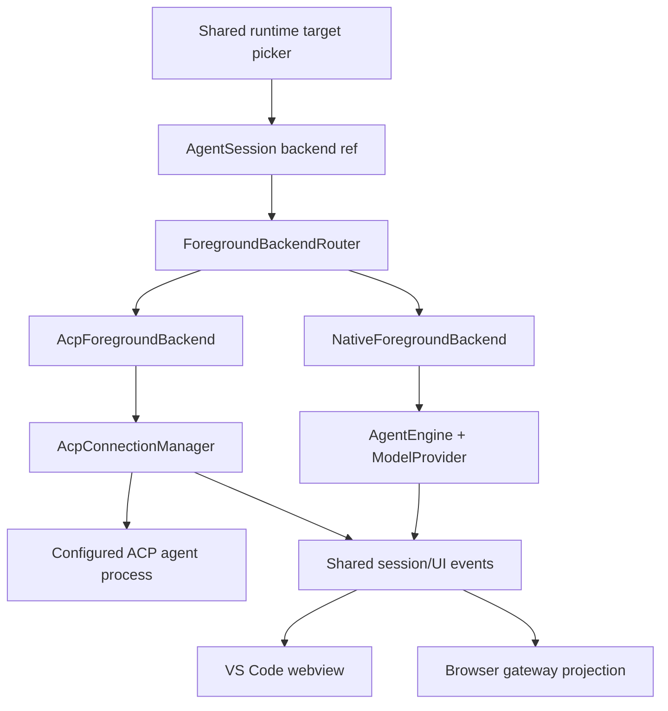

# ACP Foreground Provider Plan

## Status

Proposed implementation plan, based on the AgentLink workspace and ACP v1 as
of 2026-07-18. An independent code/protocol review was incorporated on the same
date. No production implementation is included in this document.

Related work:

- `plans/acp-background-agent-backend-plan.md` — the existing, implemented
  background-only ACP path.
- `plans/external-agent-core-rfc.md` — the provider-neutral runtime and surface
  boundary this work should follow.
- `plans/browser-remote-session-status-handoff.md` — browser gateway parity
  constraints.

## Executive recommendation

Add configured ACP agents to the existing model picker, but represent them
internally as **agent runtime targets**, not as fake model IDs implemented by
`ModelProvider`.

AgentLink's native provider contract represents one model request. `AgentEngine`
owns transcript replay, tool definitions, tool execution, retries, condensing,
and multi-request turns. ACP has the opposite ownership boundary: an ACP Agent
owns its session, model calls, tool loop, and conversation state, while the ACP
Client starts sessions, sends user prompts, supplies optional client
capabilities, answers permission requests, and renders session updates.

Forcing ACP through `ModelProvider.stream()` would create two competing agent
loops and lose ACP capabilities such as session config options, resume/load,
agent-owned tools, plans, slash commands, and native permission choices.
Instead, introduce a foreground backend seam above `AgentEngine`:



The first useful vertical slice should support a configured ACP agent in a new
foreground chat with text prompts, streaming text/thoughts, agent-owned tool
progress, stable plan/context updates, cancellation, persistence, and
remote-browser visibility. Media, dynamic options, permissions, filesystem,
terminal, MCP, and AgentLink-tool bridging should follow behind capability and
policy gates.

## Terminology

ACP calls AgentLink the **Client** and the configured subprocess the **Agent**.
The existing setting calls them `acpAgents`, which is correct protocol
terminology. User-facing text may say “ACP agent” or “ACP provider”; code should
avoid calling a configured subprocess an ACP client.

Use these identities distinctly:

- **native model** — a model routed through Anthropic or Codex
  `ModelProvider` and `AgentEngine`;
- **ACP agent** — a configured executable speaking ACP;
- **runtime target** — one selectable item in the current model picker, either
  a native model or an ACP agent;
- **ACP model option** — an optional `configOptions` selector with category
  `model`, owned by an active ACP session. This is not a top-level AgentLink
  model/provider identity.

## Goals

- Show every configured ACP agent in the shared model picker beside native
  Anthropic and Codex models.
- Let a foreground AgentLink session run through the selected ACP agent.
- Preserve as much ACP v1 capability as the Agent and AgentLink both advertise.
- Reuse the existing ACP configuration and content conversion work instead of
  creating a second incompatible registry.
- Preserve native provider behavior, model switching, background routing, and
  Browser Ask Agent behavior.
- Keep VS Code and the remote browser view on the same projection and control
  contracts.
- Make unsupported or degraded capabilities visible; never imply that a
  capability is enforced when the ACP process can bypass it.

## Non-goals

- Do not make AgentLink an ACP Agent/server for other editors.
- Do not translate ACP into synthetic Anthropic/OpenAI tool-use messages.
- Do not automatically install executables from the public ACP Registry in the
  first release.
- Do not promise that AgentLink can sandbox a configured ACP subprocess. ACP
  permission requests are cooperative protocol behavior, not an OS sandbox.
- Do not add browser-only filesystem, write, terminal, or process endpoints.
- Do not make helper-owned, projectless Browser Ask Agent sessions support ACP
  in the first vertical slice. Gate that surface explicitly until the helper
  has its own safe ACP host design.
- Do not adopt ACP v2 draft behavior. Negotiate ACP v1 and gate every optional
  method by advertised capabilities.
- Do not implement draft terminal/env authentication variants, draft plan
  update/removal variants, or experimental end-turn token accounting until the
  relevant feature stabilizes. Tolerate negotiated experimental fields only as
  best-effort input.

## Confirmed protocol constraints

The implementation should follow the negotiated protocol version and
capabilities, not infer wire behavior from the SDK package version.

- Initialization negotiates the protocol version, Client/Agent capabilities,
  implementation information, and authentication methods. Omitted
  capabilities mean unsupported.
- ACP sessions own conversation history and state. Baseline Agents support
  `session/new`, `session/prompt`, `session/cancel`, and `session/update`;
  load, resume, close, and additional directories are optional.
- One prompt turn may contain multiple model calls and tool invocations before
  returning a stop reason.
- Prompt text and resource links are baseline. Images, audio, and embedded
  resources are capability-gated.
- Session config options are the preferred model/mode/reasoning configuration
  mechanism. Categories are presentation hints; unknown categories and types
  must degrade gracefully.
- The Agent executes its tools and reports tool lifecycle. It can ask the
  Client for permission and can use advertised Client filesystem or terminal
  methods.
- ACP can report assistant messages, thoughts, tool calls, plans, slash
  commands, current mode/config changes, session title, context usage/cost, and
  stable context occupancy/cost updates.

Experimental compatibility note:

- The installed SDK exposes `PromptResponse.usage`, but marks it experimental.
  Treat it as an optional enhancement behind runtime shape validation. Stable
  `usage_update` is the primary source for the context bar and cumulative cost.
  When per-turn token usage is absent, show no token delta and no error; never
  infer a zero-token turn.
- `messageId` remains optional in ACP v1 even though supported agents should use
  it. Message grouping and replay reconciliation must have an ID-less fallback.
- Standard ACP plan snapshots are in scope. Draft `plan_update` and
  `plan_removed` variants are not advertised or consumed in the initial
  implementation.

Primary references:

- [ACP architecture](https://agentclientprotocol.com/get-started/architecture)
- [Initialization and capabilities](https://agentclientprotocol.com/protocol/v1/initialization)
- [Session setup](https://agentclientprotocol.com/protocol/v1/session-setup)
- [Prompt turns](https://agentclientprotocol.com/protocol/v1/prompt-turn)
- [Session config options](https://agentclientprotocol.com/protocol/v1/session-config-options)
- [Tool calls and permissions](https://agentclientprotocol.com/protocol/v1/tool-calls)
- [Filesystem](https://agentclientprotocol.com/protocol/v1/file-system)
- [Terminals](https://agentclientprotocol.com/protocol/v1/terminals)
- [Authentication](https://agentclientprotocol.com/protocol/v1/authentication)
- [Content](https://agentclientprotocol.com/protocol/v1/content)

## Current AgentLink shape

Useful existing pieces:

- `src/agent/background/acpAgentConfig.ts` validates configured ACP agents and
  `acp:<id>` references.
- `src/agent/background/acpBackgroundRunner.ts` proves SDK-based stdio launch,
  initialization, session creation, update streaming, permission requests,
  cancellation, and process cleanup.
- `src/agent/acpContent.ts` validates ACP image output and maps supported image
  content.
- `src/agent/AgentSessionManager.ts` already maps ACP background text, images,
  tool state, usage, stop reasons, and permissions into durable AgentLink
  background state.
- `src/agent/providers/types.ts` and `src/agent/providers/index.ts` provide the
  native single-model-turn boundary. They should remain native-model concepts.
- `src/agent/webview/components/ModelSelector.tsx` already groups choices by
  provider.
- `src/shared/chatProjection.ts`, `src/browser-gateway/BrowserGatewayService.ts`,
  and the shared webview components are the required parity path.

Assumptions that need refactoring:

- `AgentSession.model` and persisted `model` currently identify both the picker
  choice and the `ModelProvider` route.
- `AgentEngine.run()` unconditionally resolves a `ModelProvider` and owns the
  agent/tool loop.
- mode preferences, reasoning effort, auto-condense, auth status, context
  budget, API request transcript rows, and provider scheduling derive from
  native model metadata.
- changing a native model in a non-empty session is safe because AgentEngine
  replays the local transcript; ACP cannot accept an arbitrary prior transcript
  as session history.
- the browser helper model catalog contains only portable native model entries.

## Product and data model decisions

### 1. Introduce a runtime target catalog

Replace picker-facing `WebviewModelInfo[]` with a discriminated runtime target
catalog while keeping a compatibility adapter during migration:

```ts
type RuntimeTargetInfo =
  | {
      selectionId: `model:${string}`;
      kind: "native_model";
      modelId: string;
      providerId: string;
      displayName: string;
      authenticated: boolean;
      capabilities: NativeModelUiCapabilities;
    }
  | {
      selectionId: `acp:${string}`;
      kind: "acp_agent";
      agentId: string;
      displayName: string;
      connectionState:
        "not_started" | "connecting" | "ready" | "auth_required" | "error";
      readonlyOnly: boolean;
      surfaceAvailability: {
        vscode: true;
        remoteBrowser: true;
        browserAskAgent: false;
      };
    };
```

Do not add `acp:<id>` to `ProviderRegistry.modelIndex`. Native model IDs remain
owned by `ModelProvider`; runtime selection is owned by the new foreground
backend router.

Picker behavior:

- retain Anthropic and Codex groups;
- add an “ACP Agents” group with one entry per configured agent;
- show configured entries immediately without spawning processes on extension
  activation or picker open;
- lazy-connect after selection or an explicit Connect/Sign in action;
- show ACP model/reasoning/model-config controls returned by the active session
  inside the same popover, preserving Agent-provided order and grouping;
- hide the native auto-condense slider for ACP because the ACP Agent owns its
  context lifecycle;
- retain the thinking visibility toggle, which controls rendering of
  `agent_thought_chunk`, not the Agent's reasoning policy.

### 2. Persist backend identity explicitly

Add a versioned backend reference to `AgentSession` and persisted metadata:

```ts
type SessionBackendRef =
  | { kind: "native"; modelId: string }
  | {
      kind: "acp";
      agentId: string;
      remoteSessionId?: string;
      configValues?: Record<string, string | boolean>;
      agentInfo?: { name: string; title?: string; version?: string };
    };
```

`SessionBackendRef` is the foreground structured form of the existing fleet
identity, whose persisted tag is either `native` or `acp:<id>`. Use common
parse/format helpers so foreground and fleet persistence do not invent
conflicting ACP identifiers.

- Legacy records with no backend ref migrate to
  `{ kind: "native", modelId: metadata.model }`.
- Keep `session.model` temporarily as a derived display/compatibility value;
  native sessions expose their real model ID and ACP sessions expose the
  current ACP `model` config value or `acp:<agentId>`. No execution code may use
  this compatibility value to choose a provider/backend.
- Bump the existing `SessionStore` schema version and introduce the first
  explicit read migration before changing the on-disk metadata shape.
- Store only safe capability/config snapshots. Never persist environment
  values, auth material, raw `_meta`, or provider-private content.
- If a persisted ACP agent is removed or unknown, restore its transcript
  read-only, disable prompt entry, and show “Configure this ACP agent or start a
  new chat.” Never fall back to a native provider automatically.
- Older extension versions cannot understand the new backend field. Keep the
  ACP compatibility `model` value legible (`acp:<id>`) so rollback fails
  explicitly rather than accidentally routing to a native provider.

### 3. Treat backend switching as a session boundary

- Native model to native model: preserve today's in-place switch and transcript
  replay.
- ACP internal model/reasoning/mode change: call
  `session/set_config_option` on the same ACP session.
- Native to ACP, ACP to native, or ACP agent A to B:
  - if the chat is empty, mutate its target;
  - if the chat has messages, ask for confirmation and create a new foreground
    session linked with `continuedFromSessionId`;
  - do not silently inject the old transcript into a user prompt;
  - offer a future explicit “continue with summary” action, but do not make it
    implicit because ACP has no system/history import method.

Persist a default runtime target separately from native per-mode model
preferences. Existing `modeModelPreferences` remains the native fallback. A
new `modeRuntimeTargetPreferences` can store `model:<id>` or `acp:<id>` without
corrupting existing settings.

For active ACP sessions, AgentLink mode changes never consult
`modeRuntimeTargetPreferences` and never retarget the backend. If the ACP
session exposes a mapped mode config option, the mode selector changes that
option in place. Otherwise the selector is disabled. Native mode behavior and
per-mode native model selection remain unchanged.

### 4. Audit and gate every native-model consumer

Before an ACP foreground target is executable, inventory every read/write of
`session.model`, `config.model`, `resolveProvider()`, and
`tryResolveProvider()`. Classify each call site as native-only, backend-generic,
or presentation-only and add a regression test for every native-only gate.

At minimum, cover:

- `AgentEngine.run()` and all provider request, retry, cache, web-access, and
  condense paths — entered only through `NativeForegroundBackend`;
- `AgentSessionManager.setModel()`, `switchSessionMode()`, model-per-mode
  preferences, condense thresholds, reasoning effort, context budgets, and
  provider-response state — native-only or replaced by ACP config/runtime
  state;
- system-prompt build/rebuild — native-only for execution; ACP safety policy is
  enforced by Client handlers, not an unused native prompt;
- session title and summary generation — prefer stable ACP
  `session_info_update`; if absent, use the existing local first-user-message
  heuristic and never spend or require a native provider;
- background routing, status summaries, Browser Ask Agent, hosted web, image
  generation, MCP sampling, and maintenance calls — must receive an explicit
  native model/provider or a separate ACP-compatible route, never the ACP
  compatibility `session.model` value;
- transcript/API request rows and telemetry — use the backend ref and ACP Agent
  identity rather than resolving a provider from the display value.

Add a temporary assertion/helper such as `requireNativeSessionModel(session)`
at provider-resolving boundaries so missed consumers fail with an actionable
diagnostic during development.

## Runtime architecture

### 1. Add a foreground backend seam

Recommended transitional contract:

```ts
interface ForegroundSessionBackend {
  readonly kind: "native" | "acp";
  runTurn(request: ForegroundTurnRequest): AsyncIterable<AgentEvent>;
  cancel(session: AgentSession): Promise<void>;
  setConfigOption?(
    session: AgentSession,
    id: string,
    value: string | boolean,
  ): Promise<void>;
  restore?(session: AgentSession): Promise<BackendRestoreResult>;
  close(session: AgentSession): Promise<void>;
}
```

- `NativeForegroundBackend` is a thin adapter over the existing
  `AgentEngine.run()` path.
- `AcpForegroundBackend` sends only the new user turn to the remote ACP session
  and maps ACP updates to shared AgentLink events.
- `AgentSessionManager` resolves the backend once per logical turn from the
  durable session backend ref.
- Provider scheduling remains for native providers. Add ACP scheduling keys
  such as `acp:<agentId>` so foreground prompts have priority over background
  work without labeling ACP as a model provider.

Place this Phase 1 seam under `src/agent/**`, because it returns the current
`AgentEvent` union from `src/agent/types.ts`. Do not make `src/core/**` import
agent/surface modules. Moving or splitting `AgentEvent` into a portable core
event contract belongs to the external-agent-core RFC and is not a prerequisite
for ACP foreground support. Stdio launch, VS Code configuration, editor
buffers, diff review, terminals, and approval UI remain adapter/surface-owned.

### 2. Extract a reusable ACP connection layer

Refactor the one-shot background runner into reusable pieces:

- `AcpProcessTransport` — spawn without a shell, NDJSON stdio, stderr logging,
  stdout corruption diagnostics, signal escalation, and exit state;
- `AcpClientConnection` — initialize once, negotiate version/capabilities,
  handle bidirectional Client requests, and multiplex sessions;
- `AcpConnectionManager` — lazy connection per configured agent per VS Code
  window, configuration snapshots, restart/backoff, active-session lookup, and
  extension-deactivation cleanup;
- `AcpSessionHandle` — remote session ID, config options/modes, commands,
  prompt serialization, cancellation, and close/resume/load operations.

ACP supports multiple sessions per connection. Use one lazy process per
configured agent/window, but initially admit only **one in-flight prompt per ACP
agent connection**. Additional foreground sessions queue with foreground
priority. Raise concurrency only after real-agent multiplexing and cancellation
is proven. Keep the existing isolated one-process-per-background-run behavior
until shared-process cancellation and failure isolation are proven; both paths
can still share transport and event mapping utilities.

Connection requirements:

- advertise AgentLink name/title/version;
- reject an unsupported negotiated protocol version;
- cache only the current live initialization response;
- apply an initialization timeout and bounded graceful shutdown;
- redact configured env values and auth data from logs;
- fail all affected sessions with preserved partial output if the connection
  dies;
- do not silently fall back to a native provider when an explicitly selected
  ACP agent fails;
- preserve an active connection's configuration snapshot if settings change
  mid-turn, then reconnect safely after the turn.
- advertise boolean config-option support only when the SDK/schema version and
  renderer support it, using `session.configOptions.boolean: {}`; otherwise the
  Agent must omit boolean options.

### 3. Create, restore, and close ACP sessions

For a new ACP foreground session:

1. Connect and initialize lazily.
2. If session creation reports `auth_required`, surface the advertised ACP auth
   methods and retry only after successful authentication.
3. Send the selected workspace root as `cwd`.
4. Send additional roots only if the Agent advertises the capability.
5. Pass stdio MCP servers as baseline ACP behavior. Pass HTTP or deprecated SSE
   servers only when the Agent advertises the matching MCP capability and after
   applying the MCP security policy below.
6. Persist the remote session ID immediately after successful creation.
7. Adopt `configOptions`; use legacy `modes` only when config options are absent.

For restore after reload or process restart:

1. Prefer `session/resume` when advertised. It preserves remote context without
   replaying history into AgentLink.
2. Otherwise use `session/load` when advertised. Reconcile replayed updates in
   a scratch projection. Prefer message IDs; for ID-less agents, segment by
   role/update boundaries and reconcile ordered normalized content hashes plus
   position before replacing/backfilling local transcript state. Ambiguous
   replay must stop with a visible recovery notice rather than duplicate or
   discard messages.
3. If neither is supported, restore the AgentLink transcript read-only and
   require a new ACP session before another prompt. Show a clear “ACP agent
   cannot resume this chat” notice; do not pretend the old context exists.
4. Use `session/close` when advertised on eviction/deactivation.

Workspace roots are a session-creation snapshot. Added folders are unavailable
to the active ACP session until the user starts a new ACP chat. If a primary or
additional root is removed or becomes unavailable, disable further prompts for
that ACP session and require a new session with the current roots; do not widen
or silently rewrite the remote session's scope.

## Capability parity matrix

| Capability            | Target behavior                                                                                                   | Important constraint                                                                                                 |
| --------------------- | ----------------------------------------------------------------------------------------------------------------- | -------------------------------------------------------------------------------------------------------------------- |
| Text streaming        | Map `agent_message_chunk` to ordinary assistant streaming                                                         | Use message IDs when present and deterministic ID-less turn/tool boundaries otherwise                                |
| Thoughts              | Map `agent_thought_chunk` to thinking blocks                                                                      | Rendering toggle does not change Agent reasoning unless a config option does                                         |
| Images                | Send only when `promptCapabilities.image`; validate/render image output with shared ACP conversion                | Keep size/count/MIME limits                                                                                          |
| Files/PDFs            | Prefer embedded resources when supported; otherwise resource links                                                | Never drop an attachment silently; explain capability mismatch before sending                                        |
| Tool progress         | Render ACP tool call/create/update status, raw input/output, content, locations, diffs, and terminal references   | Mark execution owner `acp`; never dispatch it through AgentLink `toolAdapter`                                        |
| Permissions           | Render exact Agent-supplied choices and return its option ID                                                      | AgentLink policy may reject; do not manufacture approval the Agent did not request                                   |
| Plans                 | Map stable plan snapshots to shared todo ordering/status                                                          | Priority affects ordering only unless `TodoItem` is deliberately extended; ignore draft plan update/removal variants |
| Slash commands        | Merge `available_commands_update` into autocomplete with source `acp`                                             | Remove/update dynamically per session                                                                                |
| Models                | Render config option category `model` in the picker                                                               | Values are scoped to the ACP session, not ProviderRegistry                                                           |
| Reasoning             | Render `thought_level` and `model_config` controls near model controls                                            | Preserve unknown ordered config options in an overflow panel                                                         |
| Modes                 | Prefer category `mode`; fall back to legacy ACP modes                                                             | AgentLink built-in modes/system prompts cannot be assumed to apply                                                   |
| Usage                 | Use stable `usage_update` for context occupancy and cumulative cost; accept experimental prompt usage best-effort | Per-turn token deltas may be unavailable and need explicit degraded UI                                               |
| Authentication        | Support stable agent-handled auth and capability-gated logout                                                     | Exclude draft terminal/env auth variants until stabilized                                                            |
| Cancellation          | Send ACP cancellation and retain bounded partial output                                                           | Escalate process termination only when the connection/prompt does not stop                                           |
| Resume/load/close     | Implement only when advertised                                                                                    | Persist remote session IDs and reconcile load replay                                                                 |
| Session title         | Apply `session_info_update` title through existing rename/persistence path                                        | Resolve user rename versus Agent update deterministically                                                            |
| MCP                   | Pass baseline stdio and capability-gated HTTP/SSE servers; later add an AgentLink bridge                          | Do not leak credentials or incorrectly gate mandatory stdio support                                                  |
| Filesystem            | Implement client read/write through AgentLink workspace/edit capabilities                                         | Workspace scope and approvals are Client policy, not ACP guarantees                                                  |
| Terminal              | Implement a dedicated ACP terminal host with create/output/wait/kill/release handle semantics                     | It may mirror into VS Code terminals but cannot adapt `TerminalManager.executeCommand()` directly                    |
| Condensing            | Show ACP context usage but let the Agent manage context                                                           | Hide native condense threshold/settings for ACP                                                                      |
| Native hosted web     | Not directly portable                                                                                             | The ACP Agent uses its own capability or an explicitly bridged AgentLink/MCP tool                                    |
| Steering/interjection | Queue interjections for the next turn; disable or relabel steering as “queued for next turn”                      | ACP v1 supports cancel, not AgentLink's safe-boundary steering semantics                                             |
| Audio                 | Unsupported in the initial feature                                                                                | Reject prompt audio and warn on output audio; never drop it silently                                                 |

## Event and transcript mapping

Create pure ACP-to-AgentLink mapping functions with fixture tests. Do not add
ACP-specific branching throughout `ChatViewProvider`.

- `agent_message_chunk`
  - text -> streaming assistant text;
  - images/resources -> typed assistant content blocks;
  - use `messageId` to start/append the correct message when present;
  - without an ID, append consecutive same-kind chunks and start a new
    assistant message after a user/turn boundary or intervening tool lifecycle.
- `agent_thought_chunk`
  - emit thinking start/delta/end keyed by ACP message ID or a generated local
    stable ID.
- `user_message_chunk`
  - accept only during load replay; live user prompts already exist locally.
- `tool_call` / `tool_call_update`
  - store a dedicated external tool-call transcript shape with title, kind,
    status, content, locations, raw input/output, and execution owner;
  - feed shared tool cards and review/terminal panes without adding the call to
    AgentEngine's pending local tool batch;
  - add execution ownership/provenance to shared content/projection types on
    both surfaces, rather than relying on renderer-only metadata.
- `plan`
  - replace the current ACP-owned stable plan snapshot; map statuses to shared
    todo rows and use priority only to preserve/derive display ordering;
  - do not consume draft `plan_update` or `plan_removed` variants initially.
- `available_commands_update`, `current_mode_update`,
  `config_option_update`, and `session_info_update`
  - update durable session runtime state and publish one shared state event.
- `usage_update` and prompt response usage
  - store stable context occupancy and cumulative cost separately from native
    provider usage;
  - treat experimental prompt-response token usage as shape-validated,
    best-effort data, derive monotonic deltas only when present, and tolerate
    Agent resets after resume;
  - show an explicit unavailable/degraded token state when absent. Cost is new
    foreground UI and requires a currency-aware display contract.
- stop reasons
  - `end_turn` -> idle/success;
  - `cancelled` -> interrupted/cancelled with partial output;
  - `max_tokens`, `max_turn_requests`, `refusal` -> visible terminal reason and
    preserved output, classified consistently with background ACP results.

API request transcript rows should become generic “agent turn” rows for ACP,
showing ACP agent identity, configured model when available, elapsed time, stop
reason, usage/cost, and connection diagnostics without pretending there was one
provider API request.

## Client capability implementation and safety

### Trust boundary

A configured ACP executable is trusted local code. Even if AgentLink advertises
no filesystem or terminal capabilities, the subprocess may still access the OS
using inherited permissions or execute its own tools. ACP permissions only
mediate requests the Agent chooses to report. The configuration UI and first
selection must state this plainly.

Never claim `readonlyOnly` is a sandbox. It means AgentLink rejects
write/delete/move/execute/unknown ACP permission requests and does not expose
Client write/terminal capabilities. A truly read-only deployment requires an
OS/container sandbox outside this feature.

### Permission bridge

- Preserve every ACP option ID, label, and kind.
- Attribute approvals to the ACP agent and session.
- Apply the configured read-only policy before showing a prompt.
- Route edit/execute/fetch/read kinds through existing approval-policy
  decisions where semantics are known; fail closed for unknown operations.
- Return `cancelled` for requests arriving after turn/session cancellation.
- Store “always” decisions only if the user selected an Agent-provided always
  option, scoped to agent ID plus a conservative normalized operation key.
- Do not let a generic ACP “allow always” broaden AgentLink's global write or
  command approval settings.
- For execute permission followed by `terminal/create`, issue a single-use,
  same-turn lease keyed by ACP agent/session/tool-call ID plus a normalized
  command, arguments, cwd, and relevant environment digest extracted from the
  permission content/raw input. Consume it only when the subsequent terminal
  request matches exactly. A mismatch or unparseable permission fails closed
  into the ordinary command approval flow. Only an Agent-provided, explicitly
  selected “always” option may create a longer-lived rule.

### Filesystem client methods

Implement through host-neutral workspace/file/edit-review capabilities:

- validate absolute paths against the session's primary/additional roots;
- read unsaved VS Code buffers when available, then fall back to disk;
- honor ACP line/limit semantics;
- route writes through the existing edit review/approval/checkpoint path;
- create the file when required by ACP;
- serialize writes per path and reject stale/out-of-root requests;
- record policy audit and diff state for VS Code and browser review projection.

Advertise `readTextFile` only after the handler exists. Advertise
`writeTextFile` only for non-read-only configs after edit review, approval, and
checkpoint behavior is fully covered.

### Terminal client methods

Do not adapt ACP terminals directly onto `TerminalManager.executeCommand()`.
The current manager is an execute-and-poll abstraction, while ACP requires a
durable five-method process handle whose output remains available after kill.
Before advertising `terminal: true`, write a short dedicated design note and
implement an ACP terminal host layer with:

- an ACP terminal ID -> owned process handle table;
- non-shell process creation with per-request cwd/env validation;
- command approval before creation, using the exact single-use permission lease
  above when available;
- a byte-limited output buffer that discards from the beginning when the limit
  is exceeded, preserves valid character boundaries, and returns current output
  without blocking;
- independent wait-for-exit state and exit-status capture;
- kill semantics that terminate the process but keep the handle/output valid;
- exactly-once release that invalidates future terminal requests and frees
  resources;
- process-tree cleanup on cancellation, session close, connection death, and
  extension deactivation;
- shared terminal activity projection and optional integrated-terminal
  mirroring. Mirroring is presentation, not process ownership.

Reuse lower-level terminal/process capabilities where their contracts match,
but do not claim the existing `TerminalManager` supplies ACP lifecycle
semantics. Ship the foreground ACP feature without Client terminal support if
this host is not ready.

The remote browser may display existing projected activity and submit existing
approval decisions. This phase must not add a browser endpoint that directly
creates or controls terminals.

### Change tracking and revert

Because an ACP Agent may edit files using its own process rather than Client
filesystem methods:

- create an AgentLink checkpoint before every ACP prompt that can write;
- render Agent-reported diffs/locations immediately, but use actual disk/editor
  state as authoritative for revert;
- keep the existing rewind/revert path available after ACP turns;
- clearly label changes that bypassed AgentLink's client write method.

Live attribution of out-of-band workspace changes to a particular ACP turn is
a later observability enhancement. A pre-turn checkpoint is the required
safety property for the initial write-capable release.

## MCP and AgentLink tool parity

ACP's intended extension point is to pass MCP servers during session setup.
Implement this in two stages.

### Stage A: configured MCP passthrough

- Convert enabled stdio MCP server configs without requiring an
  `mcpCapabilities` flag; stdio is baseline ACP support.
- Include HTTP only when `mcpCapabilities.http` is advertised and deprecated
  SSE only when `mcpCapabilities.sse` is advertised.
- Preserve server order and names.
- Never expose secret values in transcript/debug state.
- Require an explicit policy for forwarding OAuth headers/tokens or sensitive
  environment values to an external ACP process.
- Prefer a local AgentLink proxy for already-authenticated remote servers so
  credentials remain owned by AgentLink.
- Surface omitted servers and reasons in session diagnostics.

### Stage B: session-bound AgentLink MCP bridge

Treat this as a separate follow-up design/implementation plan. This foreground
plan commits only to the interface: a per-session authenticated local MCP
server passed in `mcpServers`, with session identity, policy, and lifecycle
owned by AgentLink.

The follow-up must address:

- reuse canonical metadata/schema/dispatch rather than duplicating tools;
- enforce the same mode, workspace, approval, read-only, and browser policies;
- carry ACP session/turn identity into telemetry and approvals;
- start with portable read/search/context/language tools;
- add edit/terminal tools only after Client methods are stable;
- exclude recursive or UI-coupled tools by default: mode switching, ask-user,
  compose, ACP/background/worktree spawning, session control, feedback, and
  any tool whose result cannot be represented safely over MCP;
- add explicit recursion/depth limits before exposing background agents;
- terminate the bridge and revoke its token when the ACP session closes.

This bridge is the path to meaningful AgentLink-tool parity, but it is not an
acceptance requirement for the initial foreground provider. ACP tool status
updates alone only describe tools the external Agent already owns.

## Modes, prompts, and policy

AgentLink cannot send its native system prompt through ACP v1. Therefore:

- do not claim that selecting AgentLink `code`, `architect`, or `ask` mode
  changes an ACP Agent unless a mapped ACP mode/config option exists;
- when ACP provides a `mode` config option, project it into the shared mode
  selector using Agent-owned IDs/names;
- otherwise disable the mode selector with “Mode is managed by this ACP agent”;
- do not call `switchSessionMode()`, rebuild a native system prompt, repick a
  target from AgentLink mode preferences, or mutate the ACP backend when no ACP
  mode option exists;
- enforce safety-critical restrictions in Client handlers/MCP bridge policy,
  never only in prompt text;
- continue passing `cwd`, additional roots, file/resource attachments, and MCP
  configuration as the protocol-supported context mechanisms;
- let the ACP Agent independently load `AGENTS.md` or its own instructions from
  the workspace.

Title precedence is also explicit: a user rename wins for the current local
session unless the user opts back into Agent-managed titles. Before a user
rename, use stable `session_info_update` titles when present; otherwise use the
existing local first-user-message heuristic. Never call a native provider to
title or summarize an ACP session.

## Configuration and migration

Introduce a shared canonical registry:

```jsonc
"agentlink.acp.agents": [
  {
    "id": "claude",
    "label": "Claude via ACP",
    "command": "claude-agent-acp",
    "args": [],
    "env": {},
    "initTimeoutMs": 10000,
    "readonlyOnly": true
  }
]
```

Migration behavior:

- The canonical shared registry defaults `readonlyOnly` to `true`. Write-capable
  foreground use requires an explicit `false` on that agent entry.
- read `agentlink.acp.agents` first;
- also read the existing `agentlink.background.acpAgents` as a deprecated alias;
- preserve the alias's shipped default of `readonlyOnly: true`, including when
  the same resolved agent is used by `background.defaultAgent`;
- if both contain the same ID with different values, fail validation with a
  clear diagnostic rather than picking one silently;
- make `agentlink.background.defaultAgent` resolve against the shared registry;
- document `background.acpAgents` as deprecated for at least one release cycle;
- do not rewrite user settings automatically;
- keep environment values redacted and recommend executable-managed auth or
  secret references rather than plaintext secrets in settings.

Add migration tests proving an alias-defined entry with omitted
`readonlyOnly` remains read-only and cannot gain write/execute capability when
resolved through the shared registry.

Add a settings change listener that republishes runtime targets immediately,
but never kills an active prompt. Removed/reconfigured entries become
unavailable for new sessions while existing sessions retain their connection
snapshot until idle/closed.

Replace the picker’s provider-specific sign-in callback with a generic runtime
target connect/authenticate action. Native targets continue routing to the
existing Codex/Anthropic commands; ACP targets initialize, render their stable
agent-handled auth methods, call `authenticate`, and retry session creation.
Unknown target kinds must produce a visible unsupported-action error rather
than the current silent no-op.

## Browser parity

Remote browser control of a VS Code-owned foreground session is in scope:

- add backend ref, runtime target, ACP connection state, config options, ACP
  mode, commands, usage/cost, external tool calls, plans, and terminal reason to
  the foreground projection;
- handle them in `BrowserGatewayService.applyEvent` and wire snapshots;
- use the same picker/config controls and transcript components on both
  surfaces;
- add a generic runtime-target/config-option endpoint instead of teaching the
  browser about native provider internals;
- preserve instance/project ownership checks on every action;
- keep diffs read-only and do not add direct browser shell/write APIs.
- for ACP sessions, both VS Code and browser surfaces relabel interjection as
  “queued for next turn”; disable native safe-boundary steering or present the
  same queue-at-turn-end behavior. Never report a queued ACP message as already
  delivered.

Helper-owned Browser Ask Agent is explicitly out of scope for the first
release. Filter ACP targets at the model-catalog publish point in
`src/extension.ts`; only native `CoreModelCatalogEntry` records may be sent to
the helper. Keep the helper's Anthropic/OpenAI provider whitelist as defense in
depth. Test the publish boundary directly so an ACP target can never appear in
helper-owned Ask Agent. A later slice may host ACP in the helper with its own
projectless capability profile and configuration ownership.

## Implementation phases

### Phase 0: contract and protocol fixtures

- Pin the supported ACP v1 SDK range and record negotiated protocol behavior.
  Establish the minimum SDK/schema version for every advertised feature;
  boolean config options require a version that contains the stabilized type
  plus `session.configOptions.boolean` capability support (at least the
  corresponding 1.3.x schema/library line, subject to package verification).
- Capture fixtures from at least two real agents, including one with config
  options and one with permissions/tools.
- Extract pure config, content, stop/usage, tool, plan, and option mapping from
  the background implementation.
- Add a fake ACP process supporting initialize/auth/new/prompt/cancel,
  bidirectional requests, disconnects, resume/load, and malformed stdout.
- Define backend/target/persistence schemas and migration tests before UI work.
- Complete the native-model consumer audit and add native-session gate helpers.

Exit: contracts and fake transport cover the full planned state machine; no
picker entry can route into `ProviderRegistry` by accident.

### Phase 1: read-only foreground vertical slice

- Add the shared registry with deprecated background-setting compatibility.
- Add runtime target catalog and ACP picker group in shared UI.
- Add `ForegroundSessionBackend`, native adapter, connection manager, and ACP
  backend.
- Support new empty ACP chats, text prompt/output, thoughts, tool progress,
  stable plan snapshots, stable context/cost usage, optional experimental token
  usage, stop reasons, cancellation, and process cleanup.
- Persist backend/remote session identity and enforce session-boundary switching.
- Project the same state to the remote browser.
- Start with no Client write/terminal capability and no AgentLink MCP bridge.

Exit: a configured read-only ACP agent can be selected, used for multiple
turns in one live connection, stopped, persisted/restored transcript-only, and
observed from the remote browser without native regressions. Remote session
resume/load continuation becomes a Phase 2 capability.

### Phase 2: dynamic controls, media, auth, and lifecycle parity

- Render and update ordered ACP config options, including grouped model,
  thought-level, model-config, mode, boolean, and unknown options.
- Merge ACP slash commands.
- Add image/resource prompt and output mapping with capability checks.
- Implement stable agent-handled authentication and logout. Exclude terminal/env
  auth variants until their protocol proposal stabilizes.
- Implement resume, load replay reconciliation, close, connection restart, and
  non-resumable restore notices.
- Map session titles and context/cost state.

### Phase 3: permissions, filesystem, and edit review

- Complete exact ACP permission-choice mapping and policy audit.
- Add workspace-scoped read with unsaved-buffer support.
- Add reviewed writes, pre-turn checkpoints, and revert.
- Enable each advertised Client capability only after its handler and failure
  tests pass.

Treat ACP terminal hosting as a separate Phase 3 follow-up gated by the
dedicated terminal-host design note. The foreground provider may ship without
advertising `terminal: true`.

### Phase 4: MCP passthrough and bridge follow-up

- Add policy-aware MCP passthrough for supported transports.
- Write and review the separate authenticated AgentLink MCP bridge plan before
  implementation. Do not fold the bridge into the foreground-provider PRs.
- Add diagnostics for unavailable MCP/tools and telemetry attribution for ACP
  versus native execution.

### Phase 5: hardening, packaging, and release

- Run real-agent compatibility matrix and long-lived/multi-session soak tests.
- Verify native foreground/background, ACP background, worktree, browser
  remote, and Browser Ask Agent regression suites.
- Review telemetry and dev feedback for ACP failures before changing behavior.
- Update README configuration, capability table, trust warning, switching and
  restore behavior, troubleshooting, and smoke test instructions.
- Run `npm run fmt`, `npm run lint`, and `npm test` cleanly.
- Build/package and inspect `npx @vscode/vsce ls`; add `.vscodeignore`
  allowlist entries for any new bundle/runtime asset.
- Dogfood connect/auth/prompt/permission/cancel/resume/reconfigure/deactivate
  against every documented agent example.

## Primary implementation touchpoints

New modules, following current naming conventions:

- `src/agent/foregroundBackend.ts` — transitional backend contract using the
  current agent-owned event union; core extraction is deferred.
- `src/agent/acp/acpAgentConfig.ts` — shared config normalization/migration.
- `src/agent/acp/AcpProcessTransport.ts` — stdio child lifecycle.
- `src/agent/acp/AcpClientConnection.ts` — initialized ACP connection.
- `src/agent/acp/AcpConnectionManager.ts` — lazy connection/session ownership.
- `src/agent/acp/AcpForegroundBackend.ts` — prompt/session adapter.
- `src/agent/acp/acpEventMapping.ts` — pure update mapping.
- `src/agent/acp/acpClientCapabilities.ts` — fs/terminal/permission handlers.
- `src/agent/acp/AcpTerminalHost.ts` — later dedicated terminal handle host,
  only after its design note.
- a later session-bound MCP bridge whose module layout is chosen by its own
  reviewed plan.

Existing files likely changed:

- `package.json` — shared ACP settings and descriptions.
- `src/extension.ts` — composition and lifecycle.
- `src/agent/AgentSession.ts` — backend/config/session state.
- `src/agent/AgentSessionManager.ts` and host contract — backend routing,
  native-model consumer gates, persistence, cancellation, switching, titles,
  queue behavior, and projection.
- `src/agent/persistenceContracts.ts` and `src/agent/SessionStore.ts` — versioned
  backend state and migrations.
- `src/agent/background/acpBackgroundRunner.ts` — reuse extracted transport and
  mapping without changing current behavior prematurely.
- `src/agent/webview/types.ts`, `ModelSelector.tsx`, `InputArea.tsx`, and shared
  toolbar controls — runtime targets, generic connect/auth actions, and ACP
  config options.
- `src/shared/chatProjection.ts` and `src/shared/types.ts` — shared state/events,
  external tool-call execution ownership/provenance, plan state, and degraded
  usage state.
- `src/browser-gateway/BrowserGatewayService.ts`, server/protocol, and webview —
  parity snapshot/actions.
- `README.md` — full configuration, trust model, capabilities, and recovery.

If a new webview entry, worker, CSS file, or runtime asset is added, update
`esbuild.mjs` and the matching `.vscodeignore` `!dist/<file>` allowlist entry in
the same change.

## Test plan

### Unit

- shared/deprecated registry resolution, duplicates, redaction, settings change;
- canonical and deprecated-alias `readonlyOnly` defaults remain `true`;
- runtime target IDs, ordering, picker grouping, auth/connection states;
- existing-schema bump/read migration, legacy records, and removed/unknown ACP
  refs restoring transcript-only;
- backend switching rules for empty/non-empty chats;
- every audited native model/provider consumer is gated for ACP sessions;
- every ACP update/content/tool/config/usage/stop mapping;
- stable usage/cost, absent experimental usage, and cumulative delta/reset
  behavior;
- message grouping and replay reconciliation with and without message IDs;
- stable plan snapshot ordering without draft plan updates/removals;
- path/root/line-limit validation;
- permission choice preservation, read-only rejection, exact terminal permission
  lease match/mismatch, and cancellation races;
- terminal ID lifecycle and release exactly once;
- MCP baseline stdio plus capability-gated HTTP/SSE filtering and secret
  redaction;
- audio prompt/output rejection always produces a visible warning.

### Fake-process integration

- lazy spawn -> initialize -> auth required -> authenticate -> session new;
- multi-turn prompt with text, thoughts, plan, tool calls, permissions, config
  updates, usage, images, and end turn;
- simultaneous sessions on one connection queue behind the initial one-prompt
  concurrency limit;
- foreground priority over background admission;
- prompt cancellation while waiting for permission/client fs/terminal;
- process crash before/after partial output;
- malformed stdout and stderr-only banners;
- resume after reconnect;
- load replay without duplicate transcript messages;
- unsupported resume/load -> transcript-only restore notice;
- missing `messageId` load replay reconciles without duplicates;
- workspace root addition/removal produces the defined new-session/disabled
  behavior;
- settings removal/reconfiguration during an active turn;
- deactivate cleans every session, terminal, bridge, and child process.

### Surface and persistence

- VS Code and browser snapshots remain equivalent for ACP state;
- browser runtime-target/config actions round-trip to the owning VS Code
  session;
- Browser Ask Agent publish path filters ACP targets and the helper whitelist
  rejects one as defense in depth;
- browser and VS Code show the same queued-next-turn behavior and do not expose
  native ACP steering;
- external tool cards, plans, images, usage, and stop reasons rerender after
  reload;
- ACP diffs appear read-only in browser review;
- session title/history/default-target behavior remains correct;
- native Anthropic/Codex switching and auth UX is unchanged.

### Real-agent smoke matrix

For each documented ACP executable:

- clean launch and auth;
- model/mode/reasoning options;
- text/image/file prompt;
- read/search/edit/command tool progress;
- allow/reject permission choices;
- cancellation and process cleanup;
- multi-turn context;
- VS Code reload/resume;
- MCP access;
- VS Code and remote-browser rendering.

Record unsupported capabilities as expected gaps rather than failures.

## Risks and mitigations

- **Wrong abstraction** — a fake `ModelProvider` duplicates agent loops.
  - Use the foreground backend seam above AgentEngine.
- **Silent context loss when switching** — ACP cannot import arbitrary local
  history.
  - Make cross-backend switching a visible new-session operation.
- **False safety expectations** — the subprocess can bypass ACP permissions.
  - Show an explicit trust warning and describe `readonlyOnly` accurately.
- **Transcript duplication on load** — ACP load replays history.
  - Reconcile in scratch state using message IDs when present and ordered
    boundary/content-hash matching when absent; stop on ambiguity.
- **Compatibility `session.model` leaks into native execution**.
  - Complete and test the provider-consumer audit; require structured backend
    refs and explicit native-session gates at provider boundaries.
- **Capability over-advertising** — Agents may call handlers that are partial.
  - Advertise only implemented, tested Client capabilities.
- **Tool UI accidentally dispatches ACP calls locally**.
  - Add execution ownership to the transcript contract and regression tests.
- **Config/model UX conflict** — native model metadata and dynamic ACP options
  are structurally different.
  - Use runtime targets plus ordered session config controls, not synthetic
    models.
- **Connection blast radius** — one process may own several sessions.
  - Preserve partial output, fail affected sessions explicitly, use bounded
    restart/backoff, default to one in-flight prompt, and keep background
    isolation initially.
- **Terminal contract mismatch** — existing execute/poll APIs cannot implement
  ACP terminal handles faithfully.
  - Keep `terminal: true` off until the dedicated ACP terminal host and design
    note are complete.
- **Credential leakage through MCP/env/debug state**.
  - Proxy sensitive MCP access, redact structured data, and never project raw
    config/auth payloads.
- **Browser divergence**.
  - Extend shared projection/events first and reuse shared controls; explicitly
    filter projectless Ask Agent.
- **Published VSIX omission**.
  - Inspect package contents and update the allowlist for every new output.

## Acceptance criteria

The foreground feature is complete when:

- every valid configured ACP agent appears in the shared picker without being
  registered as a native model;
- selecting an ACP agent in an empty chat creates an ACP session lazily;
- cross-backend selection in a non-empty chat never silently loses context;
- multi-turn ACP text, thoughts, images/resources, tool progress, permissions,
  stable plans, commands, config options, context/cost usage, and stop reasons
  render and persist; missing experimental token usage degrades cleanly;
- ACP model/reasoning/mode controls round-trip through session config options;
- cancellation, disconnect, reload/resume/load, and extension shutdown preserve
  partial results and clean resources;
- Client filesystem/write capabilities are advertised only when their full
  policy and lifecycle implementations are active; terminal remains disabled
  until its separate host is complete;
- supported baseline/capability-gated MCP servers are available with secrets
  and policies contained; the curated AgentLink bridge remains a separately
  planned follow-up;
- pre-turn checkpoints provide a reliable revert path for write-capable ACP
  turns;
- the remote browser sees and controls the same VS Code-owned ACP session state
  without gaining direct write/shell endpoints;
- helper-owned Browser Ask Agent clearly filters ACP until it has an executable
  host;
- removed/unknown ACP configs restore transcript-only without native fallback;
- ID-less ACP messages and load replay remain segmented and deduplicated;
- audio is visibly rejected/warned rather than silently dropped;
- native providers, native background agents, ACP background agents, and
  persisted legacy sessions remain compatible;
- lint, tests, real-agent smoke tests, package inspection, and documented trust
  warnings all pass review.

## Recommended initial PR ramp

### PR 1: inert foundations with no foreground behavior change

1. Add `agentlink.acp.agents`, deprecated-alias resolution, the explicit
   `readonlyOnly: true` default, conflict validation, and migration tests.
2. Add `RuntimeTargetInfo` and `SessionBackendRef` contracts plus compatibility
   adapters so existing surfaces still consume native `WebviewModelInfo`.
3. Bump the existing persistence schema and add the explicit legacy read
   migration, including removed/unknown-backend transcript-only behavior.
4. Add the fake ACP process harness.
5. Extract process transport/connection primitives from
   `acpBackgroundRunner.ts` while proving background behavior is unchanged.
6. Complete the `session.model`/provider consumer audit and add native-session
   gate helpers without enabling ACP foreground routing.

This PR is a registry/schema/refactor change. It must not add selectable ACP
foreground behavior.

### PR 2: read-only foreground vertical slice

1. Add the agent-owned `ForegroundSessionBackend` seam and native adapter.
2. Add `AcpConnectionManager` with one in-flight prompt per configured Agent.
3. Add the ACP picker group, generic connect action, and lazy initialization.
4. Support new empty ACP chats with text, thoughts, external tool progress,
   stable plan snapshots, stable context/cost updates, stop reasons,
   cancellation, and process cleanup.
5. Add explicit cross-backend new-session behavior and persistence round-trip.
6. Add shared external-tool ownership/projection types.
7. Project the transcript/state to the remote browser where the generic target
   control fits. If target selection is not ready there, hide ACP targets from
   the browser picker and show a visible “Select this ACP agent from VS Code”
   state rather than a half-wired control.
8. Filter ACP targets at the helper model-catalog publish boundary.
9. Run the fake-process suite and one real-Agent smoke test.

Follow-up PRs add config-option UI, stable auth/logout, media, resume/load,
filesystem/edit review, MCP passthrough, and the separately designed terminal
host. The AgentLink MCP bridge remains its own plan and project.
