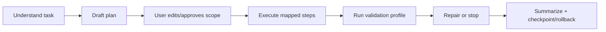
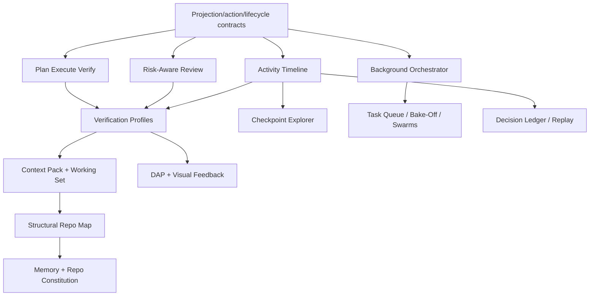

# AgentLink Expanded Capability Roadmap — Shortlist Candidate Backlog

> Companion to `plans/agentlink-capability-roadmap.md`. This document reviews the
> existing self-assessment, folds in independent background-agent critique/brainstorming,
> and converts the ideas into a shortlist-ready backlog. It is intentionally broader than
> an implementation plan: the goal is to help choose what to chase next.

## 1. Executive Takeaway

AgentLink's most valuable future direction is not simply "more tools." It is becoming a
**transparent, IDE-native coding operations system**:

- autonomous enough to do substantial work,
- observable enough that users understand what it is doing,
- scoped enough that delegation feels safe,
- reversible enough that mistakes are cheap,
- and verifiable enough that outcomes are grounded in actual editor/runtime evidence.

The existing roadmap is directionally strong: context packs, structural repo maps,
verification loops, debugger/visual feedback, memory, orchestration, and local telemetry are
all valid compounding investments. The main addition from this review is that **trust,
observability, and state architecture should move earlier** because they multiply the value
of every later capability.

Refined recommended near-term stack after review:

1. **Capability Baseline / Evaluation Harness** — establish today's efficiency/capability baseline before major capability work, using safe benchmark tasks and trace-based metrics.
2. **Activity Timeline / Flight Recorder + task memory stream** — make agent activity inspectable while preserving high-signal instructions/decisions across long runs and condense events.
3. **Context Pack + Working Set** — reduce repeated reads and round trips with budgeted context bundles, content hashes, git state, semantic chunks, and outlines.
4. **Structural Repo Map** — add durable repository understanding: import graph, top-level symbols, module neighbors, entry points, workspace boundaries, and related tests.
5. **Cross-session Project Memory** — user-reviewable, evidence-linked memory for preferences, conventions, architecture facts, gotchas, decisions, and module summaries.
6. **Risk-Aware Change Review** — classify diffs and commands by blast radius/sensitivity, then use those classes to drive validation and approval behavior.

## 2. Review of the Existing Roadmap

### What is already strong

The existing roadmap correctly identifies the core capability gaps:

- **Understanding**: no durable structural repo map or cross-session memory.
- **Correctness**: no first-class verification loop or runtime debugger integration.
- **Capability**: no visual feedback loop for UI/app work.
- **Efficiency**: context gathering is round-trip heavy and repeated reads are not deduped.
- **Learning**: failures, retries, rejections, and condense events are not turned into feedback.

It also correctly keeps several constraints explicit:

- Prompt caching already exists; remaining work is working-set dedup and cache-hit observability.
- Call edges should be computed on demand, not persisted whole-repo.
- Verification should prefer machine-readable runner output over brittle scrollback scraping.
- Browser gateway is a first-class surface and must remain in sync.
- AgentLink's MCP-server identity is a multiplier, so new read/intelligence tools should be exposed there too.

### What should be made more prominent

The background feasibility review highlighted a structural risk: adding more user-visible
features before tightening state/projection/action/persistence contracts will increase drift
between:

- runtime session state,
- VS Code webview state,
- browser gateway state,
- persisted session history,
- transcript rows,
- approval/question/diff lifecycle state,
- and MCP-visible tool behavior.

Therefore, some architectural foundation work should be treated as roadmap-enabling, not
internal cleanup.

## 3. Shortlisting Rubric

Score candidate work against these dimensions:

| Dimension                     | Question                                                                                                                                     |
| ----------------------------- | -------------------------------------------------------------------------------------------------------------------------------------------- |
| **User trust**                | Does this reduce fear of runaway edits, hidden state, destructive commands, or opaque reasoning?                                             |
| **Capability leverage**       | Does it compound existing VS Code-native strengths: LSP, diffs, diagnostics, terminal, checkpoints, background agents, browser gateway, MCP? |
| **Speed to correct outcome**  | Does it reduce tool round trips, repeated context gathering, or manual validation burden?                                                    |
| **Understanding**             | Does it help AgentLink understand structure, intent, runtime behavior, or user/project conventions?                                          |
| **Reversibility**             | Does it make mistakes easier to inspect, unwind, or partially preserve?                                                                      |
| **Surface parity**            | Can it be represented cleanly in VS Code, browser gateway, and MCP where appropriate?                                                        |
| **Architectural compounding** | Does it build primitives that many later features can reuse?                                                                                 |

## 4. P0 Candidates — Make Autonomy Trustworthy

These are the strongest shortlist candidates because they turn existing primitives into a
coherent trustworthy workflow.

### P0.1 Activity Timeline / Flight Recorder

**Idea:** A persistent, inspectable timeline of agent activity: searches, file reads, LSP calls,
edits, approvals, terminal commands, background-agent results, checkpoints, condense events,
validation runs, and final status.

**Why it matters:** AgentLink already has powerful actions, but users need to answer "what did
it just do?" without scrolling a raw transcript.

**Concrete UX:**

- Timeline rows link to source files, diffs, terminal output, diagnostics, tool results, and checkpoints.
- Failed attempts and rejected approvals remain visible as useful context.
- Browser gateway can expose this as a read-only remote progress/audit surface.
- Later features like replay, deterministic agent debugging, decision ledgers, and scorecards build on it.

**Extension points:** `AgentUiPublisher`, tool call tracker, approval manager, diff provider,
terminal command lifecycle, checkpoints/session persistence, browser projection.

**Risks:** storage volume, sensitive output redaction, and avoiding a noisy "everything log".

### P0.2 Risk-Aware Change Review

**Idea:** Classify proposed diffs/commands by risk and blast radius before approval/finalization.

Example categories:

- safe/local refactor,
- public API change,
- build/release/package change,
- dependency or install-script change,
- auth/security-sensitive change,
- browser gateway parity risk,
- MCP/tool contract change,
- destructive filesystem or network command,
- generated/vendor file change.

**Why it matters:** Visible diffs are necessary but not sufficient. Users need help deciding
which hunks deserve careful attention.

**Concrete UX:**

- Risk badges on diff files/hunks and terminal approvals.
- Final summary includes a compact risk review.
- Approval policies can become threshold-based: auto-allow low-risk, ask for high-risk.
- Risk class selects validation profile automatically.

**Extension points:** diff lifecycle, approvals, `package.json`/manifest awareness, semantic
repo map, diagnostics, validation profiles, local policy rules.

**Risks:** false confidence from bad risk labels; needs citations and conservative defaults.

### P0.3 Plan → Execute → Verify Workflow

**Idea:** First-class workflow tying architect mode, task execution, checkpoints, validation,
and final summaries together.



**Why it matters:** AgentLink already has the ingredients, but they are mostly conversational.
A structured workflow makes substantial tasks easier to supervise.

**Concrete UX:**

- Plan items become tracked execution items.
- Each edit/command can map back to a plan step.
- User can pause, skip, reorder, or narrow scope.
- Final status shows planned vs completed vs deviated work.
- Background review/self-evaluation can run at defined checkpoints.

**Extension points:** todo/task state, architect plans, final-status markers, checkpoints,
background agents, verification primitive.

**Risks:** may feel bureaucratic for small tasks; must stay optional/lightweight.

### P0.4 Context Pack + Working Set

**Idea:** Implement the existing roadmap's `get_context` bundle plus per-session content-hash
tracking to avoid repeated full reads.

**Why it matters:** This is the fastest path to measurable efficiency gains and better first
edits.

**Concrete UX/tool behavior:**

- One call returns budgeted outline, relevant chunks, diagnostics, git state, and immediate
  references/dependency summary.
- Already-read unchanged files return summaries/deltas rather than full content.
- Changed-since-last-read files are surfaced explicitly.

**Extension points:** semantic index, `read_file`, `get_symbols`, diagnostics, references,
working-set/session state, truncation budget utilities.

**Risks:** over-bundling can increase tokens if budget contracts are weak.

### P0.5 Validation Profiles + Verification Primitive

**Idea:** Make verification structured: project/user-defined profiles declare commands and
parsers, AgentLink runs them, parses failures, iterates within a budget, and reports compactly.

Profiles could include:

- fast check,
- focused package check,
- full lint/test,
- release/package smoke,
- browser parity check,
- docs-only check,
- security scan,
- dependency audit.

**Why it matters:** Correctness is currently ad hoc terminal use. A first-class primitive
turns validation into repeatable workflow state.

**Extension points:** terminal tools, diagnostics, command approvals, tool output capture,
runner-specific JSON reporters, final status summaries.

**Risks:** parser maintenance; should prefer machine-readable output and fall back to bounded
text summaries.

## 5. P1 Candidates — Make Power Users Faster and Safer

### P1.1 Structural Repo Map + Module Neighbors

Persist lightweight import/export/top-level-symbol structure, expose budgeted repo/module
queries, and compute call edges on demand.

**Use cases:** blast-radius review, architecture warnings, context pack enrichment, test-impact
selection, onboarding tours, dependency inversion detection.

### P1.2 Background Agent Orchestrator

Make background agents first-class task entities instead of transcript-only helpers.

**Concrete UX:**

- Side panel or strip showing task, owner/scope, status, files read/touched, current action,
  confidence, conflicts, and result summary.
- Promote result into foreground context.
- Kill/restart agents.
- Role templates: reviewer, test writer, researcher, debugger, browser parity checker,
  security red-team, docs skeptic.

**Architectural dependency:** durable task/session lifecycle and shared projection.

### P1.3 Checkpoint Explorer + Partial Rollback

Move beyond full checkpoint restore.

**Concrete UX:**

- Timeline of checkpoints with changed files, command/validation summary, and agent rationale.
- Restore selected files or hunks.
- Compare current workspace to checkpoint.
- Name checkpoints.
- "Keep the tests, discard the production change" style partial rollback.

**Risks:** semantic cherry-pick is hard when changes are entangled; start with file/hunk-level.

### P1.4 Scope Contracts

Let users define hard boundaries before delegation:

- allowed/forbidden files,
- max files changed,
- terminal/network/dependency permissions,
- required checkpointing,
- background-agent write permissions,
- risk threshold requiring approval.

**Why it matters:** Advanced users want bounded autonomy, not all-or-nothing control.

### P1.5 Repository Constitution / Executable Project Policy

Convert project rules like AgentLink's own `CLAUDE.md` constraints into machine-checkable
policy.

Examples:

- Tool changes must update `registerTools.ts`, `resources/claude-instructions.md`, and `README.md`.
- Browser session/state changes must declare gateway parity behavior.
- New bundle outputs require `.vscodeignore` allowlist entries.
- Production changes require `npm run lint` + `npm test` unless explicitly skipped.

**Why it matters:** This is convention memory plus validation, not just prose instructions.

### P1.6 Decision Ledger / Explainable Approval Previews

Record action rationale, consulted files/symbols/index hits, intended effect, approval scope,
and reversibility status at the choke-points AgentLink already owns.

**Use cases:** audit trail, team handoff, replayable timeline, future approval autopilot, hover
"why this exists" explanations.

**Risk:** explanation theater. Ledger entries must link to concrete evidence/tool results.

### P1.7 MCP Tool Inspector + Policy Router

Inspect connected MCP servers/tools, recent calls, schemas, mutability risk, and per-tool
approval policy.

**Why it matters:** AgentLink's external reach expands risk. The user should understand and
control that reach.

### P1.8 Browser Gateway Parity Dashboard

Dedicated development/debug surface for browser parity:

- projected session state,
- active instance ID and helper/bridge status,
- unsupported VS Code-only features shown explicitly,
- recent event stream,
- missing-field tests or diagnostics.

**Why it matters:** Browser remote is first-class; parity regressions are easy to miss.

### P1.9 Secrets Flow Sentinel / Data Egress Firewall

Detect secrets from env/logs/files before they enter prompts, browser snapshots, MCP calls,
telemetry, or shared reports.

**Why it matters:** Trust and privacy become more important as AgentLink gains memory,
telemetry, MCP integrations, and browser remote surfaces.

### P1.10 Terminal Provenance Graph

Link commands to resulting file changes, diagnostics, outputs, and validation state.

**Use cases:** "what generated this file?", repro bundles, build-log search, command risk
classification, black-box recorder.

## 6. P2 Candidates — Expand Capability After Foundations

### P2.1 Debugger / DAP Integration

Drive VS Code debugging: launch/attach, breakpoints, stepping, stack, variables, evaluations.

**Why not earlier:** high capability, but less foundational than verification/context/risk.
Browser gateway must explicitly gate this as VS Code-only or read-only observation.

### P2.2 Visual/App Feedback Loop

Playwright or Simple Browser integration for screenshots, console/network errors, and UI state.

**Why not earlier:** valuable for UI work, but heavy and project-dependent. It benefits from
verification profiles and activity timeline first.

### P2.3 Cross-Session Project Memory

User-reviewable workspace memory for conventions, architecture facts, gotchas, and decisions.

**Design principle:** memory proposals should be evidence-linked and editable, not silent model
memory. Pairs naturally with Repository Constitution and context explainability.

### P2.4 Context Explainability / "Why This Answer?"

Expandable section showing files/symbols/tools/assumptions used for major answers or edits.

**Dependency:** activity timeline and context pack metadata.

### P2.5 Test Gap Finder + Coverage-Driven Loop

For a diff, identify changed behavior without nearby tests and propose or write tests.

**Risk:** coverage gaming. Favor assertion quality and behavior mapping over line execution.

### P2.6 Extension-Specific Analyzers

Especially valuable for AgentLink and other VS Code extensions:

- contribution point verifier,
- activation event auditor,
- extension-host/webview/browser boundary analyzer,
- packaged VSIX smoke simulator,
- VS Code API upgrade assistant.

### P2.7 Intelligent Task Queue

Queue multiple requests, infer dependencies, run independent tasks in background lanes, and
assign checkpoints/validation per task.

**Dependency:** background orchestrator and task lifecycle.

## 7. Lab / Moonshot Ideas Worth Keeping

These should not crowd the near-term roadmap, but they are strategically interesting.

### Trust, auditability, reversibility

- **Intent Watermarks:** hover an agent-written line later and see original rationale and whether it still holds.
- **Approval Autopilot:** learn user approval patterns into local allow/deny/ask policies.
- **Reversible-by-construction contract:** every mutating operation emits a reversal recipe at creation time.
- **Semantic undo by intent:** undo "the caching idea" across code/tests/docs, not raw edits.

### Parallelism and multi-agent

- **Bake-Off:** two worktrees implement competing solutions, judge selects/merges.
- **Provider Duel:** Anthropic and Codex solve/critique the same task.
- **Swarm Bisect:** many agents test separate failure hypotheses.
- **Nightly Gardener:** idle agents propose reversible refactors in throwaway worktrees.
- **Negotiated Merges:** mediator reconstructs competing intents and proposes synthesis.

### Living understanding

- **Living architecture diagram:** continuously updated Mermaid/source-linked module diagram.
- **Chronovore:** semantic search across git history to answer "when did this intent change?".
- **Coverage × churn × complexity heatmap:** editor overlay for risky under-tested code.
- **Self-distilling context packs:** condenser learns what it should not have dropped.

### Editor-as-sensor

- **Struggle detection:** opt-in local signals from cursor dwell, undo loops, file flipping, and repeated reads.
- **Architectural autocomplete:** when creating files/classes, suggest location, naming, tests, and dependencies.
- **Hover-to-delegate:** launch bounded background tasks from diagnostics/symbol hovers.

### Remote/MCP platform

- **Second-screen review console:** browser optimized for remote review/approval/progress, not editing.
- **Team observer link:** temporary read-only session view for collaborators.
- **Ambient voice cockpit:** mobile/voice status and safe approvals.
- **MCP code-intelligence marketplace:** external agents rent AgentLink's warm LSP/indexed workspace intelligence.

## 8. Architecture Foundations to Pull Forward

These are not flashy, but they prevent later roadmap work from becoming brittle.

### A. Transport-neutral session projection contract

Make one typed projection the source for VS Code webview, browser gateway, and future remote
surfaces:

```text
Runtime events -> Projection store -> UI snapshots/deltas -> Transport adapters
```

New state fields should either project to browser or be explicitly marked VS Code-only.

### B. Delta/lazy browser transport

Avoid unbounded full snapshots. Add:

- initial snapshot,
- ordered deltas with sequence IDs,
- resume cursor,
- lazy endpoints for transcript pages, media, diffs, tool outputs, and command logs,
- size budgets and truncation policies.

### C. Capability/action registry

Centralize UI actions and declare where/how they work:

| Action            | VS Code | Browser   | Mutating?        | Approval? | Optimistic UI? |
| ----------------- | ------- | --------- | ---------------- | --------- | -------------- |
| send message      | yes     | yes       | yes              | no        | yes            |
| approve tool      | yes     | yes       | yes              | yes       | yes            |
| view diff         | yes     | read-only | no               | no        | no             |
| apply/edit diff   | yes     | no        | yes              | yes       | n/a            |
| execute terminal  | yes     | no        | yes              | yes       | n/a            |
| switch mode/model | yes     | yes       | session mutation | no        | yes            |

### D. Durable operation lifecycle

Normalize lifecycle state for approvals, questions, tool calls, diffs, checkpoints,
background tasks, sends, validations, and final markers:

```text
created -> visible -> pending_user -> submitted -> accepted/rejected/cancelled/failed/expired/superseded
```

### E. Session persistence v2

Split metadata, transcript pages, large blobs, diffs, command outputs, media, and operation
records. Add migrations, partial loading, corruption recovery, and index repair.

## 9. Suggested Sequencing



Practical slice order:

1. Define shared projection/action/lifecycle contracts enough to avoid immediate drift.
2. Ship Activity Timeline with bounded storage and browser read-only projection.
3. Add Risk-Aware Review labels for diffs/commands using simple rules first.
4. Add Validation Profiles + structured verification result summaries.
5. Add Context Pack + working-set dedup.
6. Add Structural Repo Map and use it to improve context/risk/test impact.
7. Add Background Agent Orchestrator and checkpoint explorer.
8. Add memory/repository constitution and advanced runtime/visual capabilities.

## 10. Candidates to Deprioritize for Now

Defer or reject until foundations/security are stronger:

- Browser file editing/apply.
- Browser interactive terminal.
- Hosted cloud gateway/control plane.
- Full browser IDE parity.
- xterm as a default dependency before structured read-only command streams prove insufficient.
- Complex multi-agent merge workflows before task lifecycle and checkpoint metadata are solid.
- Silent cross-session memory without user review.
- New session/UI features that are VS Code-only by accident.

## 11. Acceptance Criteria for Any Future Roadmap Item

Every accepted roadmap item should define:

- VS Code behavior.
- Browser gateway behavior: supported, read-only, disabled, or explicitly not applicable.
- MCP-server behavior if it is a read/intelligence/tooling capability.
- Persistence/restore behavior.
- Approval/security implications.
- Validation profile or test plan.
- Large-output/token-budget behavior.
- Multi-window/browser instance behavior where relevant.
- Packaging allowlist impact for new bundles/assets.
- Privacy posture for memory, telemetry, terminal output, media, and MCP data.

## 12. Refined Shortlist After Review

The initial brainstorm was reviewed idea-by-idea. The refined ordering prioritizes measuring
current behavior, preserving task context, improving context gathering, and building durable
repo/project understanding before heavier runtime/UI features.

### P0 — Measure and retain task context

| Rank | Candidate                                                    | Refined decision                            | First-version focus                                                                                                                                                                                                                                                                     |
| ---- | ------------------------------------------------------------ | ------------------------------------------- | --------------------------------------------------------------------------------------------------------------------------------------------------------------------------------------------------------------------------------------------------------------------------------------- |
| 1    | **Capability Baseline / Evaluation Harness**                 | Promote to P0 before major capability work. | Safe eval fixture subproject; baseline runs for small TS bugfix, architect/planning task, tool-contract/docs update, and multi-file refactor; measure tool calls, token usage, user corrections, condense-loss/forgotten instructions, approval rejections, and final-summary accuracy. |
| 2    | **Activity Timeline / Flight Recorder + Task Memory Stream** | Promote to top priority.                    | Edit/diff history, tool/search/read history, approvals/rejections, background-agent activity, and high-signal task instructions/decisions that survive long runs and condense. Optional local LLM can classify important events when available, with heuristic fallback.                |
| 3    | **Context Pack + Working Set**                               | Promote to early implementation slice.      | Working-set hashes/dedup, git status/changed files, relevant semantic chunks, and symbol outline. References/dependencies/diagnostics can follow unless cheap to include.                                                                                                               |

### P1 — Improve understanding and controlled autonomy

| Rank | Candidate                         | Refined decision                                                                                                    | First-version focus                                                                                                                                                                                                                     |
| ---- | --------------------------------- | ------------------------------------------------------------------------------------------------------------------- | --------------------------------------------------------------------------------------------------------------------------------------------------------------------------------------------------------------------------------------- |
| 4    | **Structural Repo Map**           | High priority immediately after Context Pack.                                                                       | File import graph, top-level symbols by file, module neighbors/dependents, package/workspace boundaries, entry points/commands/routes/views, and related test files.                                                                    |
| 5    | **Cross-session Project Memory**  | High priority after timeline/context foundations.                                                                   | User-reviewable, evidence-linked memory for user preferences/instructions, project conventions, architecture facts, gotchas, prior decisions/rationale, and important file/module summaries.                                            |
| 6    | **Risk-Aware Change Review**      | High priority after timeline foundations; order relative to validation is intentionally before validation profiles. | Conservative rule-based classes with citations: security/auth/secrets-sensitive changes, package/release/install changes, large multi-file blast radius, destructive/network terminal commands, and public API/exported-symbol changes. |
| 7    | **Background Agent Orchestrator** | High priority after timeline/task foundations.                                                                      | Active background-agent status, task/role/scope, current tool/action, kill/restart controls, promote result into foreground context, and assign agents to plan steps.                                                                   |

### P1/P2 — Structured correctness and rollback

| Rank | Candidate                                        | Refined decision                               | First-version focus                                                                                                                                                                                                            |
| ---- | ------------------------------------------------ | ---------------------------------------------- | ------------------------------------------------------------------------------------------------------------------------------------------------------------------------------------------------------------------------------ |
| 8    | **Validation Profiles / Verification Primitive** | Defer until risk/change classification exists. | Project-configured profiles selected by change class, AI recommendation with rationale, user override, structured result cards, mandatory skipped-validation reasons, and final summaries generated from verification records. |
| 9    | **Plan → Execute → Verify Workflow**             | Keep optional and mainly for larger tasks.     | Plan checklist/statuses, late user instructions as plan amendments, background agents owning plan steps, and final summary comparing planned vs completed work.                                                                |
| 10   | **Checkpoint Explorer / Partial Rollback**       | Defer until validation profiles exist.         | Changed files per checkpoint, compare current vs checkpoint, restore selected files, then selected hunks once dependency risks are clear.                                                                                      |

### Later roadmap / keep but not now

| Candidate                                               | Decision                                                                                                                                                                         |
| ------------------------------------------------------- | -------------------------------------------------------------------------------------------------------------------------------------------------------------------------------- |
| **Repository Constitution / Executable Project Policy** | Keep in roadmap but not near-term; concern is that it may become too restrictive. Revisit as advisory-first policy once memory/risk/validation exist.                            |
| **Secrets Flow Sentinel / Data Egress Firewall**        | Later security roadmap item. Avoid expanding scope now, though obvious redaction should be considered when storing eval/timeline artifacts.                                      |
| **MCP Tool Inspector + Policy Router**                  | P2/later power-user feature; refine only if MCP governance becomes a product priority.                                                                                           |
| **DAP Debugger Integration**                            | Dropped from active shortlist. Keep only as long-term capability backlog if debugging becomes strategically important.                                                           |
| **Visual/App Feedback Loop**                            | Dropped from active shortlist. Console-error capture is useful, but full visual feedback is not near-term.                                                                       |
| **Self-improvement Scorecard**                          | Merged into the P0 evaluation harness; eventual outputs should include tool-call/token trends, before/after feature comparisons, and forgotten-instruction/condense-loss trends. |

The refined product thesis: **measure AgentLink first, preserve what matters during a run,
make context gathering dramatically cheaper, then add durable repo/project understanding and
risk-aware autonomy.**
