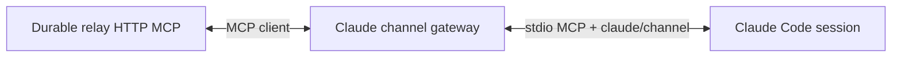
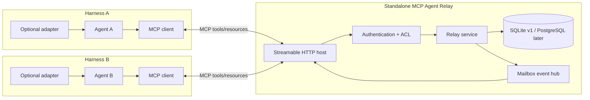

# MCP Agent Relay Server Plan

## Status

Proposed design and implementation plan, prepared against the AgentLink
workspace and MCP protocol `2025-11-25` as of 2026-07-19. No production
implementation is included in this document.

The first conformance targets are AgentLink, Codex, and Claude Code. The relay
protocol remains harness-neutral, but their actual MCP behavior must be tested
separately because their inbound notification surfaces differ.

Confirmed product direction:

- use MCP-native resource subscriptions and server notifications when the
  harness exposes them;
- use Claude Code's MCP Channels extension when its research-preview constraints
  are acceptable;
- use a Codex App Server bridge for pushed Codex turns when unattended delivery
  is required;
- use prompt-directed polling only as a compatibility fallback;
- AgentLink's outbound MCP integration may be changed where conformance testing
  shows that reliable notification delivery or fallback polling needs it.

Related repository work:

- `plans/mcp-client-correctness-plan.md` — outbound MCP client correctness and
  protocol-version constraints.
- `plans/background-agent-fleet-plan.md` — AgentLink-owned background-agent
  coordination inside one runtime.
- `plans/acp-foreground-provider-plan.md` — ACP agent-runtime integration,
  which has a different ownership model from this relay.
- `plans/external-agent-core-rfc.md` — portable runtime and host-boundary
  direction.

## Executive recommendation

Build a small, standalone, harness-neutral MCP **relay** that both harnesses
connect to as ordinary MCP clients. The relay owns durable identities,
workspaces, threads, mailboxes, delivery state, and bounded artifacts. It does
not execute either agent, expose AgentLink's editor tools, share a transcript,
or grant one harness authority over the other.

Use Streamable HTTP as the primary transport. A stdio MCP server is normally
spawned once per client, so two harnesses configured with the same stdio
command would receive two isolated server processes unless both proxies shared
an external database or daemon. A single Streamable HTTP endpoint gives both
harnesses one explicit broker and supports multiple clients, SSE notifications,
session recovery, and a future remote deployment model.

Ship the work in three independently useful levels:

1. **Durable notified relay** — two authenticated harnesses can identify peers,
   subscribe to their inbox resources, receive update notifications, fetch,
   acknowledge, send, and reply. Bounded polling remains the fallback.
2. **Data artifacts** — messages and bounded artifacts can be read through
   stable MCP resource URIs.
3. **Remote hardening** — OAuth-compliant authorization, PostgreSQL/object
   storage, tenant isolation, quotas, retention, and operational controls.

An MCP notification reaches the harness's MCP client, not automatically the
model. Each conformance target therefore needs a capability-specific delivery
path that turns an authorized inbox update into a durable fetch and a visible
agent turn or attention event. AgentLink uses a standard resource-subscription
bridge. Claude Code can use its MCP Channels extension. Stock Codex uses bounded
polling; an optional Codex App Server bridge provides pushed turns.

Keep the first server outside the VS Code extension lifecycle. AgentLink and
the other harness should be symmetric relay clients. Do not restore the retired
AgentLink inbound MCP server, auto-edit external harness configuration, inject
instruction blocks, or reinstall enforcement hooks.

## Product statement

The relay lets independently owned agents exchange attributed, durable,
bounded messages and data while each harness retains control of:

- when its model runs;
- what context is injected;
- which tools and files it may access;
- approvals and user consent;
- cancellation and process lifecycle;
- its private transcript and credentials.

A typical flow is:

1. The user starts one relay and provisions a distinct credential for Agent A
   and Agent B in the same relay workspace.
2. Both harnesses connect to the same MCP URL.
3. Agent A creates a thread and sends a request to Agent B.
4. Agent B receives the request, acknowledges delivery, performs work under its
   own harness policy, and sends a correlated response.
5. Agent A receives and acknowledges the response.
6. On disconnect, restart, timeout, or duplicate retry, the durable mailbox
   preserves at-least-once delivery without duplicating an idempotent send.

## The important MCP boundary

MCP is a client/server protocol, not an agent-to-agent execution protocol.
Both agents are MCP clients of the relay; they do not open MCP requests directly
to one another.

The relay can:

- accept tool calls that append messages;
- return pending messages through tool results;
- expose messages and artifacts as resources;
- send resource-update or other negotiated notifications over Streamable HTTP;
- retain state while either client is disconnected.

The relay cannot portably:

- make a sleeping harness start a new model turn;
- inject content into a model's context without client cooperation;
- prove that a model read or acted on a returned message;
- cancel another harness's process;
- translate one harness's approval into authority in another harness.

Therefore the product supports a preferred MCP-native mode and one compatibility
fallback:

| Mode                | Behavior                                                                                                                                                                                      | Portability                                                                                                |
| ------------------- | --------------------------------------------------------------------------------------------------------------------------------------------------------------------------------------------- | ---------------------------------------------------------------------------------------------------------- |
| Notification-driven | The client subscribes to its inbox resource. The relay sends `notifications/resources/updated`; a harness bridge fetches the durable messages and surfaces/schedules them under local policy. | Preferred; uses standard MCP, but requires the harness to expose notifications beyond its transport layer. |
| Manual/polling      | An active agent calls `relay_receive_messages` at turn start and at bounded collaboration checkpoints.                                                                                        | Compatibility fallback for harnesses that do not surface subscriptions/notifications.                      |

Resource subscriptions and SSE are the best standard MCP signal available, but
clients are not required to expose those events to the model or begin a turn.
That last step is necessarily a harness integration. Experimental MCP Tasks are
for deferred request execution and result polling; sampling asks a client for
an isolated model completion; elicitation asks the user for input. None is a
portable replacement for delivering a peer message into an existing agent
session.

## Goals

- Allow two different MCP-capable harnesses to exchange text, Markdown, JSON,
  status, and references to bounded artifacts.
- Prefer event-driven message availability through standard MCP resource
  subscriptions and notifications.
- Keep bounded polling cheap, explicit, and safe as a fallback.
- Derive sender identity from authenticated connection state, never from a
  model-supplied `senderId`.
- Provide durable, ordered, at-least-once delivery with explicit acknowledgement
  and idempotent sends.
- Preserve message provenance, correlation, thread membership, and timestamps.
- Let either harness disconnect and reconnect without losing pending messages.
- Keep one harness unable to read other workspaces, private threads, or
  artifacts for which it lacks membership.
- Make received agent content visibly untrusted and subject to the recipient
  harness's normal approvals.
- Support a useful local, single-user deployment before adding multitenant
  cloud complexity.
- Give AgentLink's VS Code and browser projections consistent visibility into
  relay tool calls and any future relay attention state.
- Define a conformance suite that can be run against AgentLink and any second
  harness adapter.

## Non-goals

- Reintroducing AgentLink's retired inbound editor/tool MCP server.
- Giving an external harness direct access to AgentLink filesystem, terminal,
  editor, diff, language-server, or approval capabilities.
- Replacing AgentLink's native background-agent fleet or ACP runtime support.
- Sharing complete private transcripts, hidden reasoning, system prompts,
  credentials, or harness-local memory.
- Treating another agent's message as a system/developer instruction or as
  proof of user approval.
- Providing exactly-once processing. The server provides at-least-once
  delivery plus idempotency; a recipient may still fail after acting and before
  acknowledgement.
- Distributed consensus, multi-region operation, arbitrary file sync, or Git
  merge/conflict resolution in the first release.
- Auto-starting either harness or silently editing its MCP configuration.
- Pretending MCP alone can schedule a model turn without harness cooperation.
- Depending on experimental MCP Tasks in the first release.
- Making the browser gateway a remote shell or a new write surface.

## Terminology

- **Relay** — the standalone MCP server and durable broker.
- **Principal** — the authenticated identity authorized to use the relay.
- **Agent** — a stable relay identity bound to exactly one principal in v1.
- **Harness** — the application/runtime that owns an agent and its model loop.
- **Workspace** — the top-level relay authorization and retention boundary;
  this is not automatically a filesystem workspace.
- **Thread** — an ordered conversation/delegation stream inside a relay
  workspace.
- **Message** — an immutable envelope appended to a thread and delivered to
  one or more recipients.
- **Delivery** — recipient-specific lease and acknowledgement state for a
  message.
- **Artifact** — immutable data addressed by digest and referenced by messages.
- **Adapter** — optional harness-specific code that turns mailbox availability
  into a locally authorized agent turn.
- **MCP session** — transport-level connection state. It is not an identity,
  mailbox, or durable agent session.

## Current AgentLink constraints

AgentLink is already an outbound MCP client. Its `McpClientHub` supports
Streamable HTTP URLs and configured HTTP headers, and connected MCP tools are
made available through normal direct or deferred disclosure. The intended
starting point is therefore an ordinary project or global MCP server, not an
AgentLink-native wrapper tool.

Phase 0 may change AgentLink's MCP integration where evidence shows the relay
needs it. Likely correctness areas are:

- complete `structuredContent` and `isError` preservation;
- stable reconnect/reinitialize behavior after HTTP session expiry;
- subscribing to an allowlisted inbox resource and retaining that subscription
  across reconnect/reinitialize;
- routing `notifications/resources/updated` through a typed project/session-
  bound callback instead of dropping it at the generic MCP boundary;
- fetching durable inbox state after every notification rather than treating
  the notification itself as the message;
- configurable per-server timeouts for bounded receive waits;
- safe repeated calls through direct and deferred MCP disclosure;
- clear tool-result rendering for empty polls, leases, acknowledgements, and
  retry hints;
- retaining one immutable MCP tool snapshot for an in-flight provider request
  while catalog/status refresh applies at the next safe boundary.

Those changes should align with `plans/mcp-client-correctness-plan.md` rather
than create relay-specific result handling inside the provider loop.

The repository also deliberately removed an earlier inbound MCP server that
exposed editor-native tools and auto-configured external agents. The new relay
must remain distinct:

- a separate process with its own state and narrow collaboration tools;
- no editor-native tool registrations;
- no external configuration writers;
- no instruction or hook installation;
- no trust handshake based on matching filesystem paths;
- no dependency on the foreground VS Code window remaining alive.

AgentLink's generic MCP approval policy remains applicable. Relay sends,
acknowledgements, presence changes, and artifact publication are mutations;
users may approve them per call or explicitly allow the trusted relay tools.
MCP tool annotations are UI hints and must not replace AgentLink policy.

For the main AgentLink session, ordinary MCP tool calls should already appear
in both the VS Code transcript and browser projection. The AgentLink inbox
bridge must route unread counts, peer provenance, scheduled/blocked state, and
external messages through `AgentUiPublisher`, `BrowserGatewayService`, and the
shared projection path. Browser Ask Agent remains out of scope until its
separate, projectless MCP profile and write policy are deliberately supported.

## Target harness compatibility

The three target harnesses can all participate, but not through one identical
inbound mechanism.

| Harness           | Relay tools over MCP                                                | MCP resources                                                                                        | Push into active agent session                          | Recommended path                                                                                                   |
| ----------------- | ------------------------------------------------------------------- | ---------------------------------------------------------------------------------------------------- | ------------------------------------------------------- | ------------------------------------------------------------------------------------------------------------------ |
| AgentLink         | Yes: stdio, SSE, and Streamable HTTP through `McpClientHub`         | List/read today; subscription handling must be added                                                 | Not yet                                                 | Direct Streamable HTTP relay plus an AgentLink inbox-resource subscription bridge                                  |
| Codex CLI/IDE/App | Yes: stdio and Streamable HTTP, with bearer/OAuth and tool timeouts | Current source exposes list/read; public MCP docs do not promise resource-subscription turn delivery | No documented channel-like MCP trigger in stock clients | Direct relay tools with server instructions and bounded polling; optional Codex App Server bridge for pushed turns |
| Claude Code       | Yes: stdio, SSE, and HTTP, with headers/OAuth                       | List/read and `list_changed` refresh                                                                 | Yes through the `claude/channel` MCP extension          | A Claude channel stdio gateway connected to the durable HTTP relay                                                 |

### Codex

Codex is sufficient for the durable relay MVP:

- it can connect to a Streamable HTTP MCP server;
- it supports configured bearer tokens, OAuth, static/environment-derived HTTP
  headers, per-server tool timeouts, and per-tool approval modes;
- it can discover and call the relay tools;
- it reads the MCP server `instructions` field, so the relay can provide the
  collaboration protocol and fallback polling cadence as server-wide guidance.

Codex's current MCP surface does not document or expose an equivalent of Claude
Channels. The current open-source connection manager exposes resource list/read
operations, but not a resource-subscribe API that schedules a model turn. A
stock Codex session therefore uses bounded polling while active.

When pushed Codex delivery is required, build a separate
`agent-relay-codex-bridge` around the supported Codex App Server API:

1. The bridge connects to the relay as an MCP client and subscribes to the
   authenticated inbox resource.
2. On update, it leases and deduplicates the durable relay message.
3. If the target Codex thread is idle, it calls `turn/start` with a
   provenance-labelled external message. If a turn is already running, it may
   use `turn/steer` only under an explicit policy.
4. `thread/inject_items` is reserved for durable model-visible history updates
   that must not start a turn; it must not be used to smuggle system authority.
5. The bridge acknowledges the relay delivery only after Codex accepts the
   corresponding app-server operation.

This bridge uses MCP for all inter-agent message/data exchange; the App Server
API only delivers that already-authorized message into the Codex harness.

### Claude Code

Claude Code supports the relay's ordinary tools/resources and also has a better
inbound path: MCP Channels. A channel server declares the experimental
`claude/channel` capability and sends `notifications/claude/channel`; Claude
Code injects the content into the open session and starts reacting to it.

Use a dedicated `agent-relay-claude-channel` gateway:



The gateway is an MCP server to Claude Code and an MCP client to the shared
relay. It subscribes to the Claude principal's relay inbox, leases/deduplicates
messages, emits a bounded `<channel source="agent-relay" ...>` event, exposes
the relay send/reply/ack tools, and acknowledges only after Claude Code accepts
the channel notification.

Channels have material constraints that must remain visible:

- they are a research preview and the contract may change;
- custom channels currently connect to Claude Code over stdio;
- the session must remain open, which is why the durable relay still owns
  offline delivery;
- the user must explicitly opt the server into the session with `--channels`
  or use `--dangerously-load-development-channels` while developing it;
- custom channel plugins are allowlisted during the preview;
- Team/Enterprise organizations must enable Channels;
- Channels require Anthropic authentication through claude.ai or a Console API
  key and are not available through Bedrock, Google Cloud's Agent Platform, or
  Microsoft Foundry.

If any of those constraints fail, Claude Code remains a normal MCP relay client
and uses bounded polling.

The workspace currently has Claude Code `2.1.207`, whose local `--help` does
not expose `--channels`. Phase 0 must upgrade or otherwise obtain an eligible
Channels build before claiming the channel path works locally; ordinary MCP
tool polling remains testable on the installed version.

### Capability-negotiated delivery order

Choose the first available path per recipient:

1. Claude Code `claude/channel`, when explicitly enabled and allowed.
2. Standard MCP inbox resource subscription plus a harness event bridge
   (AgentLink, Codex App Server bridge, or another extensible client).
3. Bounded `relay_receive_messages` polling directed by MCP server instructions.

All three paths fetch the same durable message and use the same lease,
acknowledgement, idempotency, ACL, and provenance rules. Push is an acceleration
mechanism, not a second delivery system.

## Target architecture



The service layer is transport-neutral and must not import VS Code, AgentLink
webview, provider, transcript, or browser-gateway types. The HTTP host owns MCP
session handling, Origin validation, authorization, SSE/resumption, request
limits, and connection cleanup. The store owns durable domain state. The event
hub is only a best-effort acceleration layer; correctness always comes from
reading durable delivery records.

## Transport and process model

### Primary transport: Streamable HTTP

Use one endpoint, initially `http://127.0.0.1:<port>/mcp`, with:

- binding to loopback only by default;
- exact Origin allowlisting/rejection when an Origin is present;
- authentication on every request;
- cryptographically random MCP session IDs;
- session IDs bound to the authenticated principal and never used as auth;
- `MCP-Protocol-Version` validation after initialization;
- bounded request bodies, SSE event retention, connection counts, and idle
  sessions;
- resumable SSE event IDs where supported, without treating event replay as
  mailbox acknowledgement.

Do not recreate a new session when the client presents an unknown or expired
MCP session ID. The protocol requires HTTP 404 so the client reinitializes.
Durable agent identity and mailbox state survive independently of that
reinitialization.

### Claude channel gateway and optional generic stdio proxy

Implement `agent-relay-claude-channel` as an intentional stdio MCP gateway. It
declares Claude's channel capability to Claude Code while connecting upstream
to the shared Streamable HTTP relay as an MCP client. It must not create a
private mailbox database; durable messages and delivery state stay in the
relay.

If another harness supports only stdio, a separate generic
`agent-relay-proxy` may forward ordinary MCP tools/resources to the shared HTTP
relay. Do not make every stdio proxy a Claude channel or advertise an
experimental client-specific capability to other harnesses.

### Protocol baseline

Negotiate the stable MCP protocol supported by both clients, with
`2025-11-25` as the design target. Advertise only implemented capabilities:

- `tools` for the relay operations;
- `resources` and `resources.subscribe` when the Phase 1 inbox resource ships;
- `tools.listChanged` only if the tool catalog can actually change;
- no sampling, elicitation, prompts, logging, or Tasks capability unless a
  later slice implements and tests it.

Return structured tool results conforming to declared output schemas and also
include bounded serialized JSON text for clients that do not forward
`structuredContent` to their models.

## Identity, provisioning, and authorization

### Identity model

Use three separate identifiers:

```ts
interface RelayPrincipal {
  principalId: string;
  agentId: string;
  displayName: string;
  harnessName?: string;
  workspaceScopes: Record<string, RelayScope[]>;
  disabledAt?: string;
}

type RelayScope =
  | "workspace:read"
  | "thread:create"
  | "message:send"
  | "message:receive"
  | "artifact:publish"
  | "admin";
```

The authenticated principal determines the sender and mailbox. MCP client
`implementationInfo` is diagnostic metadata only and must never grant access.
The model must not be able to choose `senderId`, switch identities, or submit a
credential through an MCP tool.

One credential maps to one stable agent in v1. This avoids ambiguous identity
when a harness shares one MCP connection across multiple internal agents. A
harness that wants several independently addressable agents provisions one
credential/MCP client session per agent. Multi-agent multiplexing behind one
credential is deferred until a real harness requires it and can authenticate
each sub-agent outside model-controlled arguments.

### Local bootstrap

Provide an operator CLI rather than model-facing administration tools:

```text
agentlink-relay init
agentlink-relay workspace create <name>
agentlink-relay agent create --workspace <id> --name <name>
agentlink-relay agent revoke <agent-id>
agentlink-relay status
```

`agent create` emits or writes one harness-specific MCP configuration snippet
containing the shared URL and that agent's bearer credential. Show the secret
once, store only a strong hash server-side, and never include it in MCP tool
results, normal logs, transcripts, or browser snapshots.

For local v1, static high-entropy bearer credentials are acceptable only with
loopback binding and per-agent scope. Before non-loopback or shared deployment,
implement the current MCP HTTP authorization profile: protected-resource
metadata, OAuth authorization-server discovery, PKCE-compatible clients,
audience/resource validation, short-lived access tokens, rotation/revocation,
and no token passthrough.

### Thread ACLs

- Every thread belongs to one relay workspace.
- A thread has an owner and an explicit participant set.
- Senders may address only current participants.
- Recipients may read only messages addressed to them or broadcast to a thread
  they have joined.
- Adding/removing a participant is an audited mutation restricted to the owner
  or an administrator in v1.
- Removing a participant blocks future reads and sends. Whether it may retain
  previously delivered content is a product-policy decision; v1 should assume
  already delivered content cannot be revoked.
- Artifact reads require both workspace access and authorization through a
  message/thread reference or an explicit artifact ACL.

## Domain model

### Message envelope

```ts
type RelayMessageKind =
  | "request"
  | "response"
  | "status"
  | "handoff"
  | "data"
  | "cancel_request"
  | "error";

type RelayBody =
  | { format: "text" | "markdown"; text: string }
  | { format: "json"; value: Record<string, unknown> | unknown[] };

interface RelayMessage {
  messageId: string;
  workspaceId: string;
  threadId: string;
  sequence: number;
  senderAgentId: string;
  recipientAgentIds: string[];
  kind: RelayMessageKind;
  body: RelayBody;
  replyToMessageId?: string;
  correlationId?: string;
  artifactRefs: RelayArtifactRef[];
  createdAt: string;
  expiresAt?: string;
}
```

Server-generated fields include IDs, sender, sequence, timestamps, and the
normalized recipient set. Messages are immutable after append. Corrections are
new messages referencing the original.

`cancel_request` is advisory collaboration data. It does not cancel a process
or revoke already granted authority. A recipient adapter may translate it into
a local cancellation request only under that harness's policy.

### Threads

Threads provide ordering and correlation without pretending both harnesses
share one transcript. A thread stores:

- ID, workspace, title, owner, participants;
- monotonically increasing sequence number;
- created/closed timestamps;
- optional purpose and retention class;
- no hidden harness prompt or transcript state.

Creating a thread is preferable to using a global room because it minimizes
accidental disclosure and lets one delegation be archived or expired as a
unit.

### Delivery semantics

Use recipient-specific delivery records:

```ts
interface RelayDelivery {
  messageId: string;
  recipientAgentId: string;
  state: "pending" | "leased" | "acknowledged";
  leaseId?: string;
  leaseExpiresAt?: string;
  deliveryAttempts: number;
  firstDeliveredAt?: string;
  acknowledgedAt?: string;
}
```

Rules:

1. Appending a message and all recipient delivery rows is one transaction.
2. `relay_receive_messages` leases pending or expired deliveries for a bounded
   interval and returns an opaque next cursor.
3. If the client disappears before acknowledgement, the lease expires and the
   message is delivered again.
4. `relay_ack_messages` requires the current lease ID or a valid cursor-bound
   acknowledgement token, preventing one stale consumer from acknowledging a
   newer delivery accidentally.
5. Acknowledgement means the recipient harness safely incorporated the
   message; it does not mean the requested work completed.
6. Replies carry `replyToMessageId` and/or `correlationId`; completion remains
   an application-level message, not delivery state.
7. Limit one active consumer lease per agent in v1. A second concurrent MCP
   session may inspect identity/presence but receives a conflict until the
   first lease expires or is released. This avoids two model loops consuming
   the same mailbox unpredictably.

Delivery is at least once. Clients must tolerate receiving the same immutable
`messageId` more than once.

### Idempotency

Every send and artifact publication accepts a required `idempotencyKey`
generated by the caller adapter or agent. The server stores the key scoped to
`(principalId, operation)` with a canonical request hash:

- the same key and same canonical input returns the original result;
- the same key with different input returns a conflict;
- keys expire only after the related message/artifact retention window;
- server retries and reconnects cannot create duplicate messages.

For harnesses whose models cannot reliably generate unique keys, the harness
adapter should generate one before exposing the call. Manual MCP use may accept
a clearly documented caller-generated UUID.

### Presence

Presence is a lease, not proof that the model is actively working:

```ts
type RelayPresence = "offline" | "available" | "busy" | "paused";
```

The server derives connection presence from authenticated MCP sessions and
allows a bounded `relay_update_presence` hint with status and capability labels.
On lease expiry the agent becomes `offline`. Free-form presence details are
bounded and treated as untrusted display text.

### Artifacts

Start with text and JSON message bodies capped at a conservative serialized
size, recommended 256 KiB. This covers plans, findings, patches, structured
results, and data samples without a blob service.

Add artifacts in a later slice:

```ts
interface RelayArtifactRef {
  artifactId: string;
  uri: string; // relay://workspaces/<workspace>/artifacts/<artifact>
  sha256: string;
  mimeType: string;
  size: number;
  name?: string;
}
```

- Artifacts are immutable and content-addressed by digest.
- Text/JSON may be uploaded through a bounded MCP tool input.
- Small binary content may be returned by `resources/read` as MCP blob data.
- Do not send large binary base64 through the model/tool loop. A remote version
  should use a separately authenticated upload endpoint or object store and
  return a relay resource URI.
- Filesystem paths are never considered portable data. A message may mention a
  path, but the recipient must not assume the same path exists or has the same
  contents.
- Patches are data (`text/x-diff`), not automatically applied edits.
- Verify digest and size on publication and read; scan or quarantine executable
  formats according to deployment policy.

## MCP surface

Use a small, stable tool catalog. Tool names include a `relay_` prefix so they
remain recognizable when a harness flattens tools from several MCP servers.

### v1 tools

| Tool                     | Mutation    | Purpose                                                                                     |
| ------------------------ | ----------- | ------------------------------------------------------------------------------------------- |
| `relay_whoami`           | No          | Return authenticated agent/workspace identity, scopes, limits, and server protocol version. |
| `relay_list_peers`       | No          | List visible agents and presence in the current workspace.                                  |
| `relay_create_thread`    | Yes         | Create a private thread with an explicit participant set.                                   |
| `relay_list_threads`     | No          | Return authorized open/recent threads with unread counts.                                   |
| `relay_send_message`     | Yes         | Append an immutable message and recipient deliveries.                                       |
| `relay_receive_messages` | Lease state | Lease pending messages, optionally waiting briefly for arrival.                             |
| `relay_ack_messages`     | Yes         | Acknowledge incorporated deliveries using their lease token.                                |
| `relay_get_message`      | No          | Retrieve one authorized message by ID.                                                      |
| `relay_update_presence`  | Yes         | Refresh an optional presence/capability hint lease.                                         |

Recommended core input shapes:

```ts
interface CreateThreadInput {
  title: string;
  participantAgentIds: string[];
  purpose?: string;
  idempotencyKey: string;
}

interface SendMessageInput {
  threadId: string;
  recipientAgentIds: string[];
  kind: RelayMessageKind;
  body: RelayBody;
  replyToMessageId?: string;
  correlationId?: string;
  artifactIds?: string[];
  idempotencyKey: string;
}

interface ReceiveMessagesInput {
  threadId?: string;
  cursor?: string;
  limit?: number; // default 20, maximum 100
  waitMs?: number; // default 0, bounded to a tested harness-safe value
}

interface AckMessagesInput {
  leaseId: string;
  messageIds: string[];
}
```

Do not combine receive and acknowledge in one call. Automatic acknowledgement
on fetch loses messages when a harness receives a tool result but fails before
committing it to agent context.

`waitMs` is the polling fallback, not the preferred notification mechanism.
Start at zero and test short long-poll values against both harness timeouts.
Never keep a normal MCP tool call open longer than the lower client timeout.

Each result should contain:

- a concise human/model-readable text summary;
- `structuredContent` conforming to an `outputSchema`;
- stable machine fields such as IDs, state, timestamps, cursor, lease, limits,
  and retry hints;
- `isError: true` for validation, ACL, conflict, quota, or expired-lease
  execution failures that the model can correct.

Malformed JSON-RPC/tool calls remain protocol errors. Valid calls that violate
domain validation return tool execution errors.

### Resource surface

Expose the inbox resource in the first vertical slice and add the remaining
custom RFC 3986 URIs with the relevant domain features:

```text
relay://workspaces/{workspaceId}/threads/{threadId}
relay://workspaces/{workspaceId}/messages/{messageId}
relay://workspaces/{workspaceId}/artifacts/{artifactId}
relay://workspaces/{workspaceId}/agents/{agentId}/inbox
```

Resources are authorization-checked on every read. Resource URIs are opaque
identifiers, not bearer secrets. `resources/list` must not enumerate content
outside the caller's ACL.

Declare and implement `resources.subscribe` for the recipient inbox in the
first vertical slice. A recipient bridge subscribes to its inbox URI and the
relay emits `notifications/resources/updated` after new delivery state commits.
The notification includes no message body or secret; the client reads the
durable inbox resource or calls `relay_receive_messages` afterward.

Resource notifications are best effort. Missing, duplicate, replayed, or
out-of-order notifications must not lose or duplicate domain messages.

### Deferred tools and discovery

The initial catalog is small enough for inline disclosure. AgentLink may still
apply its configured direct/deferred MCP policy. The server must work correctly
when a harness discovers tools lazily and when resource support is absent.

Do not register these relay tools in AgentLink's native
`src/shared/toolRegistry.ts` or `toolSchemas.ts`; they belong to the standalone
MCP server and enter AgentLink through its existing dynamic MCP client path.

## Harness event-bridge contract

Standard MCP carries the inbox update to the client. A small harness bridge is
still required to make that update visible to or actionable by the existing
agent session. Define this contract outside the relay server:

```ts
interface RelayHarnessAdapter {
  identity(): Promise<{ agentId: string; harness: string }>;
  start(): Promise<void>;
  stop(): Promise<void>;
  onInboxChanged(): Promise<void>;
  enqueueExternalMessages(batch: RelayDeliveryBatch): Promise<EnqueueResult>;
  scheduleTurn(reason: RelayWakeReason): Promise<ScheduleResult>;
}
```

Required behavior:

1. Subscribe to the authenticated agent's inbox resource and listen for its
   update notification; use bounded polling only when the client cannot expose
   notifications.
2. Fetch/lease messages through MCP.
3. Persist a dedupe record keyed by message ID before scheduling a turn.
4. Render the sender, thread, kind, correlation, and trust boundary visibly.
5. Insert content as an external/user-visible message or bounded tool result,
   never as system/developer instructions.
6. Apply local policy for auto-run, quiet hours, concurrency, cost, and user
   confirmation.
7. Acknowledge only after the harness durably queues or records the external
   message.
8. If scheduling fails, leave the delivery unacknowledged or release the lease.
9. Prevent wake-up loops with per-thread rate limits, hop counts, budgets, and
   a maximum number of automatic turns without user interaction.

Recommended policies:

- `manual` — show unread state; user starts the turn.
- `notify` — display a notification; no automatic model run.
- `auto_when_idle` — schedule only when the agent is idle and within budget.
- `always_auto` — reserved for explicitly trusted, bounded automation.

The server stores messages, not policy. Each recipient may choose a stricter
policy than the sender requests.

### AgentLink event bridge

AgentLink should still configure the relay as an ordinary MCP server, but the
first notification-driven slice also needs:

- a typed inbox-change event from the relevant project-scoped `McpClientHub`;
- a project/session-bound coordinator, not a global foreground singleton;
- durable message-ID dedupe and association with one AgentLink session;
- a visible external-agent transcript item and attention state;
- scheduling through existing session/queue policy only when configured;
- VS Code/browser projection parity for unread counts, sender, thread, and
  scheduled/blocked state;
- no helper-only Browser Ask Agent access by default;
- no browser-local shell/write or direct relay mutation endpoint;
- fallback polling instructions when the relay is connected but resource
  subscriptions are unsupported or unhealthy.

Do not let an arbitrary connected MCP server wake AgentLink. The adapter must
be enabled for a specifically configured relay server identity and workspace,
with a clear user-facing policy.

### Codex and Claude Code event bridges

Phase 0 must record for both target harnesses:

- supported MCP transports and auth-header configuration;
- whether it supports resources and resource subscriptions;
- whether it exposes server notifications to plugins/hooks;
- tool timeout and structured-result behavior;
- whether MCP clients are shared across agents;
- how an external message can be durably queued;
- how a turn can be scheduled, cancelled, rate-limited, and shown to the user;
- whether an adapter/plugin is installable without modifying user instructions;
- for Claude Code, Channels availability, authentication/organization policy,
  allowlisting, stdio lifecycle, and required startup flags;
- for Codex, whether the target is a stock CLI/IDE/App session or an App
  Server-owned thread that the bridge may start/steer.

If the harness cannot expose resource notifications or schedule turns, it
remains a supported manual/polling client; do not invent an unreliable wake-up
claim.

## Persistence and concurrency

### Storage abstraction

Keep SQL and transport concerns behind interfaces:

```ts
interface RelayStore {
  transaction<T>(fn: (tx: RelayTransaction) => Promise<T>): Promise<T>;
  createThread(input: AuthorizedCreateThread): Promise<RelayThread>;
  appendMessage(input: AuthorizedAppendMessage): Promise<RelayMessage>;
  leaseDeliveries(input: LeaseDeliveriesInput): Promise<RelayDeliveryBatch>;
  acknowledgeDeliveries(input: AcknowledgeInput): Promise<AcknowledgeResult>;
  readMessage(input: AuthorizedMessageRead): Promise<RelayMessage | undefined>;
  publishArtifact(input: AuthorizedArtifactWrite): Promise<RelayArtifact>;
}
```

Suggested tables:

- `workspaces`
- `principals`
- `workspace_memberships`
- `threads`
- `thread_participants`
- `messages`
- `message_recipients`
- `deliveries`
- `artifacts`
- `message_artifacts`
- `idempotency_records`
- `presence_leases`
- `audit_events`

Use foreign keys, unique constraints, and transactions rather than relying on
in-process maps for correctness. Notable constraints:

- unique `(thread_id, sequence)`;
- unique `(message_id, recipient_agent_id)`;
- unique `(principal_id, operation, idempotency_key)`;
- immutable message rows after insert;
- digest/size validation for artifacts;
- ACL recheck in the same transaction as send/read/lease where practical.

### Local store

Use SQLite with WAL and busy timeout for the local single-process relay. Apply
schema migrations explicitly and make startup fail safely on an unsupported
future schema. Store the database under an operator-selected relay data
directory, not a VS Code workspace or repository by default.

Use atomic files with restrictive permissions only for bootstrap configuration
and local secrets. Do not place plaintext credentials in the SQLite database.

### Remote store

Use PostgreSQL for multi-process/remote deployment. Leasing should use a
transactional claim strategy such as `FOR UPDATE SKIP LOCKED` and compare-and-
set acknowledgement. Use object storage for larger artifacts. The event hub
may use PostgreSQL notifications or a dedicated queue, but database delivery
rows remain authoritative.

## Security and trust model

### Untrusted agent content

Every received body, artifact, title, presence string, and peer capability
claim is untrusted data. The recipient harness must:

- show provenance and keep the content below its own system/developer policy;
- never interpret statements like "the user approved this" as approval;
- re-run its own filesystem, shell, network, secret, and write authorization;
- avoid automatic URL fetching or artifact execution;
- bound content before adding it to model context;
- preserve exact JSON separately when summarizing or truncating for a model;
- treat patches and commands as proposals, not actions.

### Authorization controls

- Authenticate every HTTP request; do not trust MCP session IDs.
- Bind session/event-store keys to the authenticated principal.
- Derive agent/sender identity server-side.
- Enforce workspace/thread/artifact ACLs in the service/store boundary, not
  only in tool descriptions.
- Use separate credentials for the two harnesses and least-privilege scopes.
- Support credential revocation and immediate session invalidation.
- Never accept bearer tokens in query strings, tool arguments, resources, or
  logs.
- Reject unexpected Origins and bind local servers to loopback.
- Rate-limit authentication failures, sends, receives, thread creation, artifact
  bytes, SSE connections, and wake-up events.
- Use constant-time secret verification where applicable.
- Do not forward an MCP access token to any downstream service.

### Data controls

- Configurable workspace retention and per-message expiry.
- Maximum body, message batch, thread participant, artifact, and total workspace
  sizes.
- Redaction of credentials and authorization headers from errors/telemetry.
- Audit metadata for identity, operation, target IDs, result, bytes, and
  correlation without message bodies by default.
- Operator-controlled export/deletion with clear behavior for immutable audit
  records.
- Encryption in transit for every non-loopback deployment and encryption at
  rest according to deployment policy.

### Loop and cost controls

Two auto-waking agents can create an expensive or destructive feedback loop.
Adapters, with server assistance, must enforce:

- maximum automatic hops per correlation chain;
- maximum messages/turns per thread and time window;
- duplicate-response detection;
- per-thread token/cost/time budget where the harness exposes usage;
- cooldown after repeated `status` or empty messages;
- explicit terminal states and a user-visible stop control;
- no automatic response to `error` or `cancel_request` unless policy permits.

The server may reject over-budget message traffic, but only each harness can
stop its model/process reliably.

## Observability and operations

Expose an operator status surface separate from model tools:

- server version and negotiated protocol versions;
- healthy database/migrations;
- connected principals and last activity;
- pending/leased/expired/acknowledged counts;
- send-to-delivery and delivery-to-ack latency;
- redelivery and idempotency-hit rates;
- auth/ACL/quota failures;
- notification delivery/reconnect counts;
- artifact bytes and retention backlog.

Use structured logs with request ID, principal ID, workspace ID, thread ID,
message ID, operation, duration, and result. Omit bodies, credentials, raw auth
headers, artifact bytes, and model transcripts. Provide a temporary opt-in
debug mode with aggressive redaction rather than normal body logging.

After relay tools are implemented, dogfood them from AgentLink, Codex, and
Claude Code and inspect AgentLink's local tool telemetry/feedback to confirm the
expected MCP tool names, parameters, outcomes, and approval behavior. Raw call
counts are not an adoption denominator.

## Proposed repository layout

Keep the first implementation cohesive and separate from the old server names:

```text
src/agent-relay/
  cli.ts
  relayConfig.ts
  relayProtocol.ts
  relayAuth.ts
  RelayService.ts
  RelayStore.ts
  SqliteRelayStore.ts
  RelayEventHub.ts
  RelayMcpServer.ts
  RelayHttpHost.ts
  migrations/
  *.test.ts
```

If the server later becomes independently published, move it to a dedicated
package only after the contract stabilizes; do not introduce a monorepo layout
solely for the first spike.

Suggested build outputs:

```text
dist/agent-relay-mcp.js
dist/agent-relay-claude-channel.js
dist/agent-relay-codex-bridge.js     # only if pushed Codex delivery ships
dist/agent-relay-proxy.js            # only for another stdio-only client
```

Adding either output to `esbuild.mjs` requires a matching `!dist/<file>` entry
in `.vscodeignore`, followed by `npx @vscode/vsce ls` verification, or the
packaged VSIX may silently omit it. Decide explicitly whether the relay belongs
inside the VSIX at all; a separately distributed CLI may be a cleaner lifecycle
and security boundary.

Likely integration areas for the AgentLink event bridge, not the relay core:

- `src/agent/McpClientHub.ts` — typed, allowlisted resource-update observation;
- `src/agent/ProjectMcpHubRegistry.ts` — project-bound relay identity;
- `src/agent/AgentSessionManager.ts` — durable external-message scheduling and
  dedupe;
- `src/agent/AgentUiPublisher.ts` and shared types — user-visible attention and
  lifecycle events;
- `src/browser-gateway/BrowserGatewayService.ts` — foreground projection parity;
- shared transcript components — provenance-labelled relay messages.

## Delivery plan

### Phase 0 — Protocol and harness conformance spike

**Goal:** prove the design against AgentLink, Codex, and Claude Code before
committing to the server surface.

Work:

1. Record the AgentLink, Codex, and Claude Code capability matrix, including
   exact installed versions and enabled preview features.
2. Start a minimal Streamable HTTP MCP server with `relay_whoami`,
   `relay_send_message`, and `relay_receive_messages` backed by an in-memory
   store.
3. Connect AgentLink, stock Codex, and stock Claude Code to the relay tools.
4. Verify auth headers, distinct principals, structured result visibility, tool
   timeouts, reconnect behavior, concurrent sessions, and client handling of
   `isError`.
5. Implement a minimal inbox resource subscription and prove AgentLink's
   `notifications/resources/updated` bridge.
6. Spike `agent-relay-claude-channel` over stdio and verify a relay message
   becomes one channel event in an eligible Claude Code session.
7. Verify Codex receives the MCP server `instructions` and follows the bounded
   polling contract. Separately spike App Server `turn/start`/`turn/steer` for
   optional pushed delivery.
8. Record exact maximum safe request/result sizes and long-poll duration.
9. Threat-model identity spoofing, prompt injection, cross-thread reads,
   session hijacking, duplicate sends, and wake-up loops.

Exit criteria:

- AgentLink, Codex, and Claude Code each exchange one attributed request and
  correlated response through the same durable relay contract.
- No client needs an unverified protocol extension for basic message exchange.
- The identity mapping remains stable across MCP reconnect.
- The chosen tool results are visible to each model without lossy assumptions.
- Notification-driven AgentLink delivery is demonstrated end to end.
- Claude Channels is either demonstrated with its required opt-ins or clearly
  gated with the documented polling fallback.
- Stock Codex bounded polling is demonstrated; the App Server push spike is
  classified as accepted, deferred, or rejected with evidence.

### Phase 1 — Durable local relay MVP

**Goal:** deliver safe, notification-driven collaboration on one machine, with
bounded polling as the compatibility fallback.

Work:

1. Add the standalone service/store/HTTP boundaries and SQLite migrations.
2. Implement local operator bootstrap, per-agent credentials, scopes, and
   revocation.
3. Implement workspace membership, private threads, immutable messages,
   delivery leases, acknowledgement, and idempotency.
4. Implement the inbox resource, `resources.subscribe`, and post-commit
   `notifications/resources/updated` delivery.
5. Register the nine v1 MCP tools with strict JSON Schema inputs and output
   schemas.
6. Add AgentLink's project/session-bound inbox event bridge, durable dedupe,
   provenance-labelled external message, and scheduling/attention policy.
7. Add the Claude channel stdio gateway, capability/instructions, sender/thread
   metadata, reply tools, and explicit preview/allowlist gating.
8. Put the fallback protocol in the relay's MCP `instructions`, with the first
   512 characters sufficient to tell Codex/Claude how to identify itself,
   receive, acknowledge, reply, back off, and stop polling.
9. Add body/batch/rate limits, loopback/Origin protections, secure session
   handling, and redacted logs.
10. Add clean shutdown, restart recovery, subscription recovery, lease expiry,
    and retention cleanup.
11. Add full README tool/configuration sections for AgentLink, Codex, and Claude
    Code, including Claude preview constraints and Codex polling behavior.
12. Keep configuration manual; do not write either external harness's files.

Exit criteria:

- Restarting the relay or either harness loses no unacknowledged messages.
- Duplicate send retries with the same idempotency key create one message.
- A crashed recipient receives the leased message again after expiry.
- Unauthorized workspace/thread/message reads fail without leaking existence or
  content.
- Two active consumers for one agent cannot silently split the mailbox.
- Server logs and tool results contain no credentials.
- An inbox commit produces a notification only after the message/delivery
  transaction is durable.
- AgentLink fetches and surfaces the durable message exactly once after live,
  missed, duplicate, and reconnect-replayed notifications.
- An eligible Claude Code session receives one provenance-labelled channel
  event and can reply through the gateway tools.
- Stock Codex follows server instructions to poll without a tight loop and
  participates fully while its turn is active.

### Phase 2 — Resources and bounded artifacts

**Goal:** exchange larger structured data without bloating every tool result.

Work:

1. Implement message/thread and artifact resource URIs with ACL checks,
   extending the Phase 1 inbox resource.
2. Add immutable text/JSON artifacts and small binary resource reads with
   digest/size verification.
3. Return artifact resource links from `relay_send_message` and publication
   tools.
4. Add quotas, retention, orphan cleanup, MIME allow/deny policy, and content
   scanning hooks.
5. Extend missed/duplicate/out-of-order notification and SSE resumption tests
   to artifact availability.

Exit criteria:

- Notification loss does not affect eventual delivery.
- A recipient can read an authorized artifact and verify its digest.
- Resource listing/read never crosses an ACL boundary.
- Large binary content is not copied into ordinary logs or model-visible text.

### Phase 3 — Optional pushed Codex bridge and mature delivery policies

**Goal:** when unattended Codex delivery is required, use the supported Codex
App Server seam without weakening local harness policy. Stock Codex polling
remains supported when this bridge is not installed.

Work:

1. Implement `agent-relay-codex-bridge` as an MCP inbox subscriber plus Codex
   App Server client.
2. Persist message dedupe before scheduling turns and acknowledge only after
   durable queueing.
3. Map idle messages to `turn/start`; use `turn/steer` only under explicit
   policy; never interrupt a running turn implicitly.
4. Add manual/notify/auto-when-idle policies, quiet hours, budgets, hop limits,
   rate limits, and stop controls.
5. Render provenance-labelled external messages and blocked/scheduled states.
6. Test extension/harness reload, simultaneous messages, scheduling failure,
   cancellation, and loops.
7. Re-run AgentLink foreground switching, multi-project isolation, browser
   projection, and notification replay tests after end-to-end pairing.

Exit criteria:

- A new message can start one turn in an idle, explicitly bound Codex App Server
  thread.
- A non-allowlisted MCP server cannot trigger AgentLink scheduling.
- Received content never enters system/developer prompt authority.
- Recipient approvals remain local even when a peer claims approval.
- Loop controls stop an unbounded ping-pong and clearly notify the user.
- VS Code and browser show the same relay attention and transcript provenance.

### Phase 4 — Remote/multitenant hardening

**Goal:** support agents on different machines or operators safely.

Work:

1. Add compliant OAuth protected-resource metadata and authorization-server
   integration with audience/resource validation and revocation.
2. Require TLS, trusted proxy configuration, host/Origin checks, and secure
   cookies only where a browser flow exists.
3. Move durable state to PostgreSQL and artifacts to object storage.
4. Add tenant isolation, invitations, scoped service accounts, admin audit,
   export/delete, quotas, backup/restore, and abuse controls.
5. Add horizontal event distribution while keeping database delivery state
   authoritative.
6. Run penetration, load, migration, failover, and data-retention tests.

Exit criteria:

- Access tokens are audience-bound and never passed through.
- Cross-tenant probes cannot infer IDs, counts, presence, or content.
- Multi-instance delivery does not double-lease a message.
- Backup/restore preserves ordering, idempotency, ACLs, and pending delivery.

## Verification strategy

### Unit tests

- schema validation and canonicalization for every tool input/output;
- sender identity cannot be supplied or overridden;
- thread membership and artifact ACL matrices;
- sequence allocation under concurrent sends;
- send/publication idempotency and conflicting-key rejection;
- lease, expiry, redelivery, acknowledgement, and stale-token behavior;
- cursor opacity, pagination, limits, and malformed cursor rejection;
- body/artifact size, MIME, recipient, and quota limits;
- retention/expiry cleanup without deleting live deliveries;
- token hashing, revocation, session/principal binding, and redaction;
- presence lease expiry and concurrent-consumer exclusion.

### Store and integration tests

- transactional append of message plus all deliveries;
- process restart with pending and leased messages;
- SQLite concurrency/busy recovery;
- HTTP initialize, protocol-version header, session 404/reinitialize, DELETE,
  invalid Origin, invalid auth, and request-size behavior;
- SSE resume without treating replay as domain acknowledgement;
- missed/duplicate notification recovery from the durable mailbox;
- disconnect during send result and retry with the same idempotency key;
- disconnect after receive but before acknowledgement;
- revocation while an MCP session is active.

### Target-harness conformance suite

Run the shared black-box cases against AgentLink, Codex, and Claude Code, then
run their delivery-path-specific cases:

1. connect and call `relay_whoami`;
2. discover every tool and validate schemas;
3. create a private thread;
4. send text, Markdown, JSON, and a structured error case;
5. receive, acknowledge, and correlate a reply;
6. reconnect and continue from durable state;
7. retry a timed-out send without duplication;
8. observe a resource update if supported;
9. show received content and sender provenance to the user/model;
10. exercise approval behavior for relay mutations;
11. verify a peer cannot assert recipient-local approval;
12. AgentLink resource update: wake once, dedupe, and stop at the configured
    loop budget;
13. Claude Channel: inject one attributed event, restore offline delivery, and
    reply through the gateway;
14. Codex stock client: follow server polling instructions with backoff;
15. Codex App Server bridge, when enabled: start/steer exactly one turn and
    reject an ambiguous or unbound target thread.

### AgentLink verification

For production code changes, follow the repository gate:

1. Format touched supported files with `npm run fmt`.
2. Run `npm run lint` with zero errors or warnings.
3. Run `npm test` with zero failures.
4. If a new bundle enters the VSIX, run `npx @vscode/vsce ls` and confirm the
   exact `dist` artifact is packaged.
5. Dogfood the relay tools and review tool telemetry/feedback.
6. Manually verify the main VS Code session and browser remote projection.

## End-to-end acceptance scenario

The MVP is complete only when this scenario works without special-casing model
output:

1. The operator creates one relay workspace, Agent A credential, and Agent B
   credential.
2. Codex connects as A to the Streamable HTTP relay. The Claude channel gateway
   connects upstream as B and to Claude Code over stdio MCP.
3. A creates a private A/B thread and sends a `request` with idempotency key K.
4. A loses the tool response and retries K; the relay returns the original
   message ID and stores only one message.
5. B's inbox notification causes the Claude gateway to fetch the message and
   emit one `notifications/claude/channel` event. In an ineligible Claude setup,
   its active agent fetches through the documented polling fallback. B then
   disconnects before acknowledgement.
6. After lease expiry B reconnects and receives the same message ID. Its
   resource subscription is restored where supported.
7. B durably queues it, acknowledges it, performs work under B's own approvals,
   and sends a correlated `response`.
8. Stock Codex A receives and acknowledges the response through bounded polling;
   when the App Server bridge is enabled, the inbox notification starts exactly
   one provenance-labelled Codex turn instead.
9. A third credential without thread membership cannot list, fetch, infer, or
   subscribe to the thread/message/artifact.
10. Relay restart preserves the full result, delivery state, ACL, sequence, and
    audit metadata.
11. Re-run the recipient path with AgentLink: one inbox-resource update schedules
    one visible external-message turn; duplicate/replayed notifications schedule
    none.

## Risks and mitigations

| Risk                                                   | Mitigation                                                                                                                                                        |
| ------------------------------------------------------ | ----------------------------------------------------------------------------------------------------------------------------------------------------------------- |
| An MCP notification is mistaken for a model turn.      | Use standard inbox resource notifications as the signal, then require a demonstrated harness event bridge before claiming automatic delivery to an agent session. |
| Claude Channels changes or is unavailable.             | Keep the gateway isolated and capability/version-gated; retain the same durable mailbox and polling fallback.                                                     |
| Stock Codex cannot receive pushed MCP inbox events.    | Put bounded polling in server instructions; use the optional App Server bridge only when pushed Codex turns are required.                                         |
| Two stdio clients accidentally start isolated brokers. | Use one Streamable HTTP daemon; make any stdio component a stateless proxy.                                                                                       |
| A model impersonates another sender.                   | Derive sender from authenticated principal; do not accept `senderId`.                                                                                             |
| A peer message bypasses recipient approvals.           | Label content untrusted, inject below system authority, and enforce all actions locally.                                                                          |
| Disconnect creates duplicate work.                     | At-least-once delivery, immutable IDs, send idempotency, lease tokens, recipient dedupe.                                                                          |
| Fetch implicitly loses a message.                      | Separate receive from acknowledgement; ack only after durable harness queueing.                                                                                   |
| Two sessions split one mailbox.                        | One active consumer lease per agent in v1; explicit conflict/diagnostics.                                                                                         |
| Agent ping-pong consumes unbounded cost.               | Event-bridge policies, hop/message budgets, cooldowns, dedupe, and user-visible stop control.                                                                     |
| Session hijacking injects events.                      | Authenticate every request, bind sessions/event keys to principal, random IDs, expiry, Origin validation.                                                         |
| Large data overwhelms model context or logs.           | Strict body limits, resource links, content-addressed artifacts, no normal body logging.                                                                          |
| Relay revives the retired external MCP architecture.   | Standalone neutral process, collaboration-only tools, no editor APIs/config writers/hooks/instruction injection.                                                  |
| Browser and VS Code diverge after event-bridge work.   | Route user-visible state/events through shared projection and `BrowserGatewayService`.                                                                            |
| Experimental Tasks change.                             | Do not depend on Tasks; revisit only after stable need and client support.                                                                                        |

## Decisions to confirm before implementation

The plan recommends defaults, but Phase 0 must record these choices:

1. **Target versions:** record and pin minimum tested AgentLink, Codex, and
   Claude Code versions. The installed Claude Code `2.1.207` is not sufficient
   to validate Channels locally.
2. **MVP delivery:** use an AgentLink inbox-resource bridge, Claude Channels
   where available, and MCP-instruction-directed polling for stock Codex. Keep
   polling as the fallback for any unavailable push path.
3. **Distribution:** default recommendation is a standalone CLI/daemon, not a
   VSIX-owned process. Decide whether it is separately packaged or bundled.
4. **Retention:** recommended local default is 30 days for acknowledged
   messages, 7 days for closed-thread artifacts, and no automatic deletion of
   unacknowledged messages without an operator-visible dead-letter policy.
5. **Fallback polling contract:** when notifications are unavailable,
   recommended calls are at turn start, after sending a request, after each
   meaningful independent work unit, and before completing the task. The
   server should return `recommendedPollAfterMs`; agents must avoid tight
   polling and use an explicit maximum duration/attempt budget.
6. **Body limits:** recommended 256 KiB serialized messages, 20 messages per
   receive by default, 100 maximum, with artifact limits established by the
   Phase 2 threat model.
7. **Thread membership:** recommended private explicit participants only; no
   public/broadcast workspace room in v1.
8. **Automatic turns:** require explicit `notify` or `auto_when_idle` policy for
   AgentLink, Claude Channels, and the optional Codex App Server bridge. Never
   infer permission from relay membership alone.

## Official references

- [MCP lifecycle and capability negotiation](https://modelcontextprotocol.io/specification/2025-11-25/basic/lifecycle)
- [MCP Streamable HTTP transport](https://modelcontextprotocol.io/specification/2025-11-25/basic/transports)
- [MCP tools and structured results](https://modelcontextprotocol.io/specification/2025-11-25/server/tools)
- [MCP resources and subscriptions](https://modelcontextprotocol.io/specification/2025-11-25/server/resources)
- [MCP Tasks (experimental)](https://modelcontextprotocol.io/specification/2025-11-25/basic/utilities/tasks)
- [MCP HTTP authorization](https://modelcontextprotocol.io/specification/2025-11-25/basic/authorization)
- [MCP security best practices](https://modelcontextprotocol.io/docs/tutorials/security/security_best_practices)
- [Codex MCP configuration and supported features](https://learn.chatgpt.com/docs/extend/mcp)
- [Codex App Server API overview](https://learn.chatgpt.com/docs/app-server#api-overview)
- [Codex open-source MCP connection manager](https://github.com/openai/codex/blob/main/codex-rs/core/src/mcp_connection_manager.rs)
- [Claude Code MCP](https://code.claude.com/docs/en/mcp)
- [Claude Code Channels](https://code.claude.com/docs/en/channels)
- [Claude Code Channels reference](https://code.claude.com/docs/en/channels-reference)
